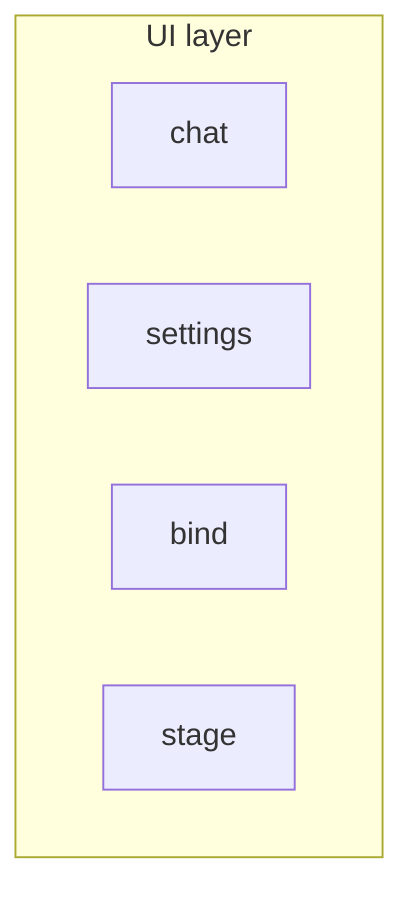
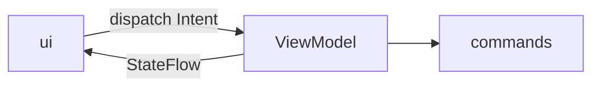

# UI Layer Constraints

Call direction lives in [Architecture Layer Constraints](./arch-layer-constraints.md). This file locks how the UI layer is divided, and how one business block holds its screen. Target constraint, not a snapshot. When a block diverges, change that block.

The UI layer is a set of business blocks. Each block owns its screen. This file does not merge those blocks into one state machine.

Inside a block, the how is MVI. The ui dispatches an Intent. The ViewModel is the only writer of `StateFlow`. Commands act and return the result to the ViewModel.

---

## One sentence

One business block has one page state machine. The machine is a `ViewModel`. Another block does not use it.

| Piece | Does | Must not |
|-------|------|----------|
| ui | paint, collect `StateFlow`, `dispatch` | write state; call commands |
| ViewModel | remember; `dispatch` is the only write | paint; import Compose runtime |
| commands | act, and return the result to the ViewModel | paint; hold `StateFlow` |

Widget-local state stays in the composable: draft text, drawer offset, press-and-hold.

---

## Hold

- One `MutableStateFlow`, exposed as `StateFlow`. The screen collects with `collectAsStateWithLifecycle`.
- Hilt injects the `ViewModel`. The Activity takes it with `viewModels()`.
- `commands` stay a separate type, injected into the `ViewModel`.
- Work that leaves the main thread goes through injected `runOffMain` / `runOnMain`. Tests pass a synchronous pair.

---

## Ban

1. Do not put one `ViewModel` over the whole UI layer.
2. Do not lift `ui`, the `ViewModel`, or `commands` to the source root.
3. Do not keep a Store beside the `ViewModel`.
4. Do not open a second write path beside `dispatch`.
5. A data store that is not a screen (`agent` `StageStore`, `HistoryStore`) is not this machine.
