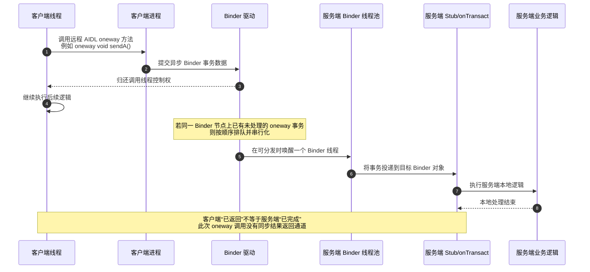

# Binder oneway 的理解路径 *从“立即返回”到“异步意图投递”*

> 本文档基于一次 LCCM 引导对话整理，目标是重建理解的过程——跟着推导走一遍，而不是直接读结论。
> 本文档基于一次引导式学习对话整理。
> 目标是重建理解的过程——跟着推导走一遍，而不是直接读结论。

> **导航**：[digest](../../../digest/android-dev-docs/binder-oneway-async-intent-delivery/202604231831-how-binder-oneway-shifts-from-immediate-return-to-asynchronous-intent-delivery.md)

## 它一开始看起来像什么

这段理解是从一个很直观的问题开始的：`oneway` 是不是 AIDL 的一个方法标记，以及它是不是能让发送方在发起调用后立即返回。

最初的把握并不复杂：`oneway` 似乎就是让调用方“不等了”，发完就走。这一层直觉并没有错，它抓住了最外层现象：调用线程不会像普通同步远程调用那样停在原地等待对端处理完成。

但这个理解很快遇到一个边界问题：如果调用方已经返回了，那么原本同步调用里能拿到的**返回值**和**异常**去了哪里？这使得最初的“立即返回”不再只是一个现象描述，而开始逼近机制问题：它返回的到底是什么，没返回的又是什么。

沿着这个问题继续推进后，较稳妥的表述变成了：`oneway` 的核心不是“让服务端立刻做完”，而是**让调用方线程不必等待服务端做完**。也正因为如此，它天然不适合承担“当前调用点必须拿到明确结果”的职责。

## 为什么它首先是在解决线程阻塞问题

在这段对话里，一个关键转折是把 `oneway` 的目标从“结果传递”重新校准为“线程阻塞控制”。

一开始，直觉容易把 `oneway` 理解成一种“更快的调用”。但这个说法会误导，因为它暗示服务端也更快完成了工作。进一步梳理后，问题被重新收紧成：它主要解决的是性能问题、结果传递问题，还是线程阻塞问题。

最后落下来的理解是：**它首先解决的是调用方线程阻塞问题。**

这一步的重要性在于，它把注意力从“调用有没有发出去”转移到了“调用方当前线程会不会被拖住”。当调用发生在 UI 线程或某条关键工作线程上时，这个区别非常大：同步 Binder 调用会把线程停在那里等结果，而 `oneway` 则让这条线程继续往下执行。

但一旦这样理解，代价也就跟着浮出来了：如果优先保证“不阻塞当前线程”，那么调用方对服务端执行结果的感知能力就会明显变弱。于是对话里又进一步把代价收束为两个方面：

- **结果无法在当前调用点同步确认**
- **时序变得不可直接观察**

这使得 `oneway` 不再只是“快一点”，而是一次明确的设计交换：**用同步确认能力，换取调用路径上的低阻塞。**

## “调用返回”不等于“服务端已经完成”

理解真正开始稳定，是在把下面三个时间点拆开之后：

1. 客户端调用返回  
2. 服务端开始处理  
3. 服务端处理完成  

在最初的机制描述里，虽然已经意识到服务端要等线程空闲后再执行，但表述中仍然混入了一个常见误区：容易把“调用已经返回”说成“`oneway` 已经执行完并返回了”。

后来这个说法被校准了。更准确的理解应该是：

- **客户端调用返回**：客户端把这次异步事务交出去后，当前线程继续执行；
- **服务端开始处理**：目标进程中的 Binder 线程在之后某个时刻开始处理这次事务；
- **服务端处理完成**：服务端本地逻辑结束，但这次 `oneway` 调用不会像同步调用那样把结果回传给调用方。

这三个点不是同一时刻，甚至在很多场景下相距并不短。也正是在这里，“立即返回”第一次真正被从“现象”翻译成了“机制”。

如果继续用一句更稳妥的话来描述，就是：

> `oneway` 返回的是“调用方线程控制权”，不是“服务端处理完成信号”。

这个区分一旦建立，很多后续判断就顺了：为什么它不适合强依赖结果的流程，为什么它容易带来时序错觉，为什么 callback 或状态查询会变得重要。

## 为什么会出现时序不可控

当“调用返回”和“处理完成”被拆开后，下一个自然问题就是：如果客户端连续调用两次 `oneway`，例如先 `sendA()` 再 `sendB()`，应该怎样理解这两个调用之间的关系。

在这里，对话完成了一次很关键的修正：不能把“两个调用都很快返回”理解成“服务端那边也差不多都做完了”。更稳妥的理解是：**客户端两次调用都可能迅速返回，但服务端只是把它们排队后再按顺序处理。**

这一步之所以重要，是因为它把“非阻塞”与“完成顺序”强行分开了。前者发生在客户端，后者发生在服务端。两边不是一件事。

进一步收束之后，时序风险变得很清楚：如果调用方误以为“前一个 `oneway` 已经返回，所以对应状态应该已经更新”，然后立刻发起依赖该状态的新动作，就容易出现竞态、读到旧状态，或者把“已发送”误当成“已生效”。

换句话说，`oneway` 容易让人高估系统的实时一致性。它让调用线程轻松了，但把时序复杂性留给了调用链之外的世界。

## 服务端排队时，会不会一直堆着不出问题

当理解推进到这里时，问题已经不再是“它会不会立即返回”，而是另一个更接近工程现场的问题：如果服务端处理不过来，异步请求排队太长，系统会不会丢弃、失败，还是永远一个一个执行下去。

这一步的推进非常关键，因为它把 `oneway` 从“语义理解”推进到了“可靠性边界”。

对话最后收束出来的判断是：**`oneway` 的不阻塞，只保证调用方尽快返回，不保证消息一定及时处理，也不保证无限可靠积压。**

这个结论不是在夸大不可靠性，而是在修正一种过度乐观的想象：很多人会下意识觉得，既然调用已经发出，那最差也不过是晚一点处理，总归会处理掉。但当服务端状态复杂、消费速度跟不上、异步缓冲承压，或者目标进程本身存在特殊状态时，这个“总归会处理掉”的想法并没有天然保证。

因此，更精确的边界应该是：

- `oneway` **不提供当前调用点上的成功确认闭环**
- 它也**不等于无限可靠队列**
- 调用方看到的“返回”，只表示“当前调用路径继续了”，不表示“远端副作用一定已完成或最终一定会完成”

这一步让 `oneway` 的使用边界开始从机制问题转成工程判断问题。

## 什么样的场景更适合它

当“不阻塞”和“确认变弱”都已经比较明确后，适用边界就变得容易判断了。

对话中用两个场景做了对照：

- **更新一个本地缓存状态通知**
- **扣款**

最后的判断是，前者更适合 `oneway`，后者不适合。

原因不在于“一个轻，一个重”这么粗糙，而在于：**后续业务是否直接依赖当前调用结果，或者这次调用是否必须在此时此地被明确确认。**

这使得适用边界可以被更稳定地表达出来：

适合 `oneway` 的，通常是这类调用：

- 更像通知、投递意图、触发异步处理
- 当前调用点不需要立刻拿到结果
- 即便服务端稍后处理，也不破坏当前主流程

不适合 `oneway` 的，通常是这类调用：

- 后续业务直接依赖这次调用结果
- 当前流程必须知道成功还是失败
- 副作用是否生效对后续步骤有强约束
- 需要强确认、强一致、可追责的同步闭环

这样一来，“业务是否重要”就不再是最稳妥的判断标准；更准确的判断标准是：**这次调用是否要求同步确认闭环。**

## 它的本质更像什么

当机制和边界都逐渐清楚之后，这段对话最终没有停留在“Binder 的某个特性怎么用”，而是继续往上提炼出一个更通用的规律：

> 当一个 IPC 机制优先保证调用方线程不被阻塞时，它往往会牺牲对处理结果的同步确认能力，因此上层需要补充 callback、状态查询或其他确认协议。

这是整个理解路径里最重要的一次抽象提升。因为到了这里，`oneway` 就不再只是一个需要记忆的术语，而变成了一个可迁移的设计判断框架。

沿着这个框架继续看，`Binder oneway` 的本质可以被表述为：

**它更像“异步意图投递”，而不是“已完成的远程过程调用”。**

在对话最后，又进一步给这类机制起了一个工作命名：

> **异步消息投递模型**：投递一个消息马上返回，后续可以发起异步确认动作。

这个命名不是在说 Binder 就等同于一个完整消息队列，而是在强调它的交互抽象：当前调用只负责把意图投递出去，结果确认则被延后到其他机制里完成。

这也解释了为什么前面那些类比——比如 `SharedPreferences.apply()` 或消息推送——虽然机制并不相同，却仍然能在更高一层共享同一种设计取舍：**先让当前路径继续，再把确认问题留给后续。** [补]

## Binder oneway 的机制时序图

把前面的理解收束成一张图，最重要的不是记住每一步 API 名称，而是看清“谁先返回、谁后处理、谁不负责回结果”。

这张图对应的最小阅读方式只有三句：

1. 客户端先返回；
2. 服务端后处理；
3. 这次调用本身不给你同步结果。

## 对话中出现的误解（回答者视角）

> 以下是本次对话推导过程中出现的明确偏差，记录在此供后续参考。

| 误解 | 准确表述 |
|------|---------|
| 将 `oneway` 的返回引用标记直接输出成乱码字符 | 这是显示层问题，不是概念内容本身；应改为自然语言说明证据来源 |
| 将“客户端调用返回”表述成“`oneway` 执行完并返回了” | `oneway` 返回的是客户端调用路径，不代表服务端已经执行完成 |
| 将服务端处理完成描述为“调用 ioctl 写入返回数据” | `oneway` 不提供同步结果返回，不能按同步 reply 语义理解 |
| 过早把同一 Binder 节点串行化的主要目的定性为“防攻击/防线程池打满” | 目前更稳妥的一手依据首先支持“保持顺序与串行化处理”，安全与资源保护属于可推断收益，但不是当前证据下最稳妥的首要表述 |

## 遗留问题

1. Binder 驱动在普通非冻结场景下，对异步 `oneway` 事务积压的限制、失败路径和触发阈值具体是什么。  
2. 服务端 Binder 线程池的扩容、唤醒与调度细节，在 AOSP 源码层面是如何实现的。  
3. `oneway` 与普通同步 Binder 调用在驱动层事务流转上的关键分叉点，能否画出更贴近源码的对照时序图。  
4. 如果业务必须使用 `oneway`，上层应如何设计 callback、ack 或状态查询，才能补足确认闭环。  

## 附录

> 以下内容在推导区无对应归属章节，但有独立使用价值，在此完整保留。
> 每条标注来源章节，需要推导上下文时可回到对应章节查阅。

### 适用与不适用的快速判断准则

| 场景特征 | 是否更适合 `oneway` | 原因 |
|---------|---------------------|------|
| 只是通知对方有空时处理 | 是 | 当前调用点不需要同步结果 |
| 需要立刻知道成功/失败 | 否 | `oneway` 不提供同步确认 |
| 后续流程依赖此次调用结果 | 否 | 调用返回不代表服务端已处理完成 |
| 可接受异步确认或状态轮询 | 是 | 可以由上层补确认机制 |

来源：什么样的场景更适合它

### 一句话规律

当一个跨进程调用机制优先保证调用方线程不被阻塞时，它往往会牺牲对处理结果的同步确认能力，因此需要由上层补充 callback、状态查询或其他确认协议。

来源：它的本质更像什么

## 对话质量诊断

### 对话质量

| 维度 | 评级 | 说明 |
|------|------|------|
| 推导过程完整度 | 高 | 对话中有多次主动猜测、边界追问、代价分析、类比修正与抽象提炼 |
| 结论直给比例 | 低 | 大部分关键结论都经过了用户猜测、纠偏和逐步校准，而非直接给结论 |
| 关键转折覆盖度 | 高 | 从“立即返回”到“结果无法同步确认”、再到“适用边界与抽象规律”的关键转折均有记录 |

**综合评级**：高质量

### 模型适用性

**适用性**：完全适用