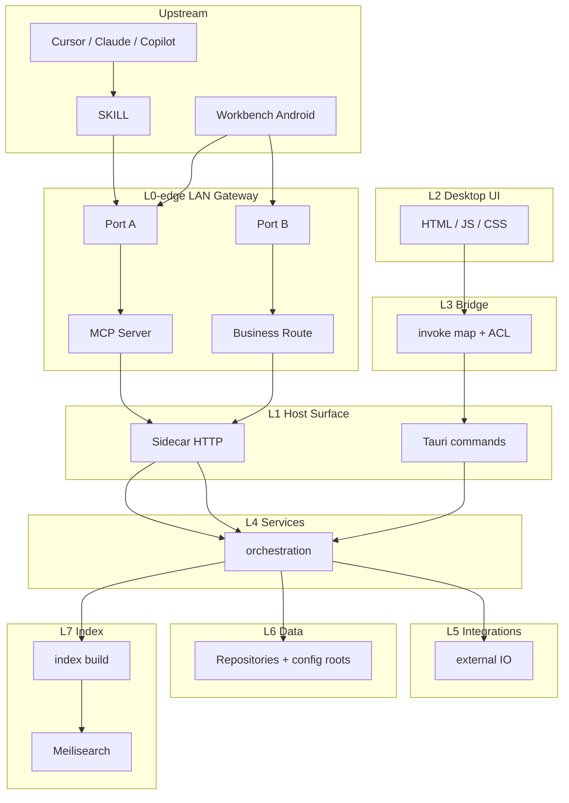

# Architecture Layer Constraints

This document is the **target** architecture constraint, not a snapshot of current code. When implementation diverges, change the code to match this file. Do not rewrite this file to match today's listen map or call graph.

Technical call-direction only: no business objects, no reverse calls, no layer skips.

---

## One sentence per layer

| Layer | Sentence |
|-------|----------|
| **L-up-ide** | Cursor / Claude / Copilot are MCP clients; they enter Port A through SKILL only. |
| **L-up-android** | Workbench Android is an upstream app; it enters only through Port A and Port B on the Gateway. |
| **L0-edge** | LAN Gateway does TLS only; it contains Port A, Port B, MCP Server, and Business Route. |
| **Port A** | Connects only to MCP Server. |
| **Port B** | Connects only to Business Route. |
| **MCP Server** | Translates protocol to L1 Sidecar HTTP only. |
| **Business Route** | Forwards to Sidecar HTTP only; it must not call L4. |
| **L2** | Desktop HTML / JS / CSS goes through L3 only. |
| **L3** | Bridge does mapping and ACL only; no business rules, no IO. |
| **L1** | Sidecar HTTP and Tauri commands are the two surfaces into L4; they do not each own orchestration. |
| **L4** | Services is the only orchestration point, including pairing and ticket issue; Sidecar is how those are exposed. |
| **L5** | Integrations talk to external IO only; they do not store authority. |
| **L6** | Data owns paths and atomic writes. |
| **L7** | Index may be off or rebuilt; it must not replace L6. |

Cross-cutting (not a layer): config and secrets flow downward only.

---

## Bans

1. Upstream must not skip L0.
2. Desktop IDEs must not use Port B / Business Route; Android must not call MCP Server directly.
3. Port A and Port B must not call each other.
4. MCP Server and Business Route must not call each other.
5. L2 must not skip L3; L0 must not touch L6.
6. L0 must not call L4 except through L1 Sidecar HTTP.
7. An L7 failure must not rewrite the L1 contract, and must not let L4 switch to another source of truth.

Entering MCP Server after credentials from Business Route is a new entry, not a nested call inside the same layer.
