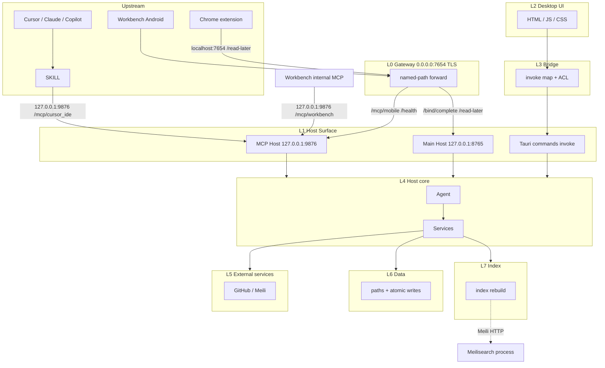

# Architecture Layer Constraints

This document is the **target** architecture constraint, not a snapshot of current code. When implementation diverges, change the code to match this file. Do not rewrite this file to match today's listen map or call graph.

Technical call-direction only: no business objects, no reverse calls, no layer skips.

---

## One sentence per layer

| Layer              | Sentence                                                                                                                                                                  |
| ------------------ | ------------------------------------------------------------------------------------------------------------------------------------------------------------------------- |
| **L-up-ide**       | Cursor / Claude / Copilot use Skills; Skills are local MCP clients that enter MCP Host directly through loopback, never through L0.                                        |
| **L-up-android**   | Workbench Android is an upstream app; it enters only through named Gateway paths.                                                                                         |
| **L-up-chrome**    | Chrome extension is an upstream local client; it enters only through loopback Gateway path `https://localhost:7654/read-later`.                                           |
| **L-internal-mcp** | Workbench-internal MCP calls use `127.0.0.1:9876/mcp/workbench` only; they are not upstream and do not use the Gateway.                                                   |
| **L0**             | The Gateway does TLS and named-path forwarding only; one port `7654`. It always binds `0.0.0.0:7654`.                                                                     |
| **L0 paths**       | `/mcp/mobile` and `/health` forward only to MCP Host; `/bind/complete` and loopback-only `/read-later` forward only to Main Host.                                        |
| **L1-mcp**         | MCP Host is the AI entry. It translates protocol, authenticates, then enters L4. It must not call Main Host or Tauri commands.                                                              |
| **L1-main**        | Main Host is the general business entry; `/api/`* enters L4. It must not call MCP Host or Tauri commands.                                                                       |
| **L1-cmd**         | Tauri commands are the desktop-UI path into L4 (through L3 only); they are not the bus for MCP Host or Main Host.                                                              |
| **L2**             | Desktop HTML / JS / CSS goes through L3 only.                                                                                                                             |
| **L3**             | Bridge does mapping and ACL only; no business rules, no IO.                                                                                                               |
| **L4**             | Agent and Services; downstream L5, L6, L7.                                                                                                                                |
| **L5**             | External services only: GitHub, Meili. They do not store authority.                                                                                                       |
| **L6**             | Data owns paths and atomic writes.                                                                                                                                        |
| **L7**             | Rebuild only; must not replace L6.                                                                                                                                        |

Cross-cutting (not a layer): config and secrets flow downward only. Host process facts (live NIC, port liveness) live in `host/` and flow downward; they are not config.

---

## Bans

1. Workbench Android must not skip L0. Skills must not enter L0.
2. `:9876` and `:8765` are loopback. Only Workbench-internal, Skills (MCP Host `:9876` only), and the Gateway may call them.
3. Skills call only `127.0.0.1:9876/mcp/cursor_ide`. Android must not call loopback MCP Host or Main Host directly.
4. MCP Host and Main Host must not call each other; both enter L4.
5. MCP Host and Main Host must not enter L4 through Tauri commands.
6. L2 must not skip L3; L0 must not touch L6; L0 must not call L4 (forward to L1 only).
7. An L7 failure must not rewrite the L1 contract, and must not let L4 switch to another source of truth.
8. L5, L6, and L7 must not call L4.
9. Chrome extension must not call loopback Main Host or MCP Host directly; it calls only the loopback Gateway `/read-later` path.

Entering MCP Host after credentials from Main Host Bind is a new entry, not a nested call inside the same layer.
