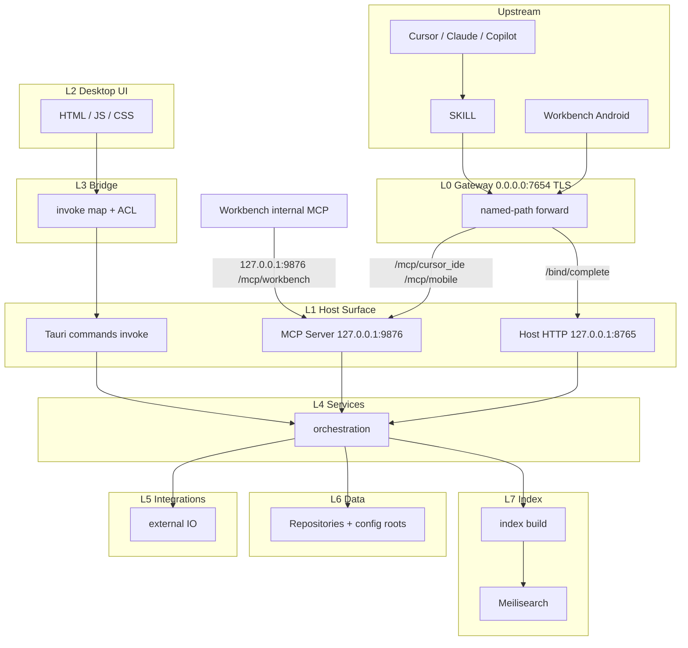

# Architecture Layer Constraints

This document is the **target** architecture constraint, not a snapshot of current code. When implementation diverges, change the code to match this file. Do not rewrite this file to match today's listen map or call graph.

Technical call-direction only: no business objects, no reverse calls, no layer skips.

Source: 2026-09-01 session `/converge` (seven locked items). ⚠️ Inferred (session decisions, not source facts)

---

## One sentence per layer

| Layer              | Sentence                                                                                                                                                                  |
| ------------------ | ------------------------------------------------------------------------------------------------------------------------------------------------------------------------- |
| **L-up-ide**       | Cursor / Claude / Copilot / Skills are MCP clients; they enter the Gateway only, never `:9876`.                                                                           |
| **L-up-android**   | Workbench Android is an upstream app; it enters only through named Gateway paths.                                                                                         |
| **L-internal-mcp** | Workbench-internal MCP calls use `127.0.0.1:9876/mcp/workbench` only; they are not upstream and do not use the Gateway.                                                   |
| **L0**             | The Gateway does TLS and named-path forwarding only; one port `7654`. It always binds `0.0.0.0:7654`.                                                                     |
| **L0 paths**       | `/mcp/cursor_ide`, `/mcp/mobile`, and `/health` forward only to MCP; `/bind/complete` forwards only to Host HTTP. |
| **L1-mcp**         | MCP Server translates protocol, authenticates, then enters L4. It must not call Host HTTP or Tauri commands.                                                              |
| **L1-http**        | Host HTTP is a parallel business entry; `/api/`* enters L4. It must not call MCP or Tauri commands.                                                                       |
| **L1-cmd**         | Tauri commands are the desktop-UI path into L4 (through L3 only); they are not the bus for MCP or Host HTTP.                                                              |
| **L2**             | Desktop HTML / JS / CSS goes through L3 only.                                                                                                                             |
| **L3**             | Bridge does mapping and ACL only; no business rules, no IO.                                                                                                               |
| **L4**             | Services is the only orchestration point, including pairing and ticket issue. The three L1 doors do not each own orchestration.                                           |
| **L5**             | Integrations talk to external IO only; they do not store authority.                                                                                                       |
| **L6**             | Data owns paths and atomic writes.                                                                                                                                        |
| **L7**             | Index may be off or rebuilt; it must not replace L6.                                                                                                                      |

Cross-cutting (not a layer): config and secrets flow downward only.

---

## Bans

1. Upstream (IDE, Skills, Android) must not skip L0.
2. `:9876` and `:8765` are loopback. Only Workbench-internal and the Gateway may call them.
3. IDE / Skills must not call `:9876`. Android must not call loopback MCP or Host HTTP directly.
4. MCP Server and Host HTTP must not call each other; both enter L4.
5. MCP and Host HTTP must not enter L4 through Tauri commands.
6. L2 must not skip L3; L0 must not touch L6; L0 must not call L4 (forward to L1 only).
7. An L7 failure must not rewrite the L1 contract, and must not let L4 switch to another source of truth.

Entering MCP after credentials from Host HTTP Bind is a new entry, not a nested call inside the same layer.