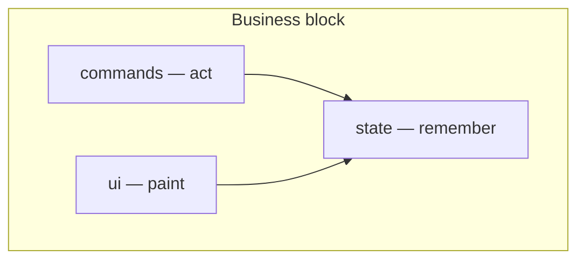

# UI Layer Constraints

Call direction lives in [Architecture Layer Constraints](./arch-layer-constraints.md). This file only locks how a business block is divided. Target constraint, not a snapshot. When the tree diverges, change the tree.

---

## One sentence

A business block marks three duties: ui, commands, and state. Do not lift these three above the block.

| Duty | Does | Must not |
|------|------|----------|
| ui | paint | act or remember |
| commands | act | paint |
| state | remember | paint or act |

Applies to business blocks only.

---

## Ban

1. Do not flatten the three duties to the source root.
