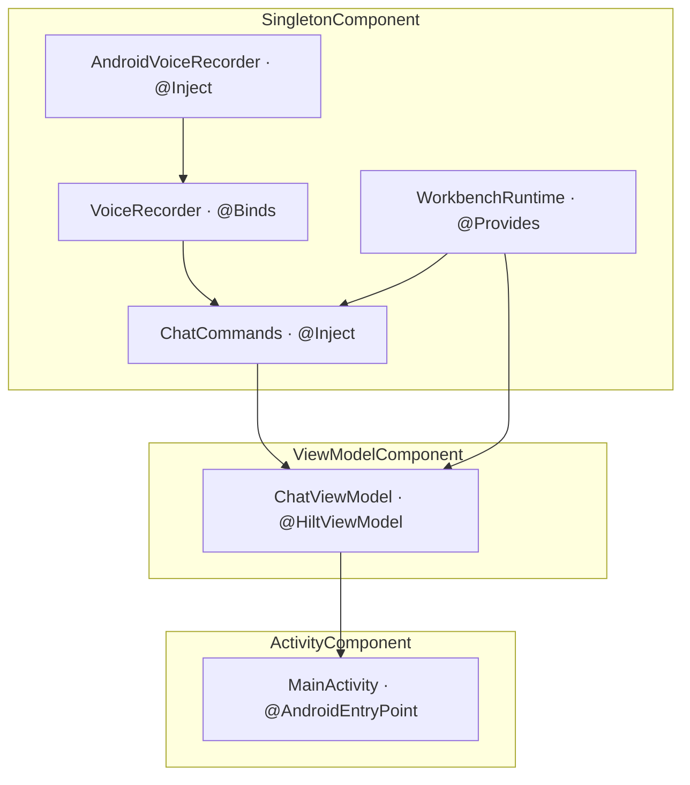

# Android 接入 Hilt 试点

**状态：** 已实施（`:app` compileDebugKotlin + testDebugUnitTest 绿）  
**关联待办：** `task_cee9f88c79bf`  
**源码：** `lulu-workbench-android/lulu-workbench/`  
**四种绑定来源：** board [b_0bfa64da](https://luluboard.app/#b:b_0bfa64da)  
**决策来源：** 2026-09-20 会话；exit gate: locked

## 1. 目标

在 `:app` 接通 Hilt，覆盖 board 的四种绑定来源各一次。试点只改 MainActivity 这一条真实路径。`WorkbenchRuntime` 仍由 Application 手工创建。不迁库模块，不重写 `ChatStore`。

## 2. 锁定决策

| # | 题目 | 选择 |
|---|---|---|
| 1 | 落点 | `:app` 真实切片，不是 Retrofit / UserRepository 玩具图 |
| 2 | 组合根 | `WorkbenchApp.onCreate` 仍 `WorkbenchRuntime.create`；Hilt 用 `@Provides` 读同一实例 |
| 3 | 四种来源 | 见 §3；Fragment 不做（与 Activity 同属 MembersInjector；工程无 Fragment） |
| 4 | `@Provides` | 只提供 `WorkbenchRuntime`。不做无消费方的 Activity 级 `Handler` |
| 5 | `@Binds` | `VoiceRecorder` → `AndroidVoiceRecorder`。不把 `:network` 的 `NetworkClient` 纳入本期 |
| 6 | 入口 | `MainActivity` `@AndroidEntryPoint`；新增薄 `ChatViewModel` `@HiltViewModel` 组 `ChatStore` |
| 7 | 版本 | Hilt 2.60.1；KSP `2.3.12`；不引入 `org.jetbrains.kotlin.android`。实施时从 `2.2.10-2.0.2` 改到 `2.3.12`：前者往 `kotlin.sourceSets` 塞生成代码，AGP 9 内置 Kotlin 拒绝。KSP 2.3 起版本号不再绑 Kotlin 小版本。 |
| 8 | 第二期 | Settings / Stage、`:network` `@Binds NetworkClient`、拆 `WorkbenchRuntime` |

未锁（实施时不要擅自写进合同）：

| 项 | 状态 |
|---|---|
| `ChatViewModel.onCleared` 是否停 `keepAlive` | 现 MainActivity 也未停；本期不改行为 |

## 3. 四种来源落点

| Board 来源 | 本期落点 | 组件 |
|---|---|---|
| `@Inject constructor` | `AndroidVoiceRecorder`、`ChatCommands` | 无 Scope，跟 `ChatViewModel` |
| `@Provides`（不能改构造的类型） | `WorkbenchRuntime` 包现有 factory | `SingletonComponent` |
| `@Binds`（接口 → 实现） | `VoiceRecorder` → `AndroidVoiceRecorder` | `SingletonComponent` |
| `@AndroidEntryPoint` / `@HiltViewModel` | `MainActivity`、`ChatViewModel` | Activity / ViewModel |

`WorkbenchRuntime` 对应 board 里 Retrofit 那种「自己不能 `@Inject`」的根对象。`ChatCommands` 对应无 Scope 的 `PaymentService`。

✅ Verified（全库 Grep `hilt|dagger|koin|@Inject|ViewModel`；`gradle/libs.versions.toml`）：工程无 Hilt / Dagger / Koin / `ViewModel` / KSP。无 Fragment。

✅ Verified（`WorkbenchApp.kt`、`MainActivity.kt`、`agent/facade/AgentFacade.kt`）：组合根是 `WorkbenchRuntime.create`；MainActivity 从 `WorkbenchApp.runtime` 手工 `ChatCommands` + `ChatStore`。

✅ Verified（`ChatCommands.kt`）：已有 `(AgentFacade, AsrClient, VoiceRecorder)` 次构造。

✅ Verified（`libs.versions.toml`、`gradle.properties`）：AGP 9.1.1，Kotlin 2.2.10，`lifecycleRuntimeKtx = 2.10.0`，`activityCompose = 1.13.0`；未开 Jetifier。

✅ Verified（[dagger.dev/hilt/gradle-setup](https://dagger.dev/hilt/gradle-setup)）：Hilt 现档 2.60.1。

✅ Verified（[KSP 2.3.12](https://github.com/google/ksp/releases/tag/2.3.12)）：AGP 9 内置 Kotlin 可用的 KSP 线；2.3 起版本号不再绑 Kotlin 小版本。

✅ Verified（本机 `./gradlew :app:compileDebugKotlin`）：KSP `2.2.10-2.0.2` 报 `Using kotlin.sourceSets DSL to add Kotlin sources is not allowed with built-in Kotlin`。KSP `2.3.12` + Hilt 2.60.1 下 `:app:compileDebugKotlin` 与 `:app:testDebugUnitTest` 通过（54 tests, 0 failures）。

✅ Verified（[dagger#5099](https://github.com/google/dagger/issues/5099) 及社区对 dagger-2.59 的说明）：AGP 9 需 Hilt ≥ 2.59；Jetifier 会干扰 Hilt 2.59+ classpath。

✅ Verified（[dagger.dev/hilt/application](https://dagger.dev/hilt/application)）：`@HiltAndroidApp` 在 `super.onCreate()` 注入 Application 字段。因此 Application **不得** `@Inject runtime`：赋值发生在 `WbLog.start` 之后。✅ Verified（`WorkbenchApp.onCreate` 顺序）

## 4. 绑定图

Settings / Stage 仍读 `WorkbenchApp.runtime`，与 `@Provides` 同一实例。禁止再 `create()` 一份。

## 5. 实施步骤

1. **Gradle（catalog + 根 + `:app`）**  
   `hilt = "2.60.1"`，`ksp = "2.3.12"`。根 `plugins`：`hilt`、`ksp` `apply false`。`:app` 加 `hilt` + `ksp`，依赖 `hilt-android` / `hilt-compiler`，以及 `androidx.lifecycle:lifecycle-viewmodel-ktx`（与现有 `lifecycleRuntimeKtx = 2.10.0` 对齐）。不要加 `kotlin-android`。不要开 Jetifier。不要设 `android.disallowKotlinSourceSets=false`。

2. **根**  
   `WorkbenchApp` 加 `@HiltAndroidApp`。`onCreate` 顺序不变：`super.onCreate()` → `WbLog.start` → `runtime = WorkbenchRuntime.create(filesDir)`。

3. **`@Provides`**  
   `app/.../di/RuntimeModule.kt`：`@Module @InstallIn(SingletonComponent::class)`，`@Provides @Singleton fun runtime(@ApplicationContext ctx): WorkbenchRuntime = (ctx as WorkbenchApp).runtime`。首次注入在 Activity / ViewModel，晚于 `Application.onCreate`。

4. **`@Inject` + `@Binds`**  
   `AndroidVoiceRecorder @Inject constructor()`。`di/VoiceModule.kt`：`@Binds abstract fun voiceRecorder(impl: AndroidVoiceRecorder): VoiceRecorder`。`ChatCommands` 增加 `@Inject constructor(runtime: WorkbenchRuntime, recorder: VoiceRecorder) : this(runtime.agent, runtime.asr, recorder)`。原主构造与次构造保留，测试可继续直接 new。录音器不标 `@Singleton`。

5. **入口**  
   新增 `chat/ChatViewModel.kt`：`@HiltViewModel @Inject constructor(commands: ChatCommands, runtime: WorkbenchRuntime)`，在 `init` 里按现 MainActivity 逻辑组 `ChatStore`（`keepAlive.start()`、`Thread`、`Handler(Looper.getMainLooper())`）。`MainActivity` 加 `@AndroidEntryPoint`，`by viewModels<ChatViewModel>()`，去掉对 `WorkbenchApp.runtime` 与 `AndroidVoiceRecorder()` 的手工 new。若 `viewModels()` 编译缺符号，补 `androidx.activity:activity-ktx`（与 `activityCompose = 1.13.0` 对齐）。

## 6. 验收

缺任一绑定应在 KSP / Hilt 聚合失败，而不是运行时 NPE。

- 编译 `:app`。  
- 冷启动进聊天、发一条、按住说话（验证 `VoiceRecorder`）。  
- 打开 Settings（未迁 Activity 仍走 `WorkbenchApp.runtime`）。  
- 现有 `app/src/test` 不碰 Application / Activity，不必上 `HiltTestApplication`。

## 7. 明确不做

不改 `:agent` / `:llm` / `:network` / `:asr` / `:wmcp`。不拆 `WorkbenchRuntime`。不把 `ChatStore` 改成 ViewModel。不加 Retrofit、不加 Fragment。不迁 Settings / Stage。不把 `OkHttpClient` 提到 `:app`。
