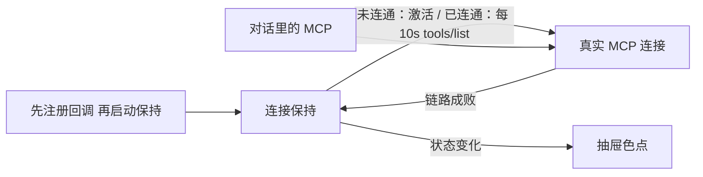

# Android wmcp 连接保持技术方案

> Related todo: `task_a2a93efb9e6e_sub_14`
> 目录与依赖重构：`docs/archive/android-wmcp-directory-dependency-reorg-tech-plan.md`
> 决策来源：本会话 `/converge`，exit gate: locked

## 1. 目标

`:wmcp` 增加连接保持：App 启动后先注册回调，再启动保持。保持是主动入口，也是连接状态中枢。对话里的 MCP 调用走同一条真实连接；链路成败回调给保持，UI 只订保持。

抽屉「Lulu Workbench」旁用色点标三态。失败不堵输入。不自动重绑、不改 Gateway。

---

## 2. 锁定决策

| # | 题目 | 选择 |
|---|---|---|
| 结构 | 三层 + 先注册再启动 + 双入口 + UI 只订阅 | 上一轮已同意 |
| 1 | 激活 = 现有建会话 | 复用 initialize → 记下 session，不另开探活 |
| 2 | 未绑定 | 启动保持当中枢；只报 Unbound；不激活、不 10s；绑定后再激活 |
| 3 | 连通后 | 每 10s 真探活（`tools/list`）；失败则未连通并继续 10s |
| 4 | 对话失败 | 只认链路失败；工具报错不动连接 |
| 5 | 抽屉标识 | 只出色点，英文 contentDescription |
| 6 | 子任务旧正文 | 以本文为准（顶栏 / 进前台轮询作废） |

---

## 3. 现状

| 项 | 现状 | 标记 |
|---|---|---|
| 绑定 | `isBound()` 只看本机是否有 `device_mcp_token` | ✅ Verified（`mcp/WmcpClientImpl.kt`） |
| 会话 | `ensureSession()`：initialize → `mcp-session-id` → initialized；仅 `listTools` / `callTool` 调用 | ✅ Verified（同上） |
| 失败 | HTTP 非 2xx / initialize 拒绝抛 `McpFailedException`；`listTools` 吞掉变空表；`callTool` 收成一段文字 | ✅ Verified（同上；`mcp/McpRpc.kt` `initializeAccepted`） |
| 传输 | 每次 POST `/mcp/mobile`，不是长连接；闲置 Host 挂了客户端收不到事件 | ✅ Verified（`WmcpClientImpl.mcpExchange`；`OkHttpNetworkClient.execute`） |
| UI | 设置页有 Bound / Not bound；抽屉标题旁无连通标识 | ✅ Verified（`ChatDrawer.kt`；sub_14 正文） |

`bound` ≠ 链路通。这是 sub_14 的缺口。✅ Verified（子任务正文）

---

## 4. 目标结构



| 层 | 职责 | 不做什么 |
|---|---|---|
| 真实连接 | 现有 `ensureSession` / `mcpExchange`；对外提供 `activate` / `probe` 与链路事件 | 不独占入口；不认工具业务对错；不改 keep-alive 状态 |
| 连接保持 | 订 MCP 事件；已绑定时主动激活；未连通 10s 再激活；已连通 10s 打 `tools/list`；对外回调 | 不另开探活协议（探活用现有 `tools/list`） |
| UI | 订保持；画色点 | 不自己探活 |

模块仍只在 `:wmcp` 做 MCP，`:app` 只 MVI。✅ Verified（`docs/archive/workbench-android-architecture.md` §4）

---

## 5. 状态与回调

```text
Unbound        无 device token
Disconnected   已绑定，会话未就绪或上次激活/链路失败
Connected      建会话成功，或之后一次 MCP HTTP 成功
```

- `addListener` 立刻回放当前态，避免先启动丢首包。
- 仅状态变化再回调。
- 绑定完成（`completeBind` 写入 token）通知保持：从 Unbound 进入激活。

闲置时靠每 10s 的 `tools/list` 发现 Host 已挂，失败则回调 Disconnected。锁定 Q3-B（本会话改锁）。探活走现有 `mcpPost("tools/list")`，不是新协议。✅ Verified（`WmcpClient.probeLink`；`McpKeepAliveImpl.armTimer`）

---

## 6. 激活与重试

激活 = `ensureSession()`（initialize → 记下 session → initialized）。✅ Verified（现实现）+ 锁定 Q1

| 时机 | 行为 |
|---|---|
| 启动且未绑定 | 报 Unbound；不打网；不排 10s |
| 启动且已绑定 | 报 Disconnected；后台激活 |
| 激活成功 / 对话链路成功 | Connected；10s 后打 `tools/list`（必须出网，不能只看内存 session） |
| 激活失败 / 对话链路失败 / 探活失败 | Disconnected；10s 后再激活 |
| 已 Connected | 每 10s 探活；对话里链路成功会把下一枪推后 10s |
| `completeBind` 成功且保持已启动 | 清 session；当新绑定激活 |

10s 在未连通时重试激活，在已连通时探活。锁定 Q2 / Q3-B。

---

## 7. 链路失败 vs 调用失败

| 算链路失败（改状态、可重启 10s） | 不算（不动连接） |
|---|---|
| `network.execute` 抛错（超时、TLS、断网） | `tools/call` HTTP 2xx，正文是 JSON-RPC / 工具 error |
| `/mcp/mobile` HTTP 不在 2xx（404 重握手失败之后） | `callTool` 返回的业务文字 |
| initialize 被拒绝 / 协议版本不对 | 未绑定就 `callTool`（保持已是 Unbound） |

404 先重握手：重握手成功仍 Connected；重握手失败才 Disconnected。⚠️ Inferred（现有 404 路径：`mcpExchange`；对齐 Q4）

---

## 8. UI

- 位置：左侧抽屉标题「Lulu Workbench」右侧。锁定 Q5。
- 只出色点，界面不写 Connected / Offline。
- 颜色：Unbound = 黄（`StudioWarn`）；Disconnected = `error`；Connected = 石墨绿 `StudioOk`。✅ Verified（`Color.kt`；`ChatDrawer.kt` `mcpLinkDotColor`）
- `contentDescription` 英文：`MCP unbound` / `MCP offline` / `MCP connected`（辅助功能，不是可见文案）。✅ Verified（`docs/biz/ui-build-constraints.md`：界面文案英文）
- Chat 仍可在未连通时本地聊。✅ Verified（架构不变项 3）

启动顺序（`:app`）：

- Chat：`ChatStore` `addListener`，然后 `keepAlive.start()`。`start()` 可重入。
- Settings Mac pair：`BindStore` **只** `addListener`，不 `start()`。`addListener` 立刻回放当前态。离开 Settings 时 `removeListener`。

两处 UI 各订一次，共用同一个保持实例。✅ Verified（`MainActivity.kt`；`SettingsActivity.kt`；`McpKeepAliveImpl.addListener`）

---

## 9. 主要文件

| 文件 | 作用 |
|---|---|
| `:wmcp` `McpKeepAlive.kt` | 对外 API：三态、`McpKeepAlive`、`IdleKeepAlive`。App 只走 `WmcpClient.keepAlive()` |
| `:wmcp` `mcp/McpWire.kt` | MCP 调用口与链路事件。keep-alive 依赖此口 |
| `:wmcp` `keepalive/McpKeepAliveImpl.kt` | 订 `McpWire` 事件，自己改三态；10s 回头调 `activate` / `probe` |
| `:wmcp` `keepalive/Assemble.kt` | Factory 在此把 MCP 与 keep-alive 接上 |
| `:wmcp` `WmcpClient.kt` | 对外接口与 Factory |
| `:wmcp` `mcp/WmcpClientImpl.kt` | 会话与 RPC；只 `emit` 事件，不持有 keep-alive |
| `:app` `ChatState` / `ChatStore` | 记住 `mcpLink` |
| `:app` `MainActivity` | 先注册再 `start()` |
| `:app` `ChatDrawer` | 标题旁色点 |

---

## 10. 不做

- 进前台另做一次探活（已由 10s `tools/list` 覆盖）
- 自动重绑 / 换 QR
- 改 Gateway 协议
- 用 Bound 冒充 Connected
- 顶栏或输入栏再放一份状态
