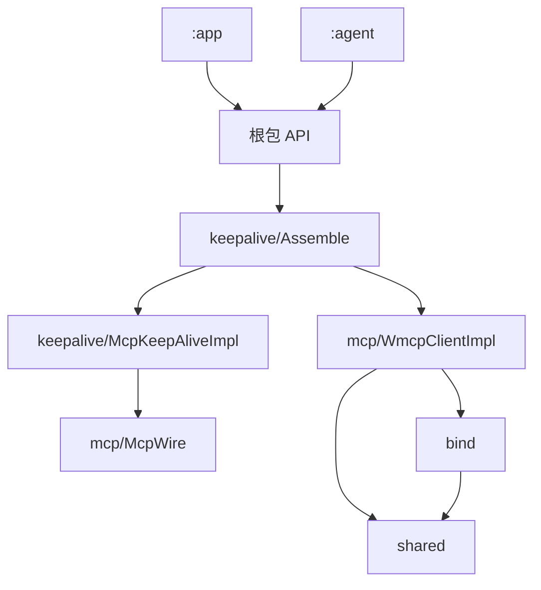
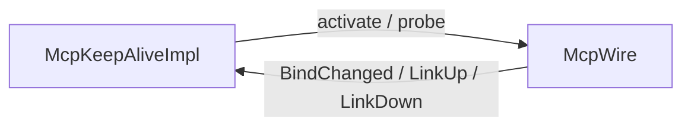

# Android wmcp 目录与依赖重构技术方案

> 源码：`lulu-workbench-android/lulu-workbench/wmcp/src/main/java/com/lulu/workbench/android/wmcp/`
> 连接保持合同：`docs/archive/android-wmcp-connection-keep-alive-tech-plan.md`
> Related todo: `task_a2a93efb9e6e_sub_16`
> 决策来源：本会话；exit gate: locked

## 1. 目标

`:wmcp` 从一层平铺改为：**对外 API 一层 + 按功能分包**。编译依赖与运行时调用对齐：keep-alive 掉头调 MCP，MCP 不改 keep-alive 的状态。`:app` / `:agent` 的公开 import 不变。不拆新 Gradle 模块。

---

## 2. 锁定决策

| # | 题目 | 选择 |
|---|---|---|
| 层次 | 根包 = 对外 API；子包 = 实现 | 本会话锁定 |
| 功能包 | `bind` / `mcp` / `keepalive` / `shared` | 本会话锁定 |
| 依赖方向 | `keepalive` → `mcp`；`mcp` 不 import `keepalive` | 本会话锁定 |
| MCP 职责 | 提供 `McpWire` 调用口 + 链路事件 | 本会话锁定 |
| 组装 | Factory 调 `assembleWmcpClient`；壳用 `WmcpClient by mcp` | 本会话锁定 |
| 连接态 SoT | `McpKeepAliveImpl.current`；UI 只订副本 | 本会话锁定 |

连接保持的行为合同（三态、10s、`tools/list` 探活）仍以保持方案为准，本文不重写。

---

## 3. 包与文件

```text
wmcp/
  WmcpClient.kt          对外接口、DTO、Factory
  McpKeepAlive.kt        对外三态与 IdleKeepAlive
  BindOffer.kt           对外 QR 解析
  bind/BindSeal.kt       密封与过期
  mcp/McpWire.kt         调用口与事件
  mcp/WmcpClientImpl.kt  会话与 /mcp/mobile
  mcp/McpRpc.kt          JSON-RPC 报文
  mcp/McpToolsJson.kt    tools 列表解析
  keepalive/McpKeepAliveImpl.kt  三态与 10s
  keepalive/Assemble.kt  把 MCP 与保持焊成一个 WmcpClient
  shared/Json.kt         jsonString
```

✅ Verified（`wmcp/src/main` 现有 11 个 `.kt`）

| 层 | 谁能用 |
|---|---|
| 根包公开类型 | `:app` / `:agent` |
| 子包 `internal` | 仅 `:wmcp` |

---

## 4. 依赖



| 从 | 到 | 允许 |
|---|---|---|
| Factory | `assembleWmcpClient` | 是 |
| `keepalive` | `mcp`（`McpWire`、`WmcpClientImpl`） | 是 |
| `mcp` | `bind`、`shared`、根包 DTO | 是 |
| `mcp` | `keepalive` | 否 |

✅ Verified（`wmcp/src/main` 全部 `import com.lulu.workbench.android.wmcp…`；`WmcpClientImpl` 无 keepalive import）

模块外：`:wmcp` → `:network` / `:storage` / `:log` / bouncycastle。✅ Verified（`wmcp/build.gradle.kts`）

---

## 5. 运行时



- `McpWire`：`isBound` / `activate` / `probe` + `addWireListener`。✅ Verified（`mcp/McpWire.kt`）
- `WmcpClientImpl` 只 `emit` 事件，不持有 keep-alive。✅ Verified（`mcp/WmcpClientImpl.kt`）
- `Assemble`：`WmcpClientImpl` + `McpKeepAliveImpl`，壳 `WmcpClient by mcp`，只改 `keepAlive()`。✅ Verified（`keepalive/Assemble.kt`）

连接态在 `McpKeepAliveImpl.current`（内存）。`sessionId` 在 `WmcpClientImpl`（会话头）。token 在 `:storage`（只答绑没绑）。`:app` 的 `ChatState.mcpLink` / `BindState.mcpLink` 是订来的副本。✅ Verified（`McpKeepAliveImpl`；`WmcpClientImpl.sessionId`；`ChatStore` / `BindStore`）

---

## 6. 不做

- 不拆 `:wmcp` 为更多 Gradle 模块
- 不改 `:app` / `:agent` 公开 import
- 不改 Gateway 协议、不改三态语义
- App 不 `new` `McpKeepAliveImpl`
