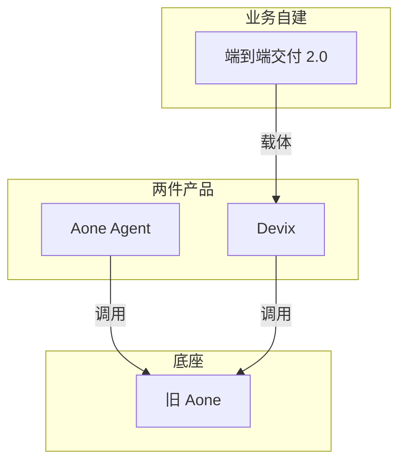

# Aone Agent 和 Devix

2026-09-08 整理。这是一份阅读公开演讲和实践文之后的介绍，不是官方手册。

主要文章：

- [从 Copilot 到 通用 Agent](https://www.infoq.cn/article/5X7q545Ua4GYJOQ7g9lt)（InfoQ，2025-06-30）
- [Vibe Coding 在代码生成与协作中的实践与思考](https://www.infoq.cn/article/QtQVbAc62O1ib1V2WftO)（演讲 2025-10-25，刊出 2026-02-13）
- [当 Agent 替你值班](https://www.53ai.com/news/shuziyuangong/2026062385729.html)（2026-06-23）
- [端到端交付 2.0](https://www.53ai.com/news/zhinenghuagaizao/2026072164931.html)（2026-07-21）
- [重构协同](https://www.aixq.cc/62205.html)（大淘宝 / 天猫技术）

---

## 先记住什么

Aone Agent 和 Devix 都是**阿里内部**的东西，挂在旧研发平台 **Aone** 上。Aone 管需求、代码、变更、发布；对外近亲是云效。

公开材料把它们写成**两个产品**，没有写成一条产品线，也没有写「Aone Agent 跑在 Devix 上」。向邦宇讲 Agent 时不提 Devix；运维、交付 2.0、天猫技术讲 Devix 时不提 Agent。

不要和这些名字混在一起：

- 蚂蚁 **LinkE**：蚂蚁自己的研发效能平台
- **邻客蚁**（`linkant.alipay.com`）：支付宝给 IoT 厂商下 SDK 的门户
- **云效**：Aone 对外售卖的近亲，不是 Devix
- 阿里云 AgentRun / ACK Agent Sandbox：另一套对外沙箱
- **AoneD**：公开网页上没出现过

---

## 两个产品差在哪

| | Aone Agent | Devix |
|---|---|---|
| 谁在做 | 代码平台，向邦宇 | Aone 团队 |
| 卖的是什么 | Web 上的异步任务 Agent | 云端常驻工位 |
| 活多久 | 一个任务起一个容器，做完就结束 | 7×24 的 Sandbox / 产品空间 |
| 什么时候被公开写清楚 | 2025 年 4 月演讲里已经能演示 | 2026 年 6 月实践文才详述，仍被写成探索期 |
| 能不能对外买 | 不能 | 不能 |

会不会共用同一套容器调度，公开没写。比较合理的看法是：同类云沙箱，两套产品；不太像 2025 年的 Agent 已经住在 Devix 产品空间里。若以后要收口，更像任务容器去短租 Devix 的工位。

---

## Aone Agent

通用任务 Agent，形态接近 Devin：自己想、做规划、用工具、再反思。编码是主场，但用户不只是后端——测试、产品、运营、设计也在丢任务。

一次典型用法：在 Web 上提需求，后台起容器、跑引擎。公开演示是生成五子棋，容器里拉起 React，再测试、查问题，大约半小时。

工具包括 shell、文件、搜索、网页、MCP。上面有 Leader 和子 Agent。引擎还带死循环检测、格式修复、流式续写——管的是循环别跑飞，不是「只能碰哪块目录」。

和 IDE 里的 Aone Copilot 是分开的产品。它也不是工作流引擎：官方说法是丢掉规则编排，走通用 Agent Loop。后文出现的 LangGraph，不属于 Aone Agent。

---

## Devix

定位是内部的 AI Native **工位**：一块云上、常驻、隔离的 Sandbox，外加文中提到的 Agent / Skill。业务团队拿它当运行载体，不是对外可买的独立产品。

工位里常见的几块：

- **产品空间**：圈住人、Agent、任务和知识
- **Sandbox**：常驻、按用户隔离，能跑脚本、挂服务
- **Skill**：把诊断一类长链路封成可触发的能力
- **独立脚本**：可以不经过 Agent，自己 7×24 轮询
- **公网端点**：让外面能打进工位。运维文里的例子是钉钉回调打进 Flask。这是入站，不是「容器能上网」，也还不是对 C 端用户的生产网关

和本机 Qoder / 悟空比，Devix 的差别是：云上、能过夜、有稳定地址、能被回调。MCP 和 Skill 不是它独有的；实践里还有脚本、DataWorks OpenAPI、ODPS REST。

---

## 端到端交付 2.0

这是云通信那条产品线 2026 年 4 月启动、7 月写出来的方法，不是第三款平台产品。他们的判断：卡点不在模型，而在没有工业流水线式的交付体系。

想复用的是物料契约：

- **Harness**：按什么标准做
- **Spec**：怎么一步步做
- **自检**：做得对不对（和编码 Agent 分开）
- **统计 & Loop**：怎么变好

自动化生产（钉钉数字分身）先按旧规范跑；新规范平行建设，成熟后再切过去。

整套跑在 Devix 隔离空间里。编排是这个队自己写的 `team-manager`（Python / FastAPI + LangGraph 九个节点），通过 MCP 打仓库、CI/CD、Aone、钉钉、语雀。这是一个队的实现，不是集团总线，也不是 Aone Agent 的内核。

人还在两个卡点上：确认需求，以及流水线跑完后研发 review 再上线。现在的分身借用人的账号权限。

---

## 公开时间线

这里量的是外界能读到的文本，不是内部有多少人在用。

| 时间 | 发生了什么 |
|---|---|
| 2025-04-10 | 向邦宇在 QCon 北京口头点名 Aone Agent |
| 2025-06-30 | InfoQ 刊出实录，腾讯新闻同日转 |
| 2025-10-25 | QCon 上海补上：Web 异步、用户角色更杂 |
| 2026-02 | 上海那场的文字版才刊出，几乎没有新事实 |
| 2026-06-23 | 运维文第一次把 Devix 的沙箱和公网端点写清楚 |
| 2026-07-21 | 交付 2.0 写它跑在 Devix 工位上 |
| 2026-08 | 《重构协同》写产品空间，并称 Devix 还在探索期 |

所以：Agent 在 2025 上半年已经能演示，不是 2026 年才成型。Devix 对外「看起来像产品」大约在 2026 年中，但那时已经被选去跑 7×24 运维，说明内部更早就能量产使用。两边都还没有对外宣称成熟。

---

## 公开没写清的

- Aone Agent 的任务容器，是不是调度在 Devix 工位上
- 沙箱底下是 Docker、K8s 还是微 VM（原文只写容器 / Sandbox）
- Devix 以后会不会做成云效的一档能力
- 蚂蚁内部用不用这两件（蚂蚁公开的是 LinkE + CodeFuse / ADEV）
