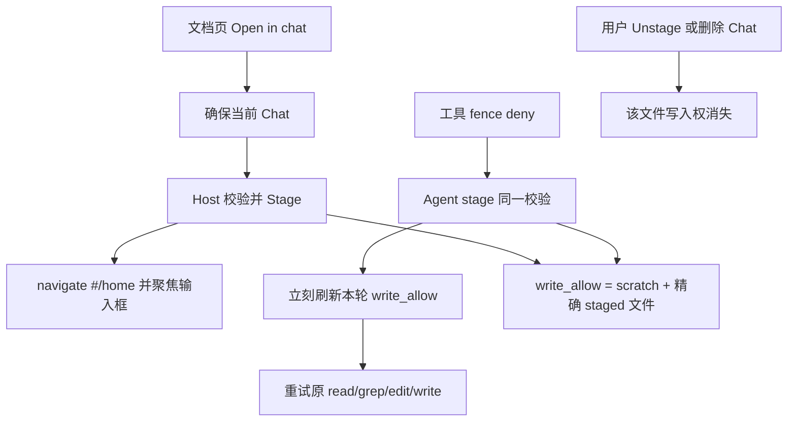

# Chat Stage 精确文件编辑授权技术方案

> 依据：`feature-20260903163820-3c7c6b5f` Approach 已交付决策（Stage-driven exact-file fence）。
> 日期：2026-09-04
> Todo：`task_9d097e7eb7be`

给人看的界面文案必须是英文。✅ Verified（`docs/biz/ui-build-constraints.md`）

---

## 1. 问题

Workbench Mac 需要：Notes / Knowledge 文档页和对话中出现的本地路径，都能在**当前 Chat** 里讨论并随后 `edit` / `write`；授权必须是精确常规文件，不能放开 deny 根目录。✅ Verified（决策 Problem / Acceptance）

---

## 2. 现状（实现 SoT）

### 2.1 写入围栏只覆盖 scratch

Binding `workbench` 展开时 `write_allow` 为空；`scratch_parent` 为 `{cache_dir}/agent-scratch`。✅ Verified（`src-tauri/src/services/workbench_path_fence.rs`）

每轮开始 `with_session_scratch` 把 `write_allow` **整表替换**为 `{cache_dir}/agent-scratch/{session_id}/`。✅ Verified（`path_fence/mod.rs` `with_session_scratch`；`agent/turn/run.rs` 约 L116–120）

`edit` / `write` 越界错误：`path is outside the write fence`。✅ Verified（`agent/tools/fs.rs`）

默认根：`workbench_root` / `knowledge_root` = `~/Code`；`cache_dir` = `~/.cache/lulu-workbench`。✅ Verified（`config/settings/types.rs`）

读允许：`$workbench_root` 加各知识仓 `$knowledge_root/{repo basename}`；读拒绝：这些树下的 `.git`。✅ Verified（`workbench_path_fence.rs`）

### 2.2 Stage 只记元数据，不校验围栏

`Session.staged[]`：`{ id: F*, path, title, kind? }`，不存文件体。✅ Verified（`agent/session/types.rs` `StagedEntry`）

Agent 工具 `stage` 只要求 path 非空，然后 `register_staged`。✅ Verified（`agent/tools/stage.rs`；`register_staged`）

同 path 再 stage 会再发一个新 `F*`，不复用。✅ Verified（`register_staged` 始终 `next_staged_handle` + `push`）

围栏在回合开始冻结；回合中 `stage` **不会**刷新 `turn_fence`。✅ Verified（`turn/run.rs` 只在回合开头构建 `turn_fence`，工具循环把同一引用传入 `invoke`）

`with_session_scratch` 会覆盖整个 `write_allow`，不能在其上直接「再调一次」来追加文件。✅ Verified（`write_allow = vec![scratch]`）

`is_under`：路径等于 root，或作为 path prefix。把**常规文件**放进 `write_allow` 时，该文件本身可通过；同名目录子路径也会被当成「在 root 下」。✅ Verified（`path_fence/mod.rs` `is_under`）

### 2.3 用户可撤、Agent 不能撤

已有 Host 命令 `unstage_chat_staged`（进行中的回合拒绝）；不是 Agent 工具。✅ Verified（`commands/ai_assistant.rs`；`unit-tests/commands/ai_assistant_chat_unstage.rs`）

Home `StagedList` 可打开 / 撤销。✅ Verified（`frontend/src/home/ui/staged-list.tsx`；`home/commands/staged.ts`）

文档页已有复制路径：Notes `btn-copy-path`，Knowledge `.kb-btn-copy-path`。没有「在对话中打开」。✅ Verified（`frontend/src/notes/page.tsx`；`knowledge/ui/viewer/shell.tsx`）

已有 `ensure_ai_assistant_session`、`create_chat_session`；**没有**可信 UI 的 Stage 命令。✅ Verified（`commands/ai_assistant.rs`；仓库无 `stage_chat_*` 命令）

跳转：`navigate('#/home')`。✅ Verified（`frontend/src/router/index.ts`）

新建 Chat 成功后会 `inputRef.focus()`；从其它页跳进 Home **不会**自动聚焦。✅ Verified（`frontend/src/home/page.tsx`）

### 2.4 分层

UI → invoke / ACL → Host command → Agent / Services。新 invoke 必须进对应 ACL。✅ Verified（`docs/architecture/arch-layer-constraints.md`；`workbench-coding-discipline.md` §4）

业务块内：ui 只画，commands 只做事。✅ Verified（`docs/architecture/ui-layer-constraints.md`）

---

## 3. 方案

一套 Host 协议，两处入口共用。

**写入允许** = 本 Chat scratch 目录 + 该 Chat `staged[]` 里每条**已校验的 canonical 常规文件**。目录、deny 根、相对路径一律拒绝。

**Stage 校验**（Agent `stage` 与 UI 命令共用）：

1. path 绝对、可规范化  
2. 存在且是常规文件（非目录、非 symlink 目标为目录）  
3. 当前 Binding 读围栏允许，且不在 read/write deny  
4. 同 canonical path 已有 `F*` 则复用，不新开 handle  

**同轮刷新**：`stage` 成功后，在本轮工具循环里重算 `turn_fence.write_allow`（scratch + 当前 session 全部合格 staged 文件），再让后续 / 重试工具看到新围栏。不要再次调用会清空 `write_allow` 的 `with_session_scratch` 而不追加 staged。

**文档页图标**（Notes 与 Knowledge）：

1. 确保当前 Chat（已有则复用，没有则 `ensure_ai_assistant_session` / 现有创建路径）  
2. 调**新的**可信 Host 命令（建议名 `stage_chat_document`），不是 Agent 工具  
3. `navigate('#/home')`  
4. 聚焦 composer  
5. **不发送**任何消息  

Tooltip / `aria-label`：`Open in chat`（英文界面）。✅ Verified（`ui-build-constraints.md`）

Home `StagedList` 继续作为打开与用户撤销面。Agent 仍无 `unstage`。

**排除**（决策）：URL→本地映射、剪贴板来源推断、自动发编辑提示、目录授权、deny 豁免、Agent 撤销、把全局 write fence 扩到全部可读文档。

**已接受代价**：Agent 可把可读、非 deny 的常规文件提升为当前 Chat 的写入目标。

**可逆**：代码可回到 scratch-only 并去掉图标；已有 Chat 的 `staged[]` 若要收回授权需单独清理。

---

## 4. 落地步骤

1. **共享校验 + 复用 `F*`**  
   Host 抽出 `validate_and_register_staged(session, path, title)`：校验后 `register_staged`；同 canonical path 返回已有条目。`agent/tools/stage.rs` 改为走这条，不再只检查非空。

2. **围栏：scratch + 精确文件**  
   回合开始与 `stage` 成功后使用同一函数：`with_session_scratch` 得到 scratch，再把合格 staged 文件 append 到 `write_allow`。目录不得进入该列表。

3. **同轮刷新**  
   `turn/run.rs` 在 Host `stage` 成功后替换 `turn_fence`（或内部 `write_allow`），保证同一轮下一次 `invoke` 使用新列表。

4. **可信 UI 命令**  
   新增 `stage_chat_document`（session + path）：同一套校验与注册；进行中回合的策略与现有 unstage 一致（拒绝或明确文档化）。写入 `lib.rs` + `permissions/write-api.toml`。前端只经 `host/api` invoke，参数 camelCase。✅ Verified（`workbench-coding-discipline.md` §1、§4）

5. **文档页入口**  
   Notes / Knowledge：ui 加图标，commands 里 ensure session → invoke → `navigate('#/home')`。不要在 page 里堆业务。

6. **Home 聚焦**  
   从文档页跳入后聚焦现有 composer（可在 Home commands / 挂载时处理）。不 `requestSubmit`、不预填发送。

7. **测试**（单测在对应域的测试树，不写进生产文件）。✅ Verified（`docs/test/unit-test-principles.md`）  
   - 合格文件：stage 后本轮 `edit`/`write` 成功；scratch 仍可写  
   - 目录 / deny / 相对路径：拒绝，围栏不变  
   - 同 path 复用 `F*`  
   - unstage / 删 Chat 后写入失败  
   - 文档页入口：Stage + 到 Home + 未发消息  
   - Chat 隔离：A 的 staged 不能写进 B 的围栏  

---

## 5. 验收

1. Notes 与 Knowledge 图标把当前合格文件 Stage 进当前 Chat，进入 Home，不发消息。  
2. fence deny 之后，成功的 `stage` 立刻刷新本轮围栏，同轮重试 `read`/`grep`/`edit`/`write` 可对该精确文件成功。  
3. `write_allow` = scratch + 精确 canonical staged 文件；目录、deny、相对路径仍拒绝。  
4. 用户 Unstage 或删除 Chat 后，该文件写入权消失。  
5. 同一 path 再 Stage 复用已有 `F*`。  

✅ Verified（决策 X acceptance_criteria）
