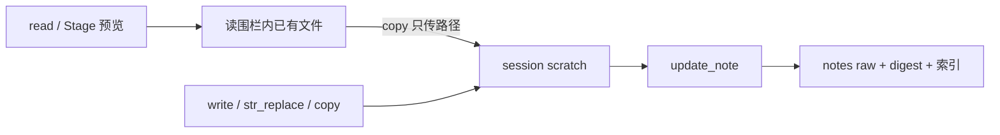

# Host 对话改稿与归档整体方案

**类型：** Analysis  
**关联待办：** `task_0a9d788642b1`  
**状态：** 代码已落地；Mac 应用需重建后实机验证

本文件是该待办的整体职责 SoT。分阶段文档若与本文冲突，以本文为准。

## 1. 职责是否清晰

运行时职责已经切开，可以执行：

| 角色 | 做什么 | 不做什么 |
|---|---|---|
| Stage | 登记、打开、预览已有文件 | 不授权 Host 直写该文件 |
| Host 文件工具 | 只在本会话 scratch 里起草、拷贝、打补丁 | 不写 notes raw / digest / 索引 |
| MCP `update_note` | 按归档 id 覆盖 raw，按规则写 digest，同步索引 | 不收正文（桌面/IDE）；不改 title / 译文 / 目录 |

✅ Verified（`turn/run.rs` `turn_fence_for_session`）：回合 `write_allow` 只来自 `with_session_scratch`。  
✅ Verified（`agent/tools/host.rs`）：`write` / `str_replace` / `copy` 说明均限定 session scratch。  
✅ Verified（`mcp_host/.../notes/update_note.rs`）：桌面/IDE 用 `source_path`，目标由 `id → common_path`。

曾不清晰的是「Stage 之后能不能写」。早期围栏把 staged 精确文件加入可写集，模型就会 `write` F1 raw，再 `update_note` 指回同一文件。✅ Verified（`workbench_chat_4419c408dfe4d82b0e9c5bc703e39f7a`）  
这一层已收掉。分阶段文档里「Stage 直写并存」作废。

仍分开、但不在本方案补的：桌面弹窗 `save_entry`；Knowledge 没有对等更新 MCP。对话里也不能再直写知识库文件。

## 2. 问题

长生成失败首先表现为界面「调用超时」，日志 `LLM timeout reading stream`。不是条数帽或上下文窗口爆了。✅ Verified（`sess_84dafc26cec6`、`host-llm-idle-timeout-120s/solution-and-plan.md`）

空闲窗口加到 120 秒之后，同类重写仍会在模型乱写路径上耗尽时间。✅ Verified（同会话后续超时；`write` 新文件名撞围栏）

根因有两层：

1. 模型看不到本会话可写目录的绝对路径。  
2. 即便写对了 scratch，归档没有「按 id 提交、Host 读文件」的 MCP；Stage 直写又让它走捷径覆盖 raw。

## 3. 整体方案

scratch 目录：`{cache_dir}/agent-scratch/{session_id}/`。✅ Verified（`path_fence` `session_scratch_root`；`workbench_path_fence` 的 `scratch_parent`）

### 3.1 Host：只改草稿

- `write`：新正文或整篇重写，目标必须在 scratch。  
- `str_replace`：在 scratch 已有文件上打补丁。  
- `copy`：从读围栏拷进 scratch，只传路径，覆盖已有 dest；dest 不能是 scratch 根，也不能是 notes raw。✅ Verified（`fs.rs` `copy`）  
- 工具说明里的 `{session_scratch}` 在发送前换成真实路径；不列 F*。撞栏原文仍是 `path is outside the write fence`。✅ Verified（`catalog.rs` `fill_session_scratch`）

### 3.2 MCP：只提交归档

`update_note(id, source_path|content, digest[, digest_body])`：

- 桌面/IDE：`source_path` 必须在 allow-list；`cache_dir`（含 scratch）可用。✅ Verified（`source_path_allow.rs`）  
- mobile：`content`，不收 `source_path`。  
- 目标路径只来自索引 `common_path`，不由调用方指定 dest。  
- digest：`auto|always|never`；要写 digest 时同一次带 `digest_body`。已有 digest 可覆盖。  
- 成功后同步关键词索引并 `produce("notes")`。  
- 不改 title / project / theme / created_at / source_type / translations。

### 3.3 Stage：只打开

`get_note_content` / `stage` 把文件登记为 F*，供人看、供 `read`。不再把该路径加入 `write_allow`。

## 4. 对话里怎么改一篇笔记

**整篇重写**（新生成全文）：`write` → scratch → `update_note(source_path=该文件)`。需要预览再 `stage`。

**小改**（换标题、改一段）：`copy` 原文 → scratch → `str_replace` → `update_note`。不必把全文再 `write` 一遍。

不要：`write` / `str_replace` / `copy` 打 notes raw；不要 `update_note(source_path=刚写过的 raw)`。

## 5. 分阶段如何叠上

| 子任务 | 作用 | 相对本文 |
|---|---|---|
| sub_01 空闲超时 120 秒 | 降低 SSE 空闲误杀 | 保留；不是主修复 |
| sub_02 说明填 scratch 路径 | 模型看得见可写目录 | 保留；说明已改为「仅 scratch」 |
| sub_03 `update_note` | 归档提交入口 | 保留契约；「Stage 直写并存」作废 |
| sub_04 write 仅 scratch + `copy` | 关掉直写洞，小改不必整篇 `write` | 当前围栏 SoT |

空闲超时只让「模型还在想」多撑一会儿。省 token 和一致性，靠 scratch + `update_note`，不靠再加超时。

## 6. 不改

条数帽、Android、gateway 60 秒、桌面 `save_entry`、在说明或错误里列 staged 路径、`update_note` 的 title / 译文 / 挪目录、Knowledge 更新 MCP。

## 7. 验证目标

- Host `write` 打已 Stage 的 notes raw → 围栏拒绝，文件不变。  
- `copy` 到 scratch 成功；`copy` dest=raw 或 dest=scratch 根失败。  
- `update_note(source_path=scratch)` 覆盖 raw，并按 digest 规则更新摘要与索引。  
- 发送给模型的 `write` / `copy` 说明含本会话 scratch 绝对路径，不含 F* 路径。

需重建并重启 Mac Workbench 后实机走一遍「小改」和「整篇重写」。
