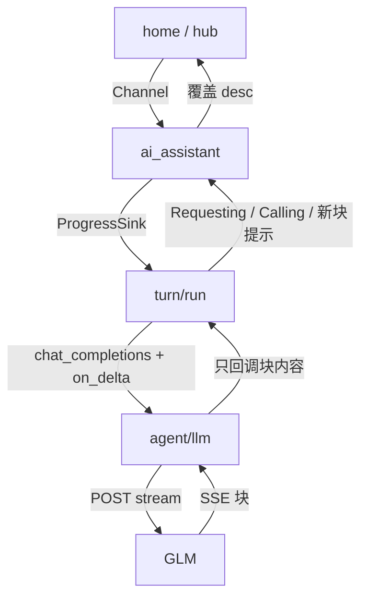

# Host LLM SSE 流式与进度提示技术方案与实施计划

官方接口说明：<https://docs.bigmodel.cn/cn/guide/develop/openai/introduction>  
官方流式说明：<https://docs.bigmodel.cn/cn/guide/capabilities/streaming>

**状态：** Implemented  
**关联待办：** `task_a697e8487834`

## 问题与目标

✅ Verified（本机 `sess_aac37bf8affe` 与 `agent-error.log`）：Agent 连续 8 次 `read` 成功后，下一轮 GLM 调用在约 60 秒超时，未执行 `write`/`edit`。当时客户端写死 `"stream": false` 并用 `resp.text()` 一次收齐整包。

✅ Verified（落地后 `src-tauri/src/agent/llm.rs`）：同一条 `POST …/chat/completions` 现为 `"stream": true`，按行解析 SSE `data:` 块，拼回 `AssistantMessage`。超时看连接/首包与每一块之后的空闲，不再按整包墙钟掐断。

✅ Verified（`src-tauri/src/agent/turn/run.rs`、`src-tauri/src/agent/turn/history.rs`）：`run.rs` 仍在一次调用返回完整 `AssistantMessage` 之后才 `invoke` 工具；`LlmError::Timeout` 仍映射为「调用超时，请稍后重试。」

## 模块调用（Turn 53）

✅ Verified（`src-tauri/src/agent/llm.rs`、`src-tauri/src/agent/turn/run.rs`）：进度文案只由 `turn/run.rs` 发出。`llm.rs` 只在每块到达时回调提示字符串，自己不碰 `ProgressSink`。

✅ Verified（`src-tauri/src/commands/ai_assistant.rs`、`src-tauri/src/agent/progress.rs`、`frontend/src/home/commands/hub.ts`）：进度仍是 L1 将 `Channel<ProgressDesc>` 包成 `ProgressSink`；前端把 `desc` 写入 `progressByChat` 覆盖一行。未改字段、未新开通道。

✅ Verified（`src-tauri/src/agent/turn/run.rs`）：问模型前仍发 `Requesting…`；有新块时覆盖为 `Receiving…` / `Preparing {name}…` / `Thinking…`；执行工具前仍发 `Calling {name}…`。

## 方案

### LLM 请求

✅ Verified（`src-tauri/src/agent/llm.rs`）：`chat_url` 仍拼 `{base}/chat/completions`（`/v1` 或智谱 `/v4`）；鉴权与 `messages`/`tools` 字段不变；请求体 `"stream": true`。

✅ Verified（`src-tauri/src/agent/llm.rs`、智谱流式页）：按行解析 `data: {json}`，增量取 `choices[0].delta.content`（或 `message`），结束为 `data: [DONE]`。

✅ Verified（`llm_assembles_sse_content_and_tool_call_deltas`）：按 `delta.tool_calls[*].index` 拼接 `id` / `name` / `arguments`，收齐后才返回 `AssistantMessage`。

❌ Unresolved：本仓库仍未对线上 `glm-5.2` 抓过真实流式响应。`tool_calls` 拼装按 OpenAI 兼容的 `index` 增量（Z.ai Stream Tool Call 说明），未发 `tool_stream`。

### 超时

✅ Verified（reqwest 0.12 阻塞 `Response::read`）：`Client::builder().timeout(d)` 对 `send()`（连上并读到响应头）是一次期限；对随后每次 body `read` 重新计时。按行读 SSE 时，这就是「有新块则续命」。

✅ Verified（`llm_idle_timeout_after_first_sse_chunk`、`llm_keeps_reading_when_chunks_keep_arriving`）：首块之后空闲超过窗口 → `LlmError::Timeout`；总时长超过窗口但块间隙更短 → 继续读完。

### 进度回调

✅ Verified（`chat_completions_with_timeout` 的 `on_delta`）：每有新正文、思考碎片或工具参数碎片，回调一次已拼好的提示字符串。`llm.rs` 不持 Channel、不调用 `emit_progress`。

✅ Verified（`run.rs`、`run_loop_emits_requesting_progress`）：`run.rs` 把 `sink` 包进 `on_delta`；文本回复会出现 `Requesting…` 与 `Receiving…`，不会出现 `Calling`。

### 循环形状

✅ Verified（`run.rs` 与既有 loop 工具测试）：`loop` 仍是问模型 → 有 `tool_calls` 则执行 → 再问。一次网络请求的多次 SSE 块不会变成多次 `invoke`。

## 实施计划

1. ✅ Verified：`llm.rs` 打开 `stream`，按行解析 SSE，拼出 `AssistantMessage`，每块调用 `on_delta`。
2. ✅ Verified：超时改为按次读空闲；`LlmError::Timeout` 文案不变。
3. ✅ Verified：`run.rs` 用现有 `progress::emit_progress` 转发 `on_delta`。
4. ✅ Verified：`unit-tests/agent/mod.rs` 断言 `body["stream"] == true`，并覆盖 SSE 拼装、空闲超时、`on_delta`；loop 进度测试断言 `Receiving…`。测试体仍只在 `unit-tests/`。

## 验收

1. ✅ Verified（`llm_keeps_reading_when_chunks_keep_arriving`）：持续出块时不因总时长超过窗口而超时。⚠️ 线上超过 60 秒的 GLM 生成未在本轮实机验证。
2. ✅ Verified（loop 单测）：`ProgressDesc` 随新块覆盖。⚠️ 桌面 UI 未在本轮点过。
3. ✅ Verified（既有 loop 工具测试）：收齐前不 `invoke`；返回后的 `tool_calls` 仍依次执行。
4. ✅ Verified（既有错误分型测试）：超时、鉴权失败等仍走 `map_llm_error`。

## 排除

✅ Verified：本轮未改 MCP Server、MCP Streamable HTTP、Stage 写围栏、Host `read` 默认 50 行；未实现 Cursor `AgentService.Run` 双向流；未做 token 级打字机气泡。
