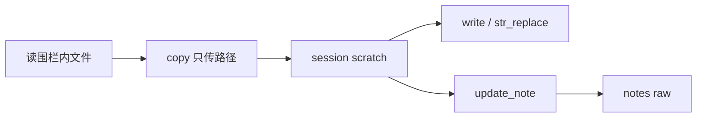

# Host write 仅 scratch 并增加 copy

**状态：** Implemented  
**关联待办：** `task_0a9d788642b1` / `task_0a9d788642b1_sub_04`

本对话锁定：`write` / `str_replace` 只写 `{cache}/agent-scratch/{session_id}/`；新增 Host `copy`，源在读围栏，**目标只能是 session scratch**；归档提交走 `update_note`。Stage 只登记、不再授权直写。

## 问题与目标

✅ Verified（`workbench_chat_4419c408dfe4d82b0e9c5bc703e39f7a`）：模型先 `write` 全文到 F1 notes raw，再 `update_note(source_path=同一 raw)`。F2 scratch 已有同一正文。

✅ Verified（改前 `path_fence/mod.rs` `with_session_writes`）：每轮曾把 staged 精确文件加入 `write_allow`。该函数已删除。

✅ Verified（`agent/tools/fs.rs`）：`write` / `str_replace` 共用 `allows_write`；`write` 是裸 `std_fs::write`，不写 digest、不同步索引。

目标：Host 文件写入只留 session scratch；小改用 `copy`（只传路径）再 `str_replace`；归档只走 MCP。不改 Stage 登记、桌面 `save_entry`、Android。

## 方案

✅ Verified（`turn/run.rs` `turn_fence_for_session`）：只调用 `with_session_scratch`。

✅ Verified（`path_fence/mod.rs`）：`with_session_writes` 已删除；`write_allow` 仅为 `{scratch_parent}/{session_id}`。

✅ Verified（`agent/tools/host.rs`、`fs.rs` `copy`）：`source_path` 走 `validate_stage_file`；`dest_path` 必须 `allows_write`，且不能是 scratch 根或已有目录；覆盖已存在的 dest；`std_fs::copy` 拷字节。

✅ Verified（`host.rs` 说明）：`write` / `str_replace` / `copy` 只写 session scratch；`{session_scratch}` 发送前替换。撞栏仍是 `path is outside the write fence`。

不改：条数帽、Android、gateway 超时、桌面 `save_entry`、MCP `update_note` 契约、在说明或错误里列 F* 路径。

## Plan

1. ✅ Verified（`path_fence/mod.rs`、`turn/run.rs`、`path_fence_tests.rs`、`ai_assistant_chat_stage.rs`）：围栏只留 scratch；staged 文件不可写。
2. ✅ Verified（`host.rs`、`fs.rs`）：`copy` 入库；`write` / `str_replace` 说明改为仅 scratch。
3. ✅ Verified（本会话 cargo，相关 11 条）：copy 进 scratch、拒 dest 在读根、拒 dest=scratch 根、write 打 staged 撞栏、回合工具含 copy。
