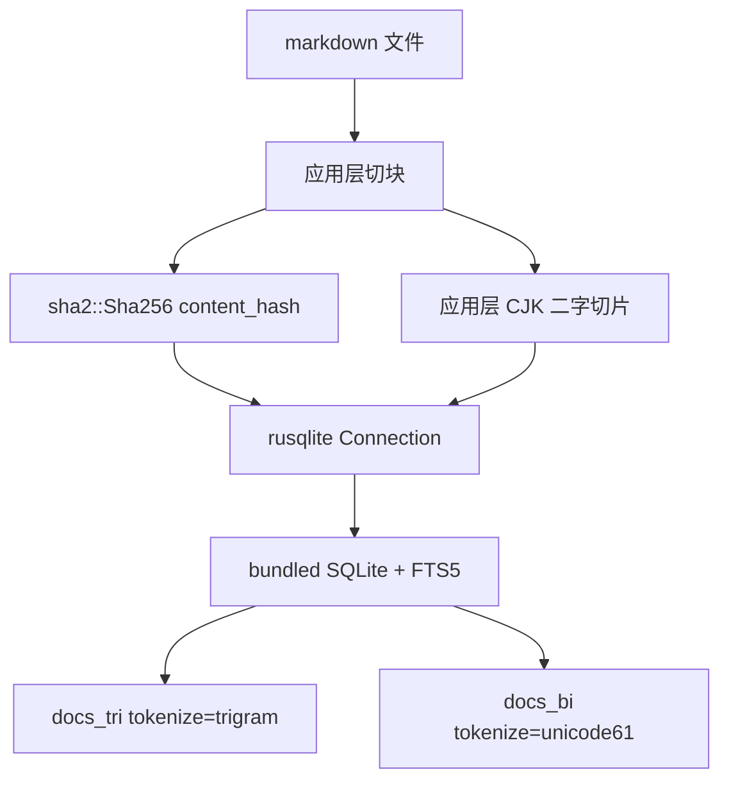

# 索引构建关键技术

SQLite FTS5：<https://www.sqlite.org/fts5.html>  
FTS5 trigram：<https://www.sqlite.org/fts5.html#the_trigram_tokenizer>  
FTS5 unicode61：<https://www.sqlite.org/fts5.html#unicode61_tokenizer>  
FTS5 UNINDEXED：<https://www.sqlite.org/fts5.html#the_unindexed_column_option>  
FTS5 辅助函数：<https://www.sqlite.org/fts5.html#auxiliary_functions>  
SQLite WAL：<https://www.sqlite.org/wal.html>  
`PRAGMA user_version`：<https://www.sqlite.org/pragma.html#pragma_user_version>  
rusqlite：<https://docs.rs/rusqlite/0.32.1/rusqlite/>  
libsqlite3-sys bundled 构建：<https://docs.rs/crate/libsqlite3-sys/0.30.1>  
sha2：<https://docs.rs/sha2/0.10.9/sha2/>  
regex：<https://docs.rs/regex/1.12.3/regex/>

**配套文档：** `technical-solution.md`（设计 why）、`implementation-plan.md`（落地与验收）  
**范围：** Turn 15 所列外部技术，以及它们在本次索引构建里怎么用。不含模块拓扑、不含验收清单。

---

## 一句话

本次建索引的外部技术栈是 **编入进程的 SQLite FTS5**。`sha2` 只算内容指纹，`regex` 不参与建索引。没有第二进程、没有分词 crate、没有向量运行时。✅ Verified（`src-tauri/Cargo.toml`；`keyword_index/{store,collect,bigram}.rs`）

---

## 1. rusqlite bundled：把 SQLite 编进 App

| 项 | 事实 |
|---|---|
| crate | `rusqlite = { version = "0.32", features = ["bundled"] }` ✅ Verified（`Cargo.toml`） |
| 锁定版本 | `rusqlite 0.32.1` → `libsqlite3-sys 0.30.1` ✅ Verified（`Cargo.lock`） |
| 为什么 bundled | 编译时编入 `sqlite3.c`，不依赖系统 SQLite，也不另起搜索进程 ✅ Verified（`libsqlite3-sys` 文档；`store.rs::open` 只 `Connection::open` 本地文件） |
| FTS5 是否自带 | bundled 构建加 `-DSQLITE_ENABLE_FTS5` ✅ Verified（本机 cargo 缓存 `libsqlite3-sys-0.30.1/build.rs` 第 129 行） |
| 落盘位置 | `{cache_dir}/keyword-index.sqlite`，常量 `INDEX_FILE` ✅ Verified（`store.rs`） |
| 打开时 pragmas | `PRAGMA journal_mode=WAL`；`PRAGMA foreign_keys=OFF` ✅ Verified（`store.rs::open`） |

WAL 让读写可并发，适合「启动后台建索引」和「前台搜索」同时发生。✅ Verified（官方 WAL；`lib.rs` 启动线程调 `run_all_reindex_blocking`）

---

## 2. FTS5 虚表：一行一块，不是一篇一篇

FTS5 是 SQLite 的全文虚表引擎。本次建两张表，同库同事务写。✅ Verified（官方 §4；`store.rs::CREATE_TABLES`、`insert_chunk`）

| 表 | tokenizer | 索引列 | 用途 |
|---|---|---|---|
| `docs_tri` | `trigram` | `title`、`body` | 字面权威。≥3 字查询、grep 预筛、混合查询的主 `MATCH` |
| `docs_bi` | `unicode61` | 仅 `body`（写入的是二字切片，原文放 `orig UNINDEXED`） | 只服务「全部词长为 2」的查询 |

`tokenize=` 是**表级**选项，不能按列指定。这是必须拆两张表的原因。✅ Verified（官方 §4.3；技术方案 Q4）

`UNINDEXED` 列不进倒排，但仍可 `SELECT` / `WHERE`。`chunk_id`、`doc_id`、`category`、`layer`、`path`、`common_path`、`repo`、`content_hash`、`created_at`、`mtime` 都标了 `UNINDEXED`。✅ Verified（官方 §4.1；`store.rs` 建表 SQL）

`mtime` 只在 `docs_tri`：grep 用「文件现在的修改时间 vs 建索时记下的时间」决定能不能跳过。✅ Verified（`store.rs`；`grep_prefilter.rs::should_scan_file`）

---

## 3. trigram：按连续 3 个 unicode 字符建倒排

官方定义：trigram 把每个连续 3 字符当作一个 token，让 FTS5 做子串匹配，而不只是「整词」。✅ Verified（官方 §4.3.4）

官方硬约束，直接决定建索策略：

- 不足 3 个 unicode 字符的全文 `MATCH` **不命中任何行**。✅ Verified（官方 §4.3.4 Notes）
- 未开 `remove_diacritics` 时，`LIKE` / `GLOB` 可用索引；带 `ESCAPE` 的 `LIKE` **不能**走该优化。✅ Verified（官方 §4.3.4）

本次用法：

- 建索：`body` 原文写入 `docs_tri`，由引擎切 trigram，应用不再切 3-gram。✅ Verified（`store.rs::insert_chunk`）
- 查询：词长 ≥3 走 `docs_tri MATCH`；混合查询里的二字词改走 `body LIKE`，不指望 trigram `MATCH`。✅ Verified（`query.rs::classify_query`、`query_tri`）
- grep 预筛：从正则抽出长度 ≥3 的字面量，再 `docs_tri MATCH`，得到候选 `path`。抽不到或有 `|` 则全扫。✅ Verified（`grep_prefilter.rs`）

「角色」两个字无法靠 `docs_tri MATCH` 召回，所以才有下一节。✅ Verified（官方 §4.3.4 + `classify_query` 词长 2 → `QueryRoute::Bi`）

---

## 4. unicode61 + 应用侧 CJK 二字：补 trigram 的盲区

unicode61 是 FTS5 默认分词器：按 Unicode 6.1 把字母/数字类跑成词，空白和标点当分隔符。中文连续段会被当成**一个超长 token**，不会自动切成二字。✅ Verified（官方 §4.3.1）

因此二字倒排不是引擎送的，是应用先切再写入：

1. `bigram.rs::cjk_bigram_text`：CJK 连续段做重叠二字（「角色扮演」→ `角色 色扮 扮演`）；非 CJK 段原样保留为一个词。✅ Verified（`bigram.rs`）
2. 切好的字符串写入 `docs_bi.body`；原文进 `orig`，供命中后切片段。✅ Verified（`store.rs::insert_chunk`）
3. 纯二字查询：`docs_bi MATCH '"角色"'`，片段用应用层窗口，不用 `snippet()`。✅ Verified（`query.rs::query_bi`）

`docs_bi` 不是第二份真值，只是二字加速表。字面权威仍是 `docs_tri`。✅ Verified（技术方案「数据流不变量」2；`grep_prefilter` 只读 `docs_tri`）

---

## 5. 建索引时的增量：sha2，不是 FTS5

| 项 | 事实 |
|---|---|
| crate | `sha2 0.10.9`，`Sha256::digest(body.as_bytes())` 十六进制 ✅ Verified（`Cargo.lock`；`collect.rs::content_hash`） |
| 何时算 | `SourceChunk::from_text`，对**切块后的 body** 哈希，不是整文件 ✅ Verified（`collect.rs`） |
| 何时跳过 | `upsert_chunks`：开头一次 `SELECT chunk_id, content_hash, mtime` 进 HashMap，再按 `chunk_id` 判断。hash 相同 → 不改两表正文；若 `mtime` 变了只 `UPDATE docs_tri.mtime`。逐条 `WHERE chunk_id=?` 在 FTS5 `UNINDEXED` 列上是全表扫，1.7 万块时约 N² ✅ Verified（`store.rs`；2026-09-05 `sample` 卡在 `existing_hash`） |
| 何时整篇替换 | 写路径 `replace_path_chunks`：先删该 `path` 两表行，再插入新块，避免文章变短留下尾块 ✅ Verified（`store.rs`） |
| 幽灵删除 | `rebuild` 末尾 `delete_ghosts`：范围内有 `chunk_id` 但本轮采集没有的，两表一起删 ✅ Verified（`store.rs::rebuild`） |

`sha2` 不检索。它只回答「这块要不要重写」。✅ Verified（`content_hash` 列为 `UNINDEXED`）

schema 升级靠 `PRAGMA user_version` 对照 `SCHEMA_VERSION = 2`；不符则 `DROP` 两表再 `CREATE`。不做行迁移。✅ Verified（官方 pragma；`store.rs::open`）

---

## 6. 查询侧才用、不参与建索引

这些在 Turn 15 出现，但**建索引不调用**：

| 技术 | 用途 | 依据 |
|---|---|---|
| `bm25()` | ≥3 字与纯二字查询的排序 | 官方 §5.1.1；`query.rs` `ORDER BY bm25(...)` ✅ Verified |
| `snippet()` | ≥3 字路径的片段；列号 `8` 对应 `docs_tri.body` | 官方 §5.1.3；`query_tri` ✅ Verified |
| `regex` crate `1.12.3` | Agent `grep` 围栏内逐文件扫行 | `agent/tools/fs.rs`；索引只缩小候选文件 ✅ Verified |
| `serde_json` | 把命中折成桌面 / MCP JSON | `query.rs` 桌面适配器 ✅ Verified |

官方：辅助函数只能出现在 FTS 查询（`MATCH`，或 trigram 表上的 `LIKE`/`GLOB`）里。✅ Verified（官方 §5）

---

## 7. 明确不依赖

| 技术 | 状态 |
|---|---|
| Meilisearch / 系统 `meilisearch` 二进制 | 已删除 ✅ Verified（技术方案 Q1；`integrations/search` 已不存在） |
| jieba 或其它中文分词 crate | 未加入 `Cargo.toml` ✅ Verified |
| walkdir | 未加入；采集用 `std::fs` ✅ Verified（`collect.rs`） |
| fastembed / ONNX / BGE-M3 | 语义路线已排除 ✅ Verified（`semantic-search-research`） |
| 系统 SQLite、独立搜索进程 | 无 ✅ Verified（`store.rs::open` 只开本地文件） |
| `git2` | 仓库里有，但 `reindex_all` 不拉仓；只给 Sync 菜单 / 单仓 Sync ✅ Verified（`reindex.rs`；技术方案入口契约） |

---

## 对照：建一条索引实际经过哪些技术

以一篇笔记写入 `docs_tri` + `docs_bi` 为例。✅ Verified（`collect.rs` → `chunk.rs` → `store.rs` → `bigram.rs`）

1. `std::fs` 读文件，记 `mtime`（纳秒）。
2. 按 ATX 标题切块，单块上限 1200 字，短纯标题（<80 字）并入下一块。这是应用规则，不是外部库。
3. `sha2` 对块正文做指纹。
4. rusqlite 在一个事务里：`docs_tri` 写入原文（trigram 由引擎切）；`docs_bi` 写入 `cjk_bigram_text(body)`（unicode61 由引擎切）。
5. hash 未变则跳过正文；整库重建再扫一遍幽灵 `chunk_id`。

查询怎么路由、桌面如何露 `raw`、MCP 如何 503，见 `technical-solution.md`。
