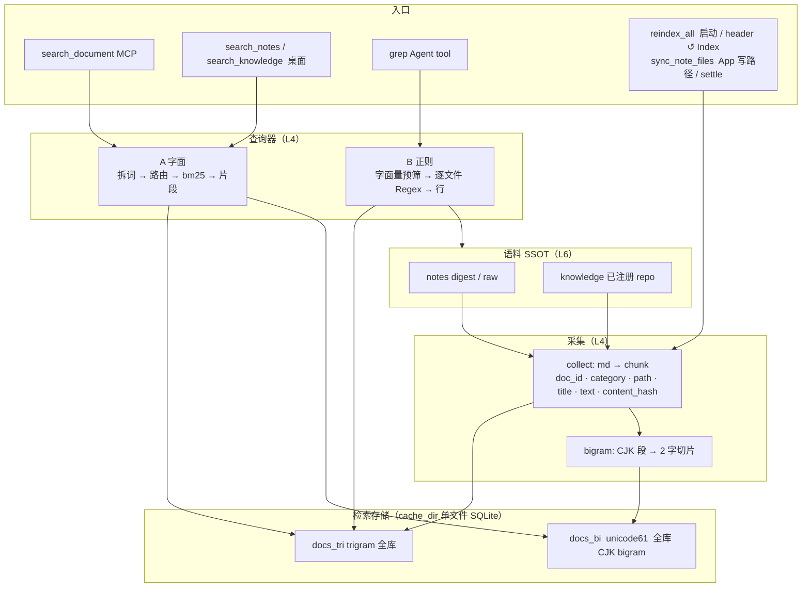

# 关键词检索 FTS5 技术方案

SQLite FTS5：<https://www.sqlite.org/fts5.html>  
libsqlite3-sys bundled 构建：<https://github.com/rusqlite/rusqlite/blob/master/libsqlite3-sys/build.rs>  
Cursor 正则索引：<https://cursor.com/blog/fast-regex-search>  
替代前基线：`src-tauri/src/services/knowledge/search_document.rs`（HEAD `587387ff`，Meili 合并版）

**对齐来源：** 2026-09-05 `/converge` Q1–Q5  
**配套文档：** `implementation-plan.md`（实施计划与验收）；`index-build-key-technologies.md`（建索引用到的外部技术）  
**前序调研：** `docs/archive/semantic-search-research/mvp-v1|v2|v3/`（语义检索 V1–V3，已证伪）

本文回答"为什么这样设计"。落地顺序、文件清单、验收状态见实施计划。

---

## 问题

✅ Verified（HEAD `587387ff`：`host/runtime.rs`、`integrations/search/meili_backend.rs`、`index_build/{workbench,knowledge}.rs`、`workbench_read/notes_catalog.rs`、`knowledge/mcp.rs`、`services/settle.rs`）：字面检索依赖外置 Meilisearch 进程。App 启动时尝试拉起系统 `meilisearch` 二进制；`search_notes` / `search_knowledge` / settle upsert 经 HTTP 调用；`workbench` 与 `knowledge` 两套索引分别重建。Meili 未运行时三处入口返回 `503 unavailable`。

✅ Verified（2026-09-05 实机日志，见 `semantic-search-research/mvp-v3`）：BGE-M3 全库重嵌预计约 2 小时，峰值物理内存 26.4 GiB，结果含小标题噪声、分数平坦。语义路线在当前体量与硬件上判定不可靠。

✅ Verified（HEAD `agent/tools/fs.rs`）：Agent `grep` 工具为 Rust 正则逐文件扫描，与任何索引无关，80 条命中上限。

✅ Verified（2026-09-05 实测）：knowledge 已注册 20 仓 705 个 md / 7.7 MB；notes 1136 个 md / 11.3 MB（digest 0.4 MB、raw 10.9 MB）；`rg` 全量扫描 30 ms。用户前提：笔记增长快速。

✅ Verified（`libsqlite3-sys 0.30.1` `build.rs` 第 129 行 `-DSQLITE_ENABLE_FTS5`）：`rusqlite = { features = ["bundled"] }` 编入 FTS5，无需额外依赖。

---

## 目标

一句话：**把字面检索从"外置进程 + HTTP"改成"进程内单文件 SQLite"，同时让 Agent `grep` 在笔记增长后仍保持秒内响应。**

约束：

- 三处入口（`search_document`、桌面搜索、settle upsert）的返回形状不变，前端不改数据契约。
- 中文二字词（如「角色」）必须可查。
- `grep` 结果集与全扫一致，索引只做加速，不做真值。

---

## 已排除路线

| 路线 | 排除理由 |
|---|---|
| BGE-M3 语义索引（全库 / 仅 notes） | 重嵌耗时与内存不可接受，质量未达预期；见 research 目录 |
| 扫描 + 手写打分，不建索引 | Meili 还服务桌面搜索与 settle upsert，需要排序、片段、过滤三件；手写等于重造 FTS5 已有的 `bm25()` / `snippet()` / `WHERE` |
| jieba 分词 + unicode61 | 个人笔记生造词多、查询方为 Agent，分词不一致导致漏召回；加词典依赖 |
| 仅 `LIKE` 回退处理二字词 | 二字 `LIKE` 走不了 trigram 索引，退回全表线性扫，随笔记增长退化 |
| 单张表、两列不同 tokenizer | ✅ FTS5 `tokenize=` 为表级选项，不可按列指定 |
| `grep` 本轮不接索引 | 用户以笔记增长为前提要求本轮接入 |

---

## 设计决议

| # | 议题 | 决议 | 为什么 |
|---|---|---|---|
| Q1 | Meili 替代范围 | **全替。** `search_document`、桌面 `search_notes` / `search_knowledge`、settle upsert 全部改走 FTS5；删除 `MeiliBackend`、autostart、Meili reindex、`meili_url` / master key / 设置字段 / Keychain 项 | 半替会留下两套真值和两条运维路径；索引可秒级重建，没有数据迁移价值 |
| Q2 | 语义代码 | **删除。** 采集与切块规则在新模块重建：按 ATX 标题切块，单块上限 1200 字符，无标题整篇一块 | 语义模块已证伪；切块规则本身在 V1 验证过，可复用 |
| Q3 | `grep` 预筛 | **本轮接入。** 从正则抽取长度 ≥3 的连续字面量 → `docs_tri` 取候选 `path` → 围栏内对候选逐文件正则出行。抽不到字面量时全扫。**不变量：预筛与全扫结果集一致** | trigram 索引天然能回答"哪些文件含这个 ≥3 字子串"；未入索引的文件仍然扫描，所以只会缩小候选、不会漏 |
| Q4 | 少于 3 字的查询词 | **D-lite。** `docs_tri`（trigram）为主表；`docs_bi`（unicode61，应用侧生成的 CJK bigram）只服务"全部词长为 2"的查询。混合查询：主表 `MATCH` ≥3 字词，再对候选做二字 `LIKE` 过滤。纯二字查询走 `docs_bi`，片段由应用层切窗。一字查询返回空 | ✅ FTS5 §4.3.4：trigram 表上不足 3 个 unicode 字符的 `MATCH` 不命中。二字词是中文高频形态，不能靠全表 `LIKE` |
| Q5 | 行粒度 | **一行 = 一个 chunk，合并短块。** 少于约 80 字的纯标题块并入下一块，阈值为常量。`search_document` 按 `doc_id` 折叠取最高分块 | 纯标题块会以高 bm25 排前却无正文可读；折叠让一篇文档只出现一次 |

不在范围：语义检索任何形式、Meili 数据迁移、`grep` 的字符类 / 分支拆解（Cursor 式 n-gram 树）、跨表 `bm25` 合并、二字 `snippet()` 原生化。

---

## 技术依赖

```text
SQLite（rusqlite bundled，已含 FTS5）
 └─ FTS5 虚表引擎
     ├─ docs_tri  tokenize = trigram        ← 查询器 A 主路径；查询器 B 预筛
     │    ├─ MATCH / LIKE                   ← A 必用；B 仅预筛时用
     │    │    ├─ bm25()                    ← 仅 A
     │    │    └─ snippet()                 ← 仅 A（≥3 字路径）
     │    └─ （表外）regex 逐文件扫行        ← 仅 B
     └─ docs_bi   tokenize = unicode61      ← 仅 A 的纯二字查询
          └─ MATCH bigram 短语              ← 片段由应用层切窗
```

| 技术 | 用途 | 状态 |
|---|---|---|
| FTS5 + trigram | `docs_tri` | ✅ bundled 已启用 |
| FTS5 + unicode61 | `docs_bi` | 同上 |
| `bm25()` / `snippet()` | 查询器 A | 随 FTS5 |
| `regex` crate | 查询器 B | ✅ 已有 |
| Meilisearch / fastembed / ONNX Runtime | — | 移除 |

✅ FTS5 官方约束（§4.3.4）：trigram 表上不足 3 个 unicode 字符的 `MATCH` 不命中；`LIKE` / `GLOB` 仅在 `remove_diacritics` 未开时可用索引；辅助函数只能出现在 FTS 查询中。

---

## 部件与边界



| 部件 | 职责 | 边界 |
|---|---|---|
| **collect** | 唯一采集入口。notes 与 knowledge 切成同一种 chunk，算 `content_hash`，合并短标题块 | 不区分下游 |
| **bigram** | 对 chunk 文本中的 CJK 连续段生成二字切片，空格分隔 | 非 CJK 段原样保留为词 |
| **docs_tri** | 字面检索权威。`category` / `layer` / `path` / `doc_id` / `chunk_id` 为列，`WHERE` 过滤 | 不分表、不分库 |
| **docs_bi** | 纯二字查询的倒排 | 不参与 ≥3 字查询、不参与 grep |
| **查询器 A** | 拆词 → 按词长路由 → 排序 → 片段 → 按 `doc_id` 折叠 | 不返回行号 |
| **查询器 B** | 正则 → 字面量预筛 → 围栏内逐文件扫 → `文件:行号:整行` | 正确性只依赖文件系统；索引只减候选 |

---

## 入口契约

| 入口 | 走哪条 | 返回形状（与替代前一致） |
|---|---|---|
| `search_document(q, limit)` | A，全库 | `{ items: [{ id, title, snippet, category }] }`（✅ HEAD `search_document.rs`） |
| `search_notes(q, catalog, limit)` | A + `WHERE category='notes' AND layer='raw'`（catalog → `common_path` 前缀） | `{ items: [{ note_id, catalog, title, created_at, matches: [{ snippet }] }] }`（✅ `notes_catalog.rs::project_raw_search_hits`）；索引文件不存在时 `{ error: "not_indexed", _status: 503 }` |
| `search_knowledge(q, limit)` | A + `WHERE category='knowledge'` | `{ items: [{ id, title, snippet }] }`（✅ `knowledge/mcp.rs`）；缺索引同上 503 |
| 桌面 `search_workbench` / `search_knowledge` | A + category 过滤；notes 命中 `layer` 固定输出 `raw`（digest 只参与召回，露出的是笔记本身） | Meili 形状 `{ hits: [{ …, body, _formatted.body }] }`；索引文件不存在时 `{ hits: [], error: "not_indexed" }` |
| `grep(pattern, path?)` | B；文件 `mtime` 晚于索引记录 → 强制扫描 | 行列表，80 条上限（✅ `fs.rs`，不变） |
| `reindex_all`（启动自动 + header ↺ Index） | notes → knowledge 顺序 collect → 两表事务写；按 `content_hash` 跳过未变块；删除幽灵行；**不拉仓** | 两个 `JobState` 槽位；`get_reindex_all_status` 合并状态 |
| App 内笔记写路径 | `sync_note_files`：按路径整篇替换 / 删除该文件全部块 | create / save / delete / move；索引文件不存在时 no-op |
| settle 写时 | 单篇 chunk 化后按路径替换两表 | 替代 `meili_upsert_best_effort`；索引文件不存在时 no-op |

替代前 `search_notes` 依赖 Meili `filter: layer = "raw"` 与 `common_path` 前缀（✅ `notes_raw_search_filter`）；改为 `docs_tri` 的 `layer` / `common_path` 列过滤，语义不变。

---

## 数据流不变量

1. **一次采集，两表落库。** 同一 `content_hash`，未变块两表都跳过；两表同一事务写。
2. **字面权威只有 `docs_tri`。** 桌面搜索、`search_document`、grep 预筛读同一份数据；`docs_bi` 是二字查询的加速表，不是第二份真值。
3. **grep 的真值是文件。** 预筛只能缩小候选文件集，结果集必须与全扫一致；单测以随机正则对比两路径。`docs_tri.mtime` 记录建索时的文件修改时间，文件更新而索引未更新时不允许跳过。
4. **单文件、进程内。** 两表同在 `{cache_dir}/keyword-index.sqlite`；无网络边界、无第二进程、无模型加载。
5. **不按库分策略。** notes 与 knowledge 在采集、存储、查询上路径相同；差别只在 `category` 列的过滤。
6. **重建秒级。** 索引可随时一键重来，因此不做数据迁移；`PRAGMA user_version` 与 `SCHEMA_VERSION` 不符时直接删表重建。
7. **写钩子不制造半成品索引。** `sync_note_files` / settle upsert 在索引文件不存在时 no-op，避免 `index_exists` 对"未建索引"说谎；建索引只经 `reindex_all`。

---

## 分层

| 层 | 内容 |
|---|---|
| L6 | notes、knowledge md 文件，SSOT 不变 |
| L4 | `services/keyword_index/{chunk, bigram, collect, store, query, grep_prefilter, sync}` |
| L3 / L1 | `search_document`、`search_notes` / `search_knowledge`、`grep`、`reindex` 入口保持既有位置 |
| L5 | 移除 Meili；只剩 GitHub |
| L7 | `index rebuild` 改为写本地 SQLite，不再经 HTTP |
