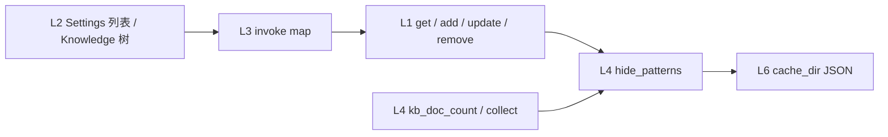

# Knowledge hide patterns

**状态：** Implemented  
**关联待办：** `task_42e997dd4f85`

- [Rust `Regex`](https://docs.rs/regex/latest/regex/struct.Regex.html)
- [Tauri 2 command / IPC](https://v2.tauri.app/develop/calling-rust/)

## 问题与目标

✅ Verified（`frontend/src/knowledge/state/hide-pattern.ts`）：隐藏规则现在是 `localStorage` 键 `kb_hide_pattern` 的**一条**正则。

✅ Verified（`frontend/src/app-shell/ui/settings/chrome.tsx`）：Settings → Knowledge → Hidden files 只有一个输入框和 Save。

✅ Verified（`src-tauri/src/services/keyword_index/collect.rs`）：搜索收集写死 `SKIP_DIRS = [".git", ".cache"]`，不读 Hidden files。

✅ Verified（`src-tauri/src/services/knowledge/read.rs`）：文档计数靠调用方传入的单条 `hide_pattern`，且只过滤文件名、仍进入匹配目录。

目标：规则改成 `cache_dir` 里的多条记录；Settings 用列表增删改；树、计数、收集共用；缺文件时写入种子，代码不再写死目录名单。

## 已锁定（本会话 converge）

| 项 | 选择 |
|---|---|
| 数据 | 多条独立记录，不再用分号拼一条字符串 |
| 落点 | `{cache_dir}/knowledge-hide-patterns.json`（默认 `~/.cache/lulu-workbench`） |
| 写入 | 增、改、删立刻落盘并刷新树 |
| 收集 | 读同一份文件；去掉 `SKIP_DIRS` |
| 种子 | `^\\.git$`、`^\\.cache$`、`^\\.worktrees$`、`^\\.repository-type\\.json$`（整名） |
| 匹配 | 或：名字命中任一条即隐藏 |
| 计数 | 自己读文件，界面不再传 `hide_pattern` |
| 添加框 | 整段当一条，`;` 是字面量 |

队列外已定：Hidden files 列表；点文字编辑；点 x 删除。

## 方案

### 文件形状

✅ Verified（`src-tauri/src/services/knowledge/doc_map.rs`）：`cache_dir` JSON 已有 `version` + 记录数组 + `random_hex12` id。本文件同形：

```json
{
  "version": 1,
  "patterns": [
    { "id": "seed00", "pattern": "^\\.git$" }
  ]
}
```

✅ Verified（`src-tauri/src/services/knowledge/hide_patterns.rs`）：种子 id 为 `seed00`–`seed03`；用户新增走 `random_hex12`，与已有 id 撞车则重抽。

文件不存在时写入种子四条。文件损坏则当空列表读，不覆盖。非法正则保存时拒绝；已在文件里的非法条匹配时跳过（与现网 I7 一致）。✅ Verified（`hide-pattern.ts` `shouldHideEntry`：编译失败当不隐藏）

### 匹配

对 `entry.name` / `file_name` 做 `Regex::is_match`。目录命中则整棵跳过（收集、计数）。添加、编辑各校验一次；`;` 不拆条。

### 分层



✅ Verified（`docs/architecture/arch-layer-constraints.md`）：L2 只经 L3 进 L1，L4 读写 L6。

新命令：

| 方向 | 命令 | HTTP |
|---|---|---|
| 读 | `get_kb_hide_patterns` | `GET /api/kb/hide-patterns` |
| 写 | `add_kb_hide_pattern` | `POST /api/kb/hide-patterns/add` |
| 写 | `update_kb_hide_pattern` | `POST /api/kb/hide-patterns/update` |
| 写 | `remove_kb_hide_pattern` | `POST /api/kb/hide-patterns/remove` |

写入走 `atomic_json::write_json`。✅ Verified（`src-tauri/src/repositories/atomic_json.rs`）

`kb_doc_count` 去掉 `hide_pattern` 参数。✅ Verified（`src-tauri/src/services/knowledge/read.rs` `kb_doc_count_json` 签名无 `hide_pattern`，内部调 `compiled_hide_regexes`）

前端：`knowledge/state` 记列表；Settings `ui` 只画、`commands` 只调接口；树用同一份列表过滤。不再读 `localStorage`。

### 不做

- 不把规则写入 `settings.toml` 或 Workbench git 仓。
- 不迁移旧 `kb_hide_pattern`。
- 不改 Android。
- 添加框不按 `;` 拆条。

## Plan

1. ✅ Verified（`src-tauri/src/config/paths.rs` `knowledge_hide_patterns_path`；`hide_patterns.rs`）：路径 + 服务（种子、增删改、按名隐藏）。
2. ✅ Verified（`src-tauri/src/services/keyword_index/collect.rs`）：无 `SKIP_DIRS`；`walk` 用 `compiled_hide_regexes` + `name_is_hidden`。
3. ✅ Verified（`kb_doc_count_json`）：自己读文件；目录命中不进入。
4. ✅ Verified（`commands/read.rs` / `commands/kb_hide_patterns.rs`；`read-api.toml` / `write-api.toml`；`readApiInvokeMap.ts` / `writeApiInvokeMap.ts`）：读 `GET /api/kb/hide-patterns`，写三条 POST。
5. ✅ Verified（`frontend/src/app-shell/ui/settings/kb-hide-patterns.tsx`；`frontend/src/knowledge/state/hide-pattern.ts`）：Hidden files 列表；树与计数走内存缓存，不再读 `localStorage`。
6. ✅ Verified（本会话命令输出）：`cargo test --lib hide_patterns` 7、`kb_doc_count` 12、`read_api_acl` 10、`write_api_acl` 17；vitest 8 个文件 109（hide-pattern、doc-list、fetch-doc-count、read/write API、settings-hide-pattern、settings-knowledge-ui）。

本机 `{cache_dir}/knowledge-hide-patterns.json` 已写入种子四条，并另有 `^\\.cursor$`、`^\\.knowledge_annotations$`。实机点选 Settings 列表与树立刻刷新：⚠️ Inferred（未在桌面 App 点选）。
