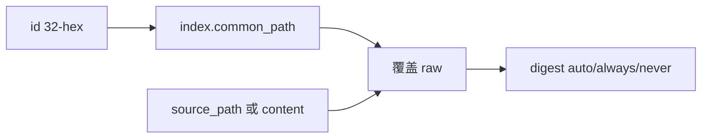

# MCP 增加 update_note

**状态：** Implemented  
**关联待办：** `task_0a9d788642b1` / `task_0a9d788642b1_sub_03`

收敛锁定（本对话 `/converge`）：路径是新正文 `source_path`；目标由 `id → common_path`；Stage 直写并存；全通道对齐 `create_note`；digest 同 `create_note`；title / 译文 / 挪路径推迟。

## 问题与目标

✅ Verified（`mcp_host/catalog/groups/notes/mod.rs`）：Notes MCP 有 `create_note` / `delete_note` / 读取，没有按 id 改正文。

✅ Verified（`document.rs`）：`create_note` 每次新文件，不覆盖。

✅ Verified（`create_note.rs`）：IDE/workbench 用 allow-list `source_path`，不传正文；mobile 用 `content`。

目标：MCP `update_note(id, source_path|content, digest[, digest_body])` 覆盖已有 raw；按 digest 规则写或覆盖 digest。不改 Stage 围栏，不改 Host `write` / `str_replace`。

## 方案

✅ Verified（`notes_catalog.rs` `get_note_path_by_id`）：id 查 `index.json` 得 `common_path`。

✅ Verified（`source_path_allow.rs`）：`source_path` 允许 `cache_dir`（含 session scratch）。

✅ Verified（`digest.rs` `write_digest_file`）：已有 digest 会 409。更新必须另走可覆盖写入，创建路径保持 409。

不收 title / project / theme / created_at / source_type / translations。digest 的 `source_type` 用索引里已有值。全文英文且索引无 `translations.zh` 仍拒（与 create 同一闸）。

不改：条数帽、Android 客户端、Host 围栏、桌面 `save_entry`、Tauri `create_note` 命令。

## Plan

1. ✅ Verified（`services/notes/update.rs`、`digest.rs` `write_digest_file_overwrite`）：覆盖 raw；digest 可覆盖；layers 缺 digest 时补上；同步关键词索引。
2. ✅ Verified（`mcp_host/.../update_note.rs`、`notes/mod.rs`）：全通道；mobile 用 `content`；IDE/workbench 用 `source_path`；成功 `produce("notes")`。
3. ✅ Verified（本会话 cargo）：覆盖 / digest never·always / 拒 title / 拒错 id / 通道 invoke / produce / catalog 登记，共 17 条相关单测通过。
