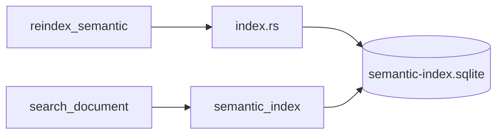

# 语义检索调研 MVP 技术方案与实施计划

现网入口：`src-tauri/src/services/knowledge/search_document.rs`  
Cursor Instant Grep：<https://cursor.com/docs/agent/tools/search>  
Cursor 语义检索：<https://cursor.com/blog/semsearch>  
Cursor 云端索引：<https://cursor.com/blog/secure-codebase-indexing>  
BGE-M3：<https://huggingface.co/BAAI/bge-m3>

**状态：** Implemented（调研管道；默认 `hash-v1`，BGE-M3 需 `--features semantic-onnx`）  
**关联待办：** `task_a2534f91ef79`  
**对齐来源：** 2026-09-04 `/converge` + 索引时机补充

完整调研合同（锁定表、两路终态、验收）见同待办附件 `yu-yi-jian-suo-diao-yan-mvp-fang-an.md`。本文只写落地合同。

---

## 落地合同

| 项 | 本轮选择 |
|---|---|
| 检索入口 | `search_document` 一律走语义索引。无环境变量开关。Meili 仍服务桌面搜索 / 相关面板，不经此入口。✅ `search_document.rs` |
| 显式索引 | Tauri `reindex_semantic`（`search-api`）。不挂 Host 启动。 |
| 向量库 | `{cache_dir}/semantic-index.sqlite`。`rusqlite` 存 BLOB + 进程内余弦精确 KNN。与拟议 sqlite-vec 同形态（单文件、无新进程）；本轮不链 sqlite-vec 扩展。 |
| 向量化 | `TextEmbedder`。默认 `HashingEmbedder`（`hash-v1`）走通管道与单测。`semantic-onnx` feature 换成 BGE-M3（`bge-m3`）。换 `model_id` 会重嵌。 |
| 切块 | 按 ATX 标题切开；无标题则整篇一块，单块上限 1200 字符。 |
| 已做判断 | 表 `chunks` 的 `(doc_id, chunk_id, content_hash, model_id)`。无第二份清单。 |
| 源目录 | 笔记：`{workbench_root}/notes`（`index.json`）。知识：`sediment_kb` 已注册仓的 `{knowledge_root}/{repo_name}`，不扫整个 `knowledge_root`。目录黑名单（任意层级）：`.git` / `.cache`。 |

不在本轮：拆 Meili、改 `grep`、相关面板、settle 写时增量、hybrid。

---

## 模块

L4 `services/semantic_index` 读 L6 路径、写 cache 下 SQLite。不是 L5。L7 Meili 重建不变。
