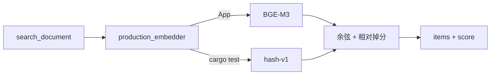

# 语义检索 MVP-V2 技术方案与实施计划

现网入口：`src-tauri/src/services/knowledge/search_document.rs`  
BGE-M3：<https://huggingface.co/BAAI/bge-m3>  
fastembed `EmbeddingModel::BGEM3`：<https://docs.rs/fastembed/6.0.0/fastembed/enum.EmbeddingModel.html>  
fastembed 4.9.1（现仓无 `BGEM3`）：<https://docs.rs/fastembed/4.9.1/fastembed/enum.EmbeddingModel.html>

**状态：** Implemented  
**关联待办：** `task_a2534f91ef79_sub_01`（MVP-V2；父任务 `task_a2534f91ef79`）  
**对齐来源：** 2026-09-05 `/converge`（Q1 A / Q2 A / Q3 B / Q4 A）

V1 管道见 `docs/archive/semantic-search-mvp/solution-and-plan.md`。本文只写 V2 增量。

---

## 问题

✅ Verified（`sess_d3170fc8ab62`）：`search_document` 已切语义入口，但默认 `hash-v1`。查询「AI 时代 creator / builder」首屏是 Docker / TLS / Android；模型换词搜了 12 次。

✅ Verified（`embed.rs`、`Cargo.lock` fastembed 4.9.1）：`semantic-onnx` 加载的是 `BGEBaseENV15`，却标 `bge-m3`。4.9.1 的 `EmbeddingModel` 没有 `BGEM3`。

✅ Verified（`search.rs`）：余弦分算完丢掉（`_score`），再硬取 10 条。

---

## 落地合同

| 项 | 本轮选择 |
|---|---|
| 模型 | 升 fastembed 到带 `EmbeddingModel::BGEM3` 的 6.x；`TextEmbedding` 只取 dense。`model_id` = `bge-m3`。✅ [fastembed 6.0.0](https://docs.rs/fastembed/6.0.0/fastembed/enum.EmbeddingModel.html) |
| 生产默认 | App / `reindex_semantic` / `search_document` 走 BGE-M3。无 feature 时返回错误，不回落 hash。✅ `/converge` Q2 A |
| 单测 | `#[cfg(test)] production_embedder` 返回 `HashingEmbedder`。测试不下载、不跑 ONNX。✅ `/converge` Q2 A |
| 分数 | 每条 hit 带 `score`（该文档最高块的余弦）。 |
| 截断 | 先按 `(doc_id, category)` 折叠，再相对前一名掉分：`score[i] < score[i-1] * 0.85` 则丢掉尾巴。最高分 `<= 0` 返回空。仍受 `limit` 上限。✅ `/converge` Q3 B |
| 索引 | 换 `model_id` 后点一次 Semantic 重嵌。不挂启动。 |

不在本轮：hybrid、限 Agent 重试、改切块、拆 Meili、改 `grep`、相关面板。✅ `/converge` Q4 A

---

## 模块

