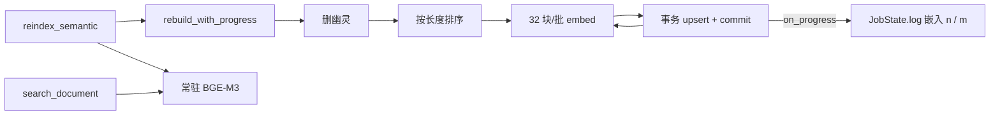

# 语义检索 MVP-V3 技术方案与实施计划

现网入口：`src-tauri/src/services/semantic_index/index.rs`  
fastembed 6.0.2 `TextEmbedding::embed(texts, batch_size)`：<https://docs.rs/fastembed/6.0.2/fastembed/struct.TextEmbedding.html#method.embed>  
rusqlite `Connection::transaction`：<https://docs.rs/rusqlite/latest/rusqlite/struct.Connection.html#method.transaction>

**状态：** Implemented（`cargo test --lib semantic_index` 12 通过；实机验收待用户点 Semantic）  
**关联待办：** `task_a2534f91ef79_sub_02`（MVP-V3；父任务 `task_a2534f91ef79`）  
**对齐来源：** 2026-09-05 用户「v3 实现」；问题分析见子任务正文

V1 / V2 见 `docs/archive/semantic-search-mvp/`、`docs/archive/semantic-search-mvp-v2/`。本文只写 V3 增量。

---

## 问题

✅ Verified（`ps` / `vmmap` / `sample` / sqlite，2026-09-05 01:07–01:17）：V2 重嵌 15808 块跑 10 分钟未完；进程物理内存 26.4 GiB，系统 swap 12 GiB；取消后 `bge-m3` 0 行。

✅ Verified（`index.rs` 44–68 行）：全部文本一次交给 `embed()`，算完才逐条写库。

✅ Verified（`embed.rs`、fastembed 6.0.2 `text_embedding/mod.rs`）：`embed(refs, None)` 走默认 `DEFAULT_BATCH_SIZE = 256`。

✅ Verified（`search_document.rs` 79 行）：每次查询 `production_embedder()` 重新 `try_new` 加载模型。

---

## 落地合同

| 项 | 本轮选择 |
|---|---|
| 批大小 | `EMBED_BATCH_SIZE = 32`。`rebuild` 按批调用 `embedder.embed`；`OnnxBgeM3::embed` 把 `Some(texts.len())` 传给 fastembed，一次调用即一批。 |
| 逐批落库 | 每批一个 rusqlite 事务：`upsert` 全批后 `commit`。取消 / 崩溃只丢当前批。 |
| 断点续跑 | 不新增状态。下次重嵌靠现有 `(doc_id, chunk_id, content_hash, model_id)` 跳过已写行。 |
| 幽灵删除 | 移到嵌入之前执行，保证中断后库里无过期行。 |
| 排序 | 待嵌块按字符数升序再分批，减少同批补齐。 |
| 进度 | `rebuild_semantic_index_with_progress(root, embedder, on_progress)`；`on_progress(done, total)` 每批一次，开始时报 `(0, total)`。`commands/search.rs` 写入 `JobState.log`「嵌入 n / m」。UI 不改，悬停按钮即见。 |
| 模型常驻 | `embed.rs` 内 `static Mutex<Option<Arc<OnnxBgeM3>>>`；首次加载后 `production_embedder` 复用同一份。加载失败不缓存，下次重试。 |
| 单测 | `HashingEmbedder` 上验证：每批 `<= 32`、进度单调到 `(total, total)`、批内长度非降、第二批失败后首批已落库且再跑只补剩余。不下载、不跑 ONNX。 |

不在本轮：改切块上限（1200 字）、换模型、hybrid、CoreML、拆 Meili、改 `grep`。切块上限留待用户决定。

---

## 模块

L4 `services/semantic_index` 内部重排；L1 `commands/search.rs` 只多传一个进度闭包。不碰 L2 / L3。

---

## 验收

1. `cargo test --lib semantic_index` 全绿，新增 3 条用例。
2. 实机：重启 App → 首页点 `↺ Semantic` → 悬停按钮可见「嵌入 n / 15808」递增；进程 RSS 不超过约 4 GiB（⚠️ Inferred，待实测）；中途关掉再点，只补剩余。
3. `search_document` 第二次查询不再重新加载模型。
