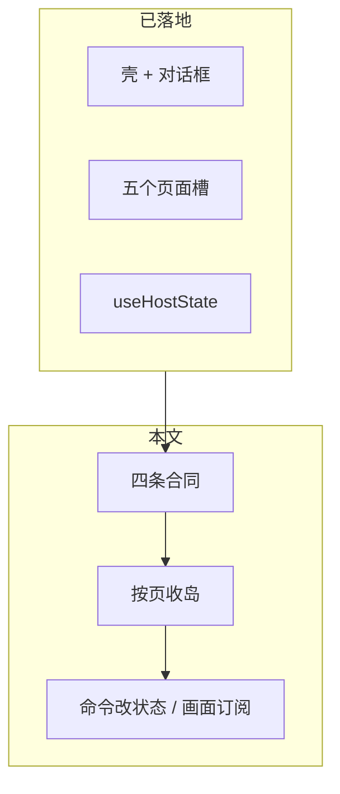

# 桌面前端 L2：块内分层与页面收岛技术方案

官方参考：[useSyncExternalStore](https://react.dev/reference/react/useSyncExternalStore)；[Vite | Tauri](https://v2.tauri.app/start/frontend/vite/)

关联：栈切换方案 `docs/archive/ui/workbench-desktop-frontend-react-and-typescript-stack-switch.md`（`5587042` 起的 Vite / React / TypeScript）。本文管**栈切换之后**还没做完的事：块内职责，以及把页面从嵌套 `createRoot` 收进路由树。

基线提交：`3e09485`（`refactor(frontend): render chrome dialogs and five page slots in React`）。✅ Verified（`git log -1 --oneline`）

决策来源：2026-08-28 会话。用户要求先提交已落地代码，再单独出本文。块内分层合同见 §2。2026-08-28 后授权：六个业务块都用 `ui/` `commands/` `state/`，不再用文件名标职责。✅ Verified（`ls frontend/src/{notes,home,todo-task,corpus,read-later,app-shell}`）

---

## 1. 目标

桌面 L2 已经换成 React + TypeScript。生产页已是 `ShellPages` 的子组件；命令改状态、画面读快照重绘。还开着的是空槽、正文 markdown leftover、QR leftover，以及本机 Tauri 验收。不另开一轮「架构重构」。✅ Verified（`shell-pages.tsx` 画 `HomePage` / `TodoTasksPage` / `CorpusDocPage` / `NotesSidebar`+`NotesMain`；`routes.ts` 仍 `getElementById` 三个空槽；`notes/ui/viewer/body.tsx` / `corpus/ui/viewer/shell.tsx` 仍灌正文；`app-shell/ui/qr-dialog.tsx` 仍 leftover `#qr-preview`）

不改 L3 invoke map，不改 Rust，不与 Android 共用 UI。不上 Redux / Zustand / React Query、react-router、Tailwind。✅ Verified（栈切换方案 §2；`docs/architecture/arch-layer-constraints.md`：L2 只经 L3）



---

## 2. 已锁合同

| # | 合同 | 依据 |
|---|------|------|
| 1 | **第一刀是业务目录，第二刀是块内职责。** 保持 `notes/`、`home/`、`todo-task/`、`corpus/`、`read-later/`、`app-shell/`、`host/`、`shared/`。不把 `frontend/src` 收成顶层 `data/`、`logic/`、`ui/`。 | ✅ Verified（现有 `frontend/src` 目录）；会话 2026-08-28 已锁 |
| 2 | **IO 只经现有 Host 出口。** 新代码走 `host/api` + `apiClient`。Todos 已有的 `todo-task/state/host.ts` 留在本块，不先并进 `host/api`。禁止再造一套「数据层」绕 L3。 | ✅ Verified（`host/api.ts`、`host/apiClient.ts`、`todo-task/state/host.ts`；`docs/architecture/arch-layer-constraints.md`） |
| 3 | **收一页 = 这页不再 `mount*(空盒子)`，且命令不再画 UI。** 画面读快照画 JSX；状态变了 `notify`；命令调 API、改状态，不准 `innerHTML` / 再 `createRoot` 进该页槽。 | ✅ Verified（`shell-pages.tsx` 画 `HomePage` / `TodoTasksPage` / `CorpusDocPage` / `NotesSidebar`+`NotesMain`。`selectDate` 不再找 `#doc-list`。阅读器 `mountKbReader` 认领 layout 里的壳。命令对 leftover id 仍双写，给 Node stub 测试用） |
| 4 | **`host/state` 先当订阅源，不先拆成五个 store。** 本块已有自己的 host 的，继续用（Todos）。 | ✅ Verified（`host/state.ts`；`todo-task/state/host.ts`） |
| 5 | **块内用 `ui/` `commands/` `state/` 三夹标职责。** 根上只留 `page.tsx` 和可选桶（`viewer.ts` / `hub.tsx` / `index.ts` / `routes.ts`）。不把 `frontend/src` 收成顶层 `data/` `logic/` `ui/`。不适用：`host/` `shared/` `doc-editor/` `router/` 与根上壳文件。旧扁平路径不留桩。Notes / Corpus 链接、标签、搜索、评论条、Settings 列表 / 连接已读快照画 JSX；正文 markdown 与 QR leftover 仍可 `innerHTML`。 | ✅ Verified（业务块含 `builders/`；`ls frontend/src/builders`；2026-08-28 leftover 收口：`notes/ui/{links-bar,tags-bar,search,comments}.tsx`；`corpus/ui/{search,links-bar,knowledge-search,diff-dialog}.tsx`；`app-shell/ui/settings/{sediment-kb,notes-connection}.tsx`；`builders/ui/feed.tsx`） |

块内三件事（用三夹标，不收到 `frontend/src` 顶层）：

| 职责 | 做什么 | 不准做什么 |
|------|--------|------------|
| 画面 | 读快照，画出 JSX | `getElementById` 去填列表 / 正文 |
| 状态 | 这页记得什么；变了通知订阅者 | 自己去改某个 `#id` |
| 命令 | 调 Host、改状态 | `innerHTML`、`createRoot(空槽)` |

同一轮不上：全站横切三层目录（顶层 `data/` `logic/` `ui/`）、新状态库、react-router。

业务块根目录（2026-08-28 用户授权跟 notes）：`page.tsx` 或桶留在块根。IO 仍走 `host/api`；`notes/state/host.ts` 与 `corpus/state/host.ts` 只再导出 `host/state`，不另造仓库。Todos 的 Host 包装在 `todo-task/state/host.ts`。旧扁平路径不留桩。✅ Verified（`ls frontend/src/{notes,home,todo-task,corpus,read-later,app-shell,builders}`）

| 块 | 根上 | 三夹 | 依据 |
|----|------|------|------|
| `notes/` | `page.tsx` `viewer.ts` | `ui/` `commands/` `state/` | ✅ Verified |
| `home/` | `page.tsx` `hub.tsx` | 同上 | ✅ Verified |
| `todo-task/` | `page.tsx` `index.ts` | 同上 | ✅ Verified |
| `corpus/` | `page.tsx` `viewer.ts` | 同上 | ✅ Verified |
| `read-later/` | （无 page，对话框模块） | 同上 | ✅ Verified |
| `app-shell/` | `routes.ts` | 同上；`settings/` 嵌在三夹里 | ✅ Verified |
| `builders/` | （入口适配器，无 page） | 同上 | ✅ Verified（2026-08-28 用户授权分层；`ls frontend/src/builders`） |

---

## 3. 现状（`3e09485`）

| 项 | 现状 | 标记 |
|----|------|------|
| 入口 | `index.html` 只留 `#root`；`main.tsx` `createRoot` → `App` → 动态 `import('./boot.ts')` | ✅ Verified（`frontend/index.html`；`frontend/src/main.tsx`） |
| 壳 | `App` 画 `Shell`（header + 对话框）和 `HashRouter` | ✅ Verified（`frontend/src/App.tsx`；`shell.tsx`） |
| 页面槽 | `HashRouter` 始终渲染 `ShellPages`；五槽按 `parseHash` 显隐，不卸载 | ✅ Verified（`hash-router.tsx`；`shell-pages.tsx`） |
| 岛屿 | 生产页由 `ShellPages` 画。`mount*` 只留给测试。`routes.ts` 仍 `mountWorkbench`（按 hash 调命令）。阅读器 `mountKbReader` 认领 layout 里的 `.kb-reader`。空槽 `#home-view` / `#todo-tasks-view` / `#corpus-doc-view` 还在。 | ✅ Verified（`shell-pages.tsx`；`app-shell/routes.ts`；`corpus/commands/viewer/mount.ts`；`corpus/ui/viewer/shell.tsx`） |
| Read Later | 路由先走 Home，再开对话框；列表是 `ReadLaterDialog` 子节点 | ✅ Verified（`mountReadLaterRoute`；`read-later/ui/dialog.tsx`） |
| 状态钩子 | `useHostState` / `notifyState` 已有。Notes 选日期写状态在 `notes/commands/sidebar.ts` `selectDate`。`boot.ts` `loadIndex` 以及 viewer / cards / routes 也会 `notifyState`。`ShellPages` 用 `useHostState` 订 `data-active-date` | ✅ Verified（`rg notifyState frontend/src`；`rg useHostState frontend/src`） |
| 对话框 | Settings / Bind / Skills / Commit / Comment / Diff / Move / Settle / Todo / Convert / Read Later 由 `Shell` 挂组件；开闭双写 `createModuleStore` + `classList.open` | ✅ Verified（`shell.tsx`；`shared/module-store.ts`） |
| Notes 铬 | 编辑 / 保存 / 取消 / 提交 / 关闭等 `onClick` 在 `NotesMain`。`openDoc` 改快照并 `notifyState`；对 leftover id 仍双写给 Node stub。 | ✅ Verified（`notes/page.tsx`；`notes/commands/viewer/doc.ts`；`routes.ts` `mountWorkbench`） |
| boot | 拉 index、注册 hash handler、挂 home-entry overlay；已去掉 Notes 铬的 import-time 监听 | ✅ Verified（`boot.ts`） |
| 模块顶层找 id | `app-shell/ui/qr-dialog.tsx` 仍留一条 `#qr-input` import-time 监听，给 Node stub 测试用 | ✅ Verified（`rg "^document.getElementById" frontend/src/app-shell`） |
| `@ts-nocheck` | `frontend/src` 55 个文件仍有 | ✅ Verified（`rg -l '@ts-nocheck' frontend/src \| wc -l`，2026-08-28） |
| 规模 | 177 个 `.ts`/`.tsx`；`app.css` 仍一份 | ✅ Verified（`find frontend/src -name '*.ts' -o -name '*.tsx' \| wc -l`，2026-08-28） |
| vanilla | `frontend/js/` 不存在；`frontend/src` 无 `.js` | ✅ Verified（`test -d frontend/js`；`find frontend/src -name '*.js'`） |

栈切换方案 §5 的 P3–P8（按页换成 TSX、最后删 `frontend/js/`）描述的是当时阶段。P7 / P8 的对话框与删 vanilla **已做完**。未做完的收页，以本文 §5 为准，不要再按 P3–P8 的顺序施工。

---

## 4. 目标结构

```text
App
├── Shell          header + 对话框（已在树里）
└── HashRouter
    └── ShellPages
        ├── Home 组件        不再 mountHomeHub(#home-view)
        ├── Todos 组件       不再 mountTodoTaskSplit(#todo-tasks-view)
        ├── Corpus 组件      不再 mountCorpusDocList(#corpus-doc-view)
        ├── Notes 组件       不再 openDoc / selectDate 填 id
        └── Read Later 列表  不再 mountReadLaterList(对话框 body)
```

⚠️ Inferred：五槽可以收成页面组件后删掉空 `div`；在对应页收完之前必须留着，供残留 `getElementById` 使用。

路由仍是 `#` / `parseHash`。✅ Verified（栈切换方案 §2；`frontend/src/router/index.ts`）

---

## 5. 分步实施

每一阶段结束应用都能开。**禁止**让 `HashRouter` 的子组件和 `mount*` 同时拥有同一页（重复 id、双 `createRoot`）。收完一页，再删该页的 `mount*`。

### 第 1 步：Home 收岛（合同第一份实物）

**文件：** `home/hub.tsx`、`shell-pages.tsx`、`app-shell/routes.ts`、`tests/home-entry-shell/hub.test.js` 及相关 Home 扫描测试。

**现状（收完后）：** `HomePage` 在 `ShellPages` 的 `#home-view` 里。状态在 `home/state/store.ts`，命令在 `home/commands/hub.ts`，markdown 在 `home/ui/chat-render.ts`。`hub.tsx` 是桶。`mountHomeHub` 只留给测试。`#home-view` 外壳还在，因为 `routes.ts` 仍 `getElementById('home-view')`。✅ Verified（`home/page.tsx`；`ls frontend/src/home`；`shell-pages.tsx`；`app-shell/routes.ts`）

**做：**

- [x] 把 `HomeHubView`（或等价页面组件）作为 `ShellPages` 在 `home` / `read-later` 时的子节点。
- [x] 会话 / 消息从「闭包 + `paint()`」改成模块 store 或组件 state；变了靠订阅重绘，不 `root.render`。
- [x] `mountHomeRoute` 不再调用 `mountHomeHub`。只留换页时的 unmount 其它岛、导航铬（在其它岛未收完之前）。
- [ ] `#home-view` 空槽：Home 收完且没有代码再 `getElementById('home-view')` 之后再删。

**完成条件：** `#/home` 能聊、能进 Read Later 入口；`document.querySelectorAll('#home-view')` 至多一个根；Home 路径上不再 `createRoot(homeView)`。

2026-08-28 Vite `http://127.0.0.1:5173/#/home`：`#home-view` 1 个、`.home-chat` 1 个；Read Later 打开 `#read-later-dialog.open`；Notes / Todos / Knowledge 改 hash 后 `#home-view` 子节点为 0。✅ Verified（浏览器 CDP + 点击）。无 Binding 时 composer 禁用、文案 `Chat requires a workspace Binding.`。✅ Verified。真实发消息需 Tauri Host。❌ Unresolved。`mountHomeHub` 只在 `home/page.tsx` 给测试用。✅ Verified（`rg mountHomeHub frontend/src`）

**测：** 现有 Home / hub 源码扫描测试；浏览器 `#/home`。

---

### 第 2 步：Todos 收岛

**文件：** `todo-task/page.tsx`、`todo-task/index.ts`、`shell-pages.tsx`、`app-shell/routes.ts`、`tests/todo-task/*.test.js`。

**现状（收完后）：** `TodoTasksPage` 在 `ShellPages` 的 `#todo-tasks-view` 里。hash 的 `master` / `sub` 经 `routeParams` 传入；变了走 `applyRoute`，不整页卸挂。`mountTodoTaskSplit` 只留给测试（`createRoot` 进测试容器）。`#todo-tasks-view` 外壳还在，因为 `routes.ts` 仍 `getElementById('todo-tasks-view')`。IO 仍在 `todo-task/state/host.ts`。✅ Verified（`shell-pages.tsx`；`todo-task/page.tsx`；`app-shell/routes.ts`）

**做：**

- [x] 页面壳作为 `ShellPages` 在 `todo-tasks` 时的子节点。
- [x] 路由参数变化继续原地更新，不整页卸挂。
- [x] `todo-task/state/host.ts`、`commands/lifecycle.ts`、`commands/binding.ts` 留在本块；命令不写 `#todo-tasks-view` 的 `innerHTML`。
- [x] 生产路径删 `mountTodoTaskSplit(container)`。测试辅助仍保留。
- [ ] `#todo-tasks-view` 空槽：Todos 收完且没有代码再 `getElementById('todo-tasks-view')` 之后再删。

**完成条件：** `#/todo-tasks` 列表 / 详情 / 创建仍可用；该槽不再嵌套 `createRoot`。

2026-08-28 Vite `http://127.0.0.1:5173/#/todo-tasks`：`#todo-tasks-view` 1 个、`.todo-tasks-page` 1 个；`+ New todo` 打开创建对话框；回 Home 后该槽子节点为 0；再进 Todos 仍画出页面；改 hash `?master=&sub=` 后同一 `.todo-tasks-react-host` 还在（`dataset.probe` 未丢）。✅ Verified（浏览器 CDP + 点击）。无 Host 时详情为 `Temporarily unavailable`。✅ Verified。真实列表 / 创建写入需 Tauri Host。❌ Unresolved。`mountTodoTaskSplit` 只在 `todo-task/page.tsx` 给测试用。✅ Verified（`rg mountTodoTaskSplit frontend/src`）

**测：** `tests/todo-task/page.test.js` 等；浏览器 `#/todo-tasks`。

---

### 第 3 步：Corpus 收岛

**文件：** `corpus/page.tsx`、`corpus/viewer.ts`、`corpus/ui/**`、`corpus/commands/**`、`shell-pages.tsx`、`app-shell/routes.ts`。

**现状（收完后）：** `CorpusDocPage` 在 `ShellPages` 的 `#corpus-doc-view` 里。hash 的 `repo` / `path` 经 `routeParams` 传入；同 repo 改 path 走 `navigateToPath`，换 repo 用 `key={repo}` 重开会话。`mountCorpusDocList` 只留给测试。`#corpus-doc-view` 外壳还在。`ReaderShell` 是 layout 的子节点；生产 `mountKbReader` 认领已有 `.kb-reader`，不再 `createRoot` 进 pane。空容器（测试）仍会 `createRoot`。Kb Commit 命令写 `state/commit.ts`，`KbCommitDialog` 读快照画。树走 `corpusTreeStore`；链接 / 评论条 / 顶栏搜索是 React。正文仍 `paintKb*` / `renderKbMdBody` 进 `.kb-reader-body`。✅ Verified（`corpus/page.tsx`；`corpus/state/tree.ts`；`corpus/ui/links-bar.tsx`；`corpus/ui/search.tsx`；`corpus/commands/viewer/mount.ts`）

**做：**

- [x] 文档树作为 `corpus-doc` 槽的子节点。阅读器壳 `ReaderShell` 在 layout 里；`mountKbReader` 认领已有壳。
- [x] 同 repo 改 path 仍不整页卸挂。
- [x] 知识库评论、提交对话框已在 `Shell`；不要再复制一份盒子。
- [x] 生产路径删 `mountCorpusDocList(container)`。测试辅助仍保留。
- [ ] `#corpus-doc-view` 空槽：没有代码再 `getElementById('corpus-doc-view')` 之后再删。
- [x] 生产路径阅读器不再 `createRoot` 进 pane。`mountKbReader` 只在空容器（测试）时建根。✅ Verified（`corpus/commands/viewer/mount.ts`；`corpus/ui/viewer/shell.tsx`）

**完成条件：** `#/corpus-doc/...` 能打开文档与评论；该槽不再嵌套 `createRoot`。

2026-08-28 Vite `http://127.0.0.1:5173/#/corpus`：`#corpus-doc-view` 1 个、`.corpus-doc-react-host` 1 个；回 Home 后该槽子节点为 0；再进 Knowledge 仍画出页面；同 repo 改 `?path=` 后同一 host 还在（`dataset.probe` 未丢）。✅ Verified（浏览器 CDP + 点击）。无 Tauri Host 时错误文案 `Opened Tauri Dev page in an external browser — return to the app window.`。✅ Verified。真实树 / 打开文档 / 评论需 Tauri 窗口。❌ Unresolved。`#corpus-doc-view` 本身不再 `createRoot`。✅ Verified（`routes.ts` 不再 `mountCorpusDocList`）。生产 pane 内 `ReaderShell` 已在 layout 树上；无 Host 时 layout 未画出，`.kb-reader` 为 0。✅ Verified（2026-08-28 CDP `#/corpus`：`#corpus-doc-view` 在、`.corpus-doc-layout` 无）

**测：** `tests/corpus/*`；浏览器知识库路由。

---

### 第 4 步：Notes 收岛，并真正订阅 `host/state`

**文件：** `notes/ui/sidebar.tsx`、`notes/commands/sidebar.ts`、`notes/viewer.ts`、`notes/ui/viewer/**`、`notes/commands/viewer/**`、`notes/ui/cards.tsx`、`notes/commands/cards.ts`、`notes/commands/assistant.ts`、`notes/state/**`、`shell-pages.tsx`、`app-shell/routes.ts`、`boot.ts`。

**现状（收完后）：** `NotesSidebar` + `NotesMain` 在 `ShellPages` 的 `.layout` 里，读 `useHostState()`。选日期 / 筛选命令在 `notes/commands/sidebar.ts`：`selectDate` 只写 `state` + `notifyState()` + `loadTitles`，源码不再出现 `getElementById('doc-list')`。`openDoc` / `openCreateNote` / `saveDoc` 在 `commands/viewer/doc.ts` 与 `commands/viewer/create.ts`。`sidebar/sidebar.tsx` 只画侧栏，并再导出这些命令给旧 import。`mountWorkbench` 按 hash 调 `openDoc` / `selectDate` 或写 `outletMode`，不再创建 / 填 `#note-outlet`。`renderSidebar` / `renderDocList` 只留给测试。`openDoc` / `enterEditMode` / `showNoteOutlet` 等仍双写 leftover id，给 Node stub 测试用。链接 / 标签 / 评论条 / 顶栏搜索已是 React；正文岛仍 `renderDocBody` 进 `#md-body`。Commit / Settle / Move project 命令只写 `notes/state` 快照，不再 JSX / `innerHTML`。✅ Verified（`notes/page.tsx`；`notes/ui/links-bar.tsx`；`notes/ui/tags-bar.tsx`；`notes/ui/search.tsx`；`notes/ui/comments.tsx`；`notes/commands/sidebar.ts` `selectDate`；`notes/commands/viewer/doc.ts` `openDoc`；`app-shell/routes.ts` `mountWorkbench`）

**做：**

- [x] 侧栏、日期列表、阅读器改为读 `useHostState()` 的 JSX，不再 `innerHTML`。
- [x] `selectDate` 只改 `state` + `notifyState()`，不碰 `#doc-list`。`openDoc` / `saveDoc` 改状态并 `notifyState`；对 leftover id 仍双写（Node stub）。
- [x] `mountWorkbench` 收成「根据 hash 调命令」；不再创建 / 填 `#note-outlet`。
- [x] `boot.ts` 的 `loadIndex` 可继续写 `state` 并 `notifyState`；生产路径不再调用 `renderSidebar()` 写 DOM。

**完成条件：** `#/workbench` 选日期、打开、编辑、返回与现在一致；`selectDate` 源码中不再出现 `getElementById('doc-list')`。

2026-08-28 Vite `http://127.0.0.1:5173/#/workbench`：`.layout` `display:flex`；`#sidebar` / `#note-outlet` / `#md-panel` 各 1 个；无 Host 时 `#status` 为 `Could not load index.json: Opened Tauri Dev page in an external browser — return to the app window.`，Retry 按钮在。点 ← Home 后 hash `#/home`，`.layout` `display:none`，侧栏仍挂在树上（不卸载）。✅ Verified（浏览器 CDP + 点击）。真实选日期 / 打开 / 编辑需 Tauri 窗口。❌ Unresolved。

**测：** `tests/notes/*`；浏览器 `#/workbench`（无 Host 时 Retry 仍可接受）。

**注意：** 这是最大的一块。不要和第 1 步抢；Home 先交出合同实物。

---

### 第 5 步：Read Later 列表离开第二棵树

**文件：** `read-later/ui/list.tsx`、`read-later/ui/dialog.tsx`、`read-later/commands/**`、`read-later/state/**`。

**现状（收完后）：** `ReadLaterDialog` 在 `open` 时直接画 `<ReadLaterList>`。生产路径不再 `createRoot` 进对话框。`mountReadLaterList` 只留给测试。`#read-later-view` 已从 `ShellPages` 删掉；`routes.ts` 仍防御性 `getElementById('read-later-view')`。✅ Verified（`read-later/ui/dialog.tsx`；`rg read-later-view frontend/src/shell-pages.tsx` 无匹配；`rg mountReadLaterList frontend/src` 只在 `ui/list.tsx`）

**做：**

- [x] 列表作为 `ReadLaterDialog` 的子组件，随 `open` 显隐。
- [x] 生产路径不再调用 `mountReadLaterList`。测试辅助仍保留。
- [x] `#read-later-view` 已从 `ShellPages` 删除。✅ Verified（`shell-pages.tsx` 无该 id）

**完成条件：** Home 上打开 Read Later，列表仍可筛未读；对话框内不再 `createRoot`。

2026-08-28 Vite Home 点 Read Later：`#read-later-dialog.open`；body 内有 All / Unread 标签；无 `[data-reactroot]`。✅ Verified（浏览器 CDP + 点击）。无 Host 时列表文案随现有 empty / unavailable。⚠️ Inferred（未在有 Host 时筛未读）。

---

### 第 6 步：收 `boot.ts` 与模块顶层找 id

**文件：** `boot.ts`、`corpus/viewer.ts`、`app-shell/ui/settings/sediment-kb.tsx`、`app-shell/ui/qr-dialog.tsx`、`app-shell/routes.ts`。

**做：**

- [x] 把上述文件的 import-time `getElementById` + `addEventListener` 改到对应组件的 `onClick` / `useEffect`。`sediment-kb` 列表 / 分类订 `sedimentKbStore` 画 JSX，不再 `innerHTML`；按钮走组件。`corpus/viewer.ts` 不再在 import 时绑 `#kb-btn-*`；Escape 仍在模块顶层，按键时才找 id。`ui/qr-dialog.tsx` 仍留一条 `#qr-input` import-time 监听，给 Node stub 测试用；`ConvertDialog` 也有 `onInput`。✅ Verified（`app-shell/ui/settings/sediment-kb.tsx`；`app-shell/state/settings/sediment-kb.ts`；`app-shell/ui/qr-dialog.tsx` 文末；`app-shell/ui/convert-dialog.tsx`）
- [x] `routes.ts` 顶层 `document.getElementById('feed-view')` 删掉或改到渲染之后。✅ Verified（`routes.ts` 只在 `mount*` 函数内找 `#feed-view`；`#feed-view` 在 `shell-pages.tsx`）
- [x] `boot.ts` 只保留：拉 index、注册 `setRouteHandlers`、挂 home-entry overlay。换页不再靠它绑 Notes 铬。

**完成条件：** 除测试辅助外，业务模块顶层不再在 import 时找 id。

`commands/settings/dialog.ts` 在函数里找 leftover id（双写），模块顶层不再 `document.getElementById`。✅ Verified（`rg "^document.getElementById" frontend/src/app-shell/commands/settings/dialog.ts` 无匹配）

---

### 第 7 步：拆 `@ts-nocheck`

**现状：** 52 个文件。✅ Verified（2026-08-28 `rg -l '@ts-nocheck' frontend/src`，52 行）

**做：** 收完哪一页，就拆那一页的 nocheck。禁止单独开一轮「全仓补类型」。

已拆、且 `tsc --noEmit` 不靠 nocheck：`notes/page.tsx`、`home/*`、`read-later/ui/{dialog,list}.tsx`、`corpus/page.tsx`、`corpus/viewer.ts`、`notes/commands/{settle-dialog,move-project-dialog,viewer/commit}.ts`、`notes/ui/{settle-dialog,move-project-dialog,viewer/commit}.tsx`。✅ Verified（各文件无 `@ts-nocheck`；`npx tsc --noEmit` 2026-08-28 退出 0）

未拆：`notes/ui/sidebar.tsx`、`notes/commands/sidebar.ts`、`notes/ui/cards.tsx`、`notes/commands/cards.ts`、`notes/commands/viewer/doc.ts`、`notes/commands/viewer/create.ts`、`todo-task/page.tsx` 以及 viewer / host 岛。单独去掉 nocheck 会撞上未检查的 `host/state` 形状（`never[]` / `null`）。按「禁止全仓补类型」留下。✅ Verified（去掉后 `tsc` 报 16 处，已复原；新 commands 文件同样依赖未检查的 `host/state`）

**完成条件：** 该页相关文件 `tsc --noEmit` 不再靠 nocheck 过关。整仓 52 → 随步递减。

---

### 第 8 步：验收

- [x] `npx tsc --noEmit` 通过。✅ Verified（2026-08-28 命令退出 0）
- [x] 改动过的 vitest 文件通过。✅ Verified（全量 vitest 1296 passed / 2 failed，见下）
- [x] 浏览器走 `#/home`、`#/todo-tasks`、`#/workbench`、知识库、Settings / Bind。✅ Verified（Vite `http://127.0.0.1:5173/` CDP + 点击，2026-08-28）
- [ ] 有 Tauri 窗口时再跑一遍同一条路径（本机 Host）。本机无 Tauri 进程。❌ Unresolved（`pgrep` 未见 Tauri / workbench 桌面窗）
- [x] `npm test`（cargo lib + vitest）在收口时跑全量。cargo lib 1168 passed；vitest 1296 passed / 2 failed。✅ Verified（2026-08-28 `npm test`）。仍失败的 2 个与本次无关，见下。

已知仍在：
- `tests/todo-task/ac-gate.test.js` 找 sibling 路径 `../475641f1-4be0-lulu-workbench-skills/todo-task/SKILL.md`，该目录不存在。✅ Verified（2026-08-28 vitest）
- `tests/gates/cursor-ide-mcp-json.test.js` 找 `docs/knowledge-mcp.md`，该文件不存在。✅ Verified（2026-08-28 vitest）

栈切换遗留：Rust 源码探针曾读 `binding.js` / `shell.js` / `assistant.js`。已改到 `binding.ts` / `index.ts` / `shell.tsx` / `assistant.tsx`。✅ Verified（`cargo test --lib t4_notes_binding_consumer_follows_todos_key_only_contract`；`t4_hub_and_shell_close_are_not_reset_paths`）

---

## 6. 每步共同禁令

1. 不把目录改成顶层 `data/` / `logic/` / `ui/`。块内用 `ui/` `commands/` `state/`，不建 `data/` `logic/`。✅ Verified（§2 合同 1、5；`ls frontend/src`）
2. 不在收岛完成前，让页面组件和 `mount*` 同时画同一页。
3. 不引入新状态库、react-router、新 CSS 方案。
4. L2 不静态 import `@tauri-apps/*`。✅ Verified（`docs/architecture/workbench-coding-discipline.md`）
5. 用户可见文案仍为英文。✅ Verified（`docs/biz/ui-build-constraints.md`）
6. 不把 Todos 的 `state/host.ts` 为了对齐「三层」而搬进 `host/api`（除非另授权）。

---

## 7. 与已提交代码的关系

`5587042`：栈切到 Vite + React + TypeScript。  
`3e09485`：对话框与五个槽进 App 树；页面仍是岛。

本文的步骤**就是**架构落地，不是收完岛再重构。第 1 步 Home 是合同的第一份实物；第 4 步 Notes 才把 `useHostState` 用满。

---

## 8. 开放（未锁，不在本文默认步骤里）

| 项 | 状态 |
|----|------|
| 全站一个 `host/state` + 切片订阅，还是每块一个 store | ❌ Unresolved。默认按 §2 合同 4：先不拆。要改用 `/converge`。 |
| 命令独立 `.ts`，还是和组件写在同一文件 | ✅ Verified（六个业务块已拆 `commands/`；正文 markdown / QR / 测试助手仍可混在 `ui/`） |
| 块内文件名 vs 三层目录；多份 store/命令怎么命名 | ✅ Verified（2026-08-28 用户授权全部业务块用 `ui/` `commands/` `state/`；见 §2 合同 5） |
| 设计文档是否再归档进语料仓 | ❌ Unresolved。 |
| 是否授权从第 1 步（Home 收岛）开工 | ✅ Verified（2026-08-28 用户授权「按照实施」；第 1 步代码 + Vite 浏览器已走完，见 §5 第 1 步） |
