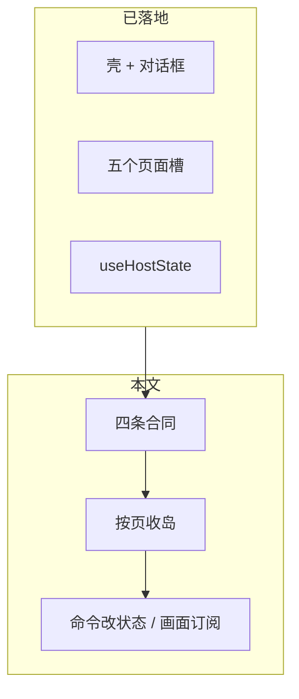

# 桌面前端 L2：块内分层与页面收岛技术方案

官方参考：[useSyncExternalStore](https://react.dev/reference/react/useSyncExternalStore)；[Vite | Tauri](https://v2.tauri.app/start/frontend/vite/)

关联：栈切换方案 `docs/archive/ui/workbench-desktop-frontend-react-and-typescript-stack-switch.md`（`5587042` 起的 Vite / React / TypeScript）。本文管**栈切换之后**还没做完的事：块内职责，以及把页面从嵌套 `createRoot` 收进路由树。

基线提交：`3e09485`（`refactor(frontend): render chrome dialogs and five page slots in React`）。✅ Verified（`git log -1 --oneline`）

决策来源：2026-08-28 会话。用户要求先提交已落地代码，再单独出本文。块内分层四条合同见 §2。

---

## 1. 目标

桌面 L2 已经换成 React + TypeScript。还差的是：每一页成为路由树里的子组件；命令改状态、画面读快照重绘。不另开一轮「架构重构」。

不改 L3 invoke map，不改 Rust，不与 Android 共用 UI。不上 Redux / Zustand / React Query、react-router、Tailwind。✅ Verified（栈切换方案 §2；`docs/architecture/layer-constraints.md`：L2 只经 L3）



---

## 2. 已锁合同

| # | 合同 | 依据 |
|---|------|------|
| 1 | **第一刀是业务目录，第二刀是块内职责。** 保持 `notes/`、`home/`、`todo-task/`、`corpus/`、`read-later/`、`app-shell/`、`host/`、`shared/`。不把 `frontend/src` 收成顶层 `data/`、`logic/`、`ui/`。 | ✅ Verified（现有 `frontend/src` 目录）；会话 2026-08-28 已锁 |
| 2 | **IO 只经现有 Host 出口。** 新代码走 `host/api` + `apiClient`。Todos 已有的 `todo-task/host.ts` 留在本块，不先并进 `host/api`。禁止再造一套「数据层」绕 L3。 | ✅ Verified（`host/api.ts`、`host/apiClient.ts`、`todo-task/host.ts`；`docs/architecture/layer-constraints.md`） |
| 3 | **收一页 = 这页不再 `mount*(空盒子)`，且命令不再画 UI。** 画面读快照画 JSX；状态变了 `notify`；命令调 API、改状态，不准 `innerHTML` / 再 `createRoot` 进该页槽。 | ✅ Verified（当前反例：`app-shell/routes.ts` 的 `mountHomeHub` 等；`notes/sidebar.tsx` `selectDate` 找 `#doc-list`） |
| 4 | **`host/state` 先当订阅源，不先拆成五个 store。** 本块已有自己的 host 的，继续用（Todos）。 | ✅ Verified（`host/state.ts`；`todo-task/host.ts`） |

块内三件事（不必做成三个文件夹）：

| 职责 | 做什么 | 不准做什么 |
|------|--------|------------|
| 画面 | 读快照，画出 JSX | `getElementById` 去填列表 / 正文 |
| 状态 | 这页记得什么；变了通知订阅者 | 自己去改某个 `#id` |
| 命令 | 调 Host、改状态 | `innerHTML`、`createRoot(空槽)` |

同一轮不上：全站横切三层目录、新状态库、react-router。

---

## 3. 现状（`3e09485`）

| 项 | 现状 | 标记 |
|----|------|------|
| 入口 | `index.html` 只留 `#root`；`main.tsx` `createRoot` → `App` → 动态 `import('./boot.ts')` | ✅ Verified（`frontend/index.html`；`frontend/src/main.tsx`） |
| 壳 | `App` 画 `Shell`（header + 对话框）和 `HashRouter` | ✅ Verified（`frontend/src/App.tsx`；`shell.tsx`） |
| 页面槽 | `HashRouter` 始终渲染 `ShellPages`；五槽按 `parseHash` 显隐，不卸载 | ✅ Verified（`hash-router.tsx`；`shell-pages.tsx`） |
| 岛屿 | `routes.ts` 仍 `mountHomeHub` / `mountTodoTaskSplit` / `mountCorpusDocList` / `mountWorkbench` 进这些槽 | ✅ Verified（`app-shell/routes.ts`；`home/hub.tsx` `createRoot`；`todo-task/page.tsx` `createRoot`；`corpus/corpus-doc-list.tsx` `createRoot`） |
| Read Later | 路由先走 Home，再开对话框；列表仍 `mountReadLaterList` 进对话框 body | ✅ Verified（`mountReadLaterRoute`；`read-later/dialog.tsx`） |
| 状态钩子 | `useHostState` / `notifyState` 已有。调用 `notifyState` 的只有 `boot.ts` `loadIndex` 与 `notes/sidebar.tsx` `selectDate`。订阅者只有 `ShellPages`（`data-active-date`） | ✅ Verified（`rg notifyState`；`rg useHostState`） |
| 对话框 | Settings / Bind / Skills / Commit / Comment / Diff / Move / Settle / Todo / Convert / Read Later 由 `Shell` 挂组件；开闭双写 `createModuleStore` + `classList.open` | ✅ Verified（`shell.tsx`；`shared/module-store.ts`） |
| Notes 铬 | 编辑 / 保存 / 取消 / 提交 / 关闭等 `onClick` 在 `ShellPages`；阅读器仍 `openDoc` 改 `#note-outlet` | ✅ Verified（`shell-pages.tsx`；`routes.ts` `mountWorkbench`） |
| boot | 拉 index、注册 hash handler、挂 home-entry overlay；已去掉 Notes 铬的 import-time 监听 | ✅ Verified（`boot.ts`） |
| 模块顶层找 id | `corpus-viewer.ts`、`sediment-kb.tsx`、`qr-dialog.tsx` 仍在 import 时 `getElementById` + `addEventListener`；`routes.ts` 顶层读 `#feed-view` | ✅ Verified（各文件模块顶层） |
| `@ts-nocheck` | `frontend/src` 53 个文件仍有 | ✅ Verified（`rg -l '@ts-nocheck' frontend/src \| wc -l`，2026-08-28） |
| 规模 | 125 个 `.ts`/`.tsx`，22,208 行；`app.css` 7,410 行；126 个 vitest 文件 | ✅ Verified（`find` + `wc`，2026-08-28） |
| vanilla | `frontend/js/` 不存在；`frontend/src` 无 `.js` | ✅ Verified（`test -d frontend/js`；`find frontend/src -name '*.js'`） |

栈切换方案 §5 的 P3–P8（按页换成 TSX、最后删 `frontend/js/`）描述的是当时阶段。P7 / P8 的对话框与删 vanilla **已做完**。未做完的收页，以本文 §5 为准，不要再按 P3–P8 的顺序施工。

---

## 4. 目标结构

```text
App
├── Shell          header + 对话框（已在树里）
└── HashRouter
    └── ShellPages
        ├── Home 组件        不再 mountHomeHub(#home-view)
        ├── Todos 组件       不再 mountTodoTaskSplit(#todo-tasks-view)
        ├── Corpus 组件      不再 mountCorpusDocList(#corpus-doc-view)
        ├── Notes 组件       不再 openDoc / selectDate 填 id
        └── Read Later 列表  不再 mountReadLaterList(对话框 body)
```

⚠️ Inferred：五槽可以收成页面组件后删掉空 `div`；在对应页收完之前必须留着，供残留 `getElementById` 使用。

路由仍是 `#` / `parseHash`。✅ Verified（栈切换方案 §2；`frontend/src/router/index.ts`）

---

## 5. 分步实施

每一阶段结束应用都能开。**禁止**让 `HashRouter` 的子组件和 `mount*` 同时拥有同一页（重复 id、双 `createRoot`）。收完一页，再删该页的 `mount*`。

### 第 1 步：Home 收岛（合同第一份实物）

**文件：** `home/hub.tsx`、`shell-pages.tsx`、`app-shell/routes.ts`、`tests/home-entry-shell/hub.test.js` 及相关 Home 扫描测试。

**现状：** `HomeHubView` 已是组件；`mountHomeHub` 在闭包里记会话 / 消息，再 `createRoot(#home-view)` + `paint()`。✅ Verified（`home/hub.tsx`）

**做：**

- [ ] 把 `HomeHubView`（或等价页面组件）作为 `ShellPages` 在 `home` / `read-later` 时的子节点。
- [ ] 会话 / 消息从「闭包 + `paint()`」改成模块 store 或组件 state；变了靠订阅重绘，不 `root.render`。
- [ ] `mountHomeRoute` 不再调用 `mountHomeHub`。只留换页时的 unmount 其它岛、导航铬（在其它岛未收完之前）。
- [ ] `#home-view` 空槽：Home 收完且没有代码再 `getElementById('home-view')` 之后再删。

**完成条件：** `#/home` 能聊、能进 Read Later 入口；`document.querySelectorAll('#home-view')` 至多一个根；Home 路径上不再 `createRoot(homeView)`。

**测：** 现有 Home / hub 源码扫描测试；浏览器 `#/home`。

---

### 第 2 步：Todos 收岛

**文件：** `todo-task/page.tsx`、`todo-task/index.ts`、`shell-pages.tsx`、`app-shell/routes.ts`、`tests/todo-task/*.test.js`。

**现状：** `mountTodoTaskSplit` 对 `#todo-tasks-view` `createRoot`；同页改 master/sub 走 `applyRoute`，不 remount。IO 在 `todo-task/host.ts`。✅ Verified（`routes.ts` `mountTodoTasksRoute`；`todo-task/page.tsx`；`todo-task/host.ts`）

**做：**

- [ ] 页面壳作为 `ShellPages` 在 `todo-tasks` 时的子节点。
- [ ] 路由参数变化继续原地更新，不整页卸挂。
- [ ] `todo-task/host.ts`、`lifecycle.ts`、`binding.ts` 留在本块；命令不写 `#todo-tasks-view` 的 `innerHTML`。
- [ ] 删 `mountTodoTaskSplit(container)`。

**完成条件：** `#/todo-tasks` 列表 / 详情 / 创建仍可用；该槽不再嵌套 `createRoot`。

**测：** `tests/todo-task/page.test.js` 等；浏览器 `#/todo-tasks`。

---

### 第 3 步：Corpus 收岛

**文件：** `corpus/corpus-doc-list.tsx`、`corpus/corpus-viewer/**`、`shell-pages.tsx`、`app-shell/routes.ts`。

**现状：** `mountCorpusDocList` 对 `#corpus-doc-view` `createRoot`；同 repo 改 path 走 `navigateToPath`，不 remount。✅ Verified（`routes.ts` `mountCorpusDocRoute`）

**做：**

- [ ] 文档树 / 阅读器作为 `corpus-doc` 槽的子节点。
- [ ] 同 repo 改 path 仍不整页卸挂。
- [ ] 知识库评论、提交对话框已在 `Shell`；不要再复制一份盒子。
- [ ] 删 `mountCorpusDocList(container)`。

**完成条件：** `#/corpus-doc/...` 能打开文档与评论；该槽不再嵌套 `createRoot`。

**测：** `tests/corpus/*`；浏览器知识库路由。

---

### 第 4 步：Notes 收岛，并真正订阅 `host/state`

**文件：** `notes/sidebar.tsx`、`notes/viewer.ts`、`notes/viewer/**`、`notes/cards.tsx`、`shell-pages.tsx`、`app-shell/routes.ts`、`boot.ts`。

**现状：** `ShellPages` 已画 Notes 铬和空的 sidebar / `#doc-list` / `#note-outlet`。`selectDate` 写 `state.ui.activeDate` 后仍找 `#status`、`#date-heading`、`#doc-list`。`mountWorkbench` 仍 `openDoc`、保证 `#note-outlet`。`useHostState` 只给 layout 的 `data-active-date`。✅ Verified（`shell-pages.tsx`；`notes/sidebar.tsx` `selectDate`；`routes.ts` `mountWorkbench`）

**做：**

- [ ] 侧栏、日期列表、阅读器改为读 `useHostState()` 的 JSX，不再 `innerHTML`。
- [ ] `selectDate` / `openDoc` / `saveDoc` 只改 `state` + `notifyState()`（或本块 store），不碰那些 id 的内容。
- [ ] `mountWorkbench` 收成「根据 hash 调命令」；不再创建 / 填 `#note-outlet`。
- [ ] `boot.ts` 的 `loadIndex` 可继续写 `state` 并 `notifyState`；`renderSidebar()` 的 DOM 写入随本步删掉。

**完成条件：** `#/workbench` 选日期、打开、编辑、返回与现在一致；`selectDate` 源码中不再出现 `getElementById('doc-list')`。

**测：** `tests/notes/*`；浏览器 `#/workbench`（无 Host 时 Retry 仍可接受）。

**注意：** 这是最大的一块。不要和第 1 步抢；Home 先交出合同实物。

---

### 第 5 步：Read Later 列表离开第二棵树

**文件：** `read-later/list.tsx`、`read-later/dialog.tsx`。

**现状：** 对话框已在 `Shell`；打开后 `useEffect` 里 `mountReadLaterList(body)` 再 `createRoot`。✅ Verified（`read-later/dialog.tsx`）

**做：**

- [ ] 列表作为 `ReadLaterDialog` 的子组件，随 `open` 显隐。
- [ ] 删 `mountReadLaterList`。
- [ ] `#read-later-view` 槽今日恒隐。✅ Verified（`shell-pages.tsx` `slotStyle(false, …)`）。无引用后删除。

**完成条件：** Home 上打开 Read Later，列表仍可筛未读；对话框内不再 `createRoot`。

---

### 第 6 步：收 `boot.ts` 与模块顶层找 id

**文件：** `boot.ts`、`corpus/corpus-viewer.ts`、`app-shell/sediment-kb.tsx`、`app-shell/qr-dialog.tsx`、`app-shell/routes.ts`。

**做：**

- [ ] 把上述文件的 import-time `getElementById` + `addEventListener` 改到对应组件的 `onClick` / `useEffect`。
- [ ] `routes.ts` 顶层 `document.getElementById('feed-view')` 删掉或改到渲染之后。✅ Verified（`routes.ts` 第 18 行；`#feed-view` 在 `shell-pages.tsx`）
- [ ] `boot.ts` 只保留：拉 index、注册 `setRouteHandlers`、挂 home-entry overlay。换页不再靠它绑 Notes 铬。

**完成条件：** 除测试辅助外，业务模块顶层不再在 import 时找 id。

---

### 第 7 步：拆 `@ts-nocheck`

**现状：** 53 个文件。✅ Verified（2026-08-28 `rg`）

**做：** 收完哪一页，就拆那一页的 nocheck。禁止单独开一轮「全仓补类型」。

**完成条件：** 该页相关文件 `tsc --noEmit` 不再靠 nocheck 过关。整仓 53 → 随步递减。

---

### 第 8 步：验收

- [ ] `npx tsc --noEmit` 通过。
- [ ] 改动过的 vitest 文件通过。
- [ ] 浏览器走 `#/home`、`#/todo-tasks`、`#/workbench`、知识库、Settings / Bind。
- [ ] 有 Tauri 窗口时再跑一遍同一条路径（本机 Host）。
- [ ] `npm test`（cargo lib + vitest）在收口时跑全量。

已知：此前 vitest 有 2 个与本次无关的失败（缺 `docs/knowledge-mcp.md`、缺 sibling skills `todo-task/SKILL.md`）。⚠️ Inferred（2026-08-28 绞杀验收笔记；收口时须重核是否仍在）。

---

## 6. 每步共同禁令

1. 不把目录改成顶层 `data/` / `logic/` / `ui/`。
2. 不在收岛完成前，让页面组件和 `mount*` 同时画同一页。
3. 不引入新状态库、react-router、新 CSS 方案。
4. L2 不静态 import `@tauri-apps/*`。✅ Verified（`docs/coding/coding-workbench-discipline.md`）
5. 用户可见文案仍为英文。✅ Verified（`docs/biz/ui-conventions.md`）
6. 不把 Todos 的 `host.ts` 为了对齐「三层」而搬进 `host/api`（除非另授权）。

---

## 7. 与已提交代码的关系

`5587042`：栈切到 Vite + React + TypeScript。  
`3e09485`：对话框与五个槽进 App 树；页面仍是岛。

本文的步骤**就是**架构落地，不是收完岛再重构。第 1 步 Home 是合同的第一份实物；第 4 步 Notes 才把 `useHostState` 用满。

---

## 8. 开放（未锁，不在本文默认步骤里）

| 项 | 状态 |
|----|------|
| 全站一个 `host/state` + 切片订阅，还是每块一个 store | ❌ Unresolved。默认按 §2 合同 4：先不拆。要改用 `/converge`。 |
| 命令独立 `.ts`，还是和组件写在同一文件、只保证不碰 DOM | ❌ Unresolved。默认：不强制拆文件。 |
| 设计文档是否再归档进语料仓 | ❌ Unresolved。 |
| 是否授权从第 1 步（Home 收岛）开工 | ❌ Unresolved（用户尚未授权写代码）。 |
