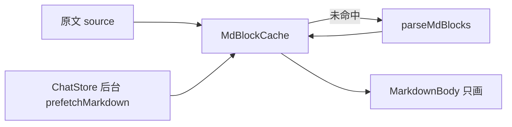

# Android Chat Markdown 解析内存缓存技术方案

> 源码：`lulu-workbench-android/lulu-workbench/markdown/`、`lulu-workbench/app/src/main/java/com/lulu/workbench/android/chat/`
> Related todo: `task_a2a93efb9e6e_sub_17`
> 决策来源：本会话 `/converge`，exit gate: locked

## 1. 目标

助手回复的 Markdown 只解析一次。结果放在 `:markdown` 的进程内表里。滚动、滑出再滑回不再现算。`:app` 不持有块列表；画面仍只交原文。不写磁盘。

---

## 2. 锁定决策

| # | 题目 | 选择 |
|---|---|---|
| 落点 | 缓存在哪 | `:markdown` 内部表。输入原文，输出块列表；命中直接返回 |
| 渲染 | 块还没到时画什么 | 先解析再上屏。画面只读缓存结果，原文不是第二条渲染路径 |
| 键 | 原文哈希还是下标 | 表键仍是原文字符串（库不认识会话下标）。MD5 只进日志 `key=`，命中复用已存值 |
| 日志 | 打在哪 | 只在 `MdBlockCache.getOrParse`。未命中：`parse miss key=… chars=… blocks=… ms=… thread=…`。命中：`parse hit key=… chars=… blocks=… thread=…`。不进 Compose |
| 磁盘 | 是否旁路落盘 | 否 |
| 历史模型 | 是否改 `HistoryTurn` | 否，仍只存 `role` / `content` |

`:agent` 不依赖 `:markdown`。✅ Verified（`HistoryTurn` 在 `agent/session/HistoryJson.kt`，仅 `role` + `content`）

---

## 3. 改前现状

| 项 | 现状 | 标记 |
|---|---|---|
| 落盘 | `sessions/<id>/history` 只存原文 JSON | ✅ Verified（`agent/session/Session.kt` `saveTurns`） |
| 解析入口 | `MarkdownBody` 对 `source` 做 `remember { parseMdBlocks(source) }` | ✅ Verified（改前 `MarkdownBody.kt`） |
| 调用点 | 仅助手行；用户行是 `Text` | ✅ Verified（`ChatTranscript.kt`） |
| 列表回收 | `LazyColumn` 滑出即拆行，`remember` 丢掉 | ✅ Verified（`ChatTranscript.kt`） |
| 助手上屏 | `Finished` 时整段追加，不是半截 Markdown | ✅ Verified（`ChatStore.applyProgress`） |

`remember` 只活在当前可见的那一行，不是会话级缓存。

---

## 4. 结构

| 层 | 职责 | 不做什么 |
|---|---|---|
| `:markdown` `MdBlockCache` | 原文 → 块列表；`ConcurrentHashMap`；命中返回同一实例 | 不认 session / 下标；不写盘 |
| `:markdown` `prefetchMarkdown` | 对外预热入口，内部走同一张表 | 不把 `MdBlock` 暴露给 `:app` |
| `:markdown` `MarkdownBody` | 收 `source`，读缓存后画 | 不再用行上 `remember` 现拆 |
| `:app` `ChatStore` | 后台对助手 `content` 调 `prefetchMarkdown`，完成才挂 `turns` | 不存块列表 |

缓存实现：未命中时 `computeIfAbsent` 解析，算一次 UTF-8 MD5，写入 `CachedMd`；命中直接返回同一 `blocks` 并打 `parse hit`。✅ Verified（`markdown/.../MdCache.kt`）

`:markdown` 依赖 `:log`，模块名 `LogModule.MARKDOWN`。✅ Verified（`markdown/build.gradle.kts`、`LogModule.kt`）

`MarkdownBody` 用 `remember(source) { cachedMdBlocks(source) }` 取块，不再在 Compose 里计时或打日志。✅ Verified（`MarkdownBody.kt`）

---

## 5. 预热时机

都在 `runOffMain` 里预热，主线程只挂已经预热过的 `turns`。

| 时机 | 行为 |
|---|---|
| 冷启动 / 打开已有会话 | `init` 里 `loadTurns`：读历史，对每条 `assistant` 预热，再上屏 |
| 切换会话 | 先清空 `turns`，后台 `loadTurns`，再挂上 |
| 删除当前会话并切到下一条 | 同上 |
| 助手 `Finished` 或发送异常文案 | 先 `prefetchMarkdown(reply)`，再 `applyProgress` |

✅ Verified（`ChatStore.kt` `init` / `SelectSession` / `DeleteSession` / `Send` / `loadTurns`）

用户行不预热。进行中的「Requesting…」仍是普通 `Text`。✅ Verified（`ChatTranscript.kt`）

列表 `key` 为 `sessionId + index + role`，不再拼整段 `content`。✅ Verified（`ChatTranscript.kt`）

进程被杀后表没了；下次打开再预热。⚠️ Inferred（进程内 `ConcurrentHashMap`，无持久化）

---

## 6. 主要文件

| 文件 | 作用 |
|---|---|
| `:markdown` `MdCache.kt` | `prefetchMarkdown`、`cachedMdBlocks`、`MdBlockCache`、miss/hit 日志 |
| `:markdown` `MdParse.kt` | 纯解析；不进缓存层 |
| `:markdown` `MarkdownBody.kt` | 只读缓存并画 |
| `:log` `LogModule.kt` | `MARKDOWN` |
| `:app` `ChatStore.kt` | 后台预热，完成后才挂 `turns` |
| `:app` `ChatTranscript.kt` | 助手行仍交 `turn.content` |

---

## 7. 不做

- 按条或按会话写解析旁路文件
- 把块列表放进 `ChatState` / `HistoryTurn`
- 块缺失时对原文现算当第二条路径
- 按块虚拟化长回复（量高 / 表格 `IntrinsicSize` 是另一刀）
- 缓存淘汰或跨进程共享
