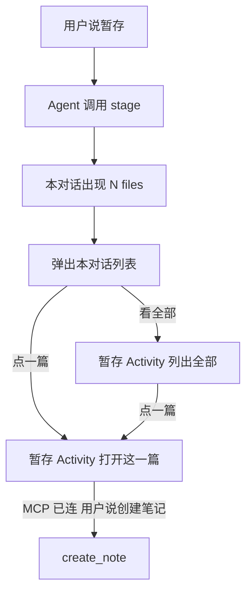
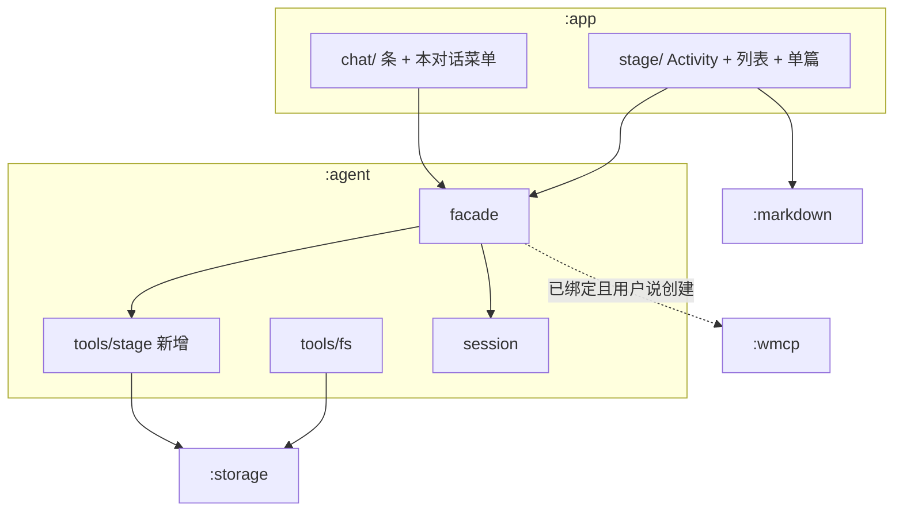

# Android 对话暂存技术方案

> 源码：`lulu-workbench-android/lulu-workbench/`
> 架构约束：`docs/archive/v0.1/workbench-android-architecture.md`
> Related todo: `task_a2a93efb9e6e` / `task_a2a93efb9e6e_sub_18`
> 决策来源：2026-08-30 会话 `/converge`，exit gate: locked

## 1. 目标

MCP 暂时连不上时，用户仍能把一篇 Markdown **暂存**在手机上；连上 Mac 之后，在对话里说「用这篇创建笔记」，再走现有 `create_note`。不做隧道、不做云副本、不缓存 MCP Task。

手机不是第二套笔记库。家仍是 Mac 上的 Host 数据层。

---

## 2. 锁定决策

| # | 题目 | 选择 |
|---|---|---|
| 1 | 本切片范围 | 只做暂存；连上后由用户再说创建笔记。隧道 / 云副本不做 |
| 2 | 「N files」默认 | 只列本对话；「看全部」跳进独立暂存 Activity |
| 3 | 本对话点一篇 | 跳进同一座暂存 Activity，直接打开该篇 |
| — | 库的寿命 | App 级，不跟对话删 |
| — | 来源 | 创建时写 `source_session_id` + `source_session_title` 快照；本对话特标 |
| — | `write` | 不改名；仍是 session scratch |
| — | 格式 | 暂存只支持 Markdown |
| — | Editor | Compose 组件，嵌在暂存 Activity 里；不新开 Gradle 模块 |

来源是标签，不是所有权。对话删了，稿还在，快照仍可展示。

未锁（实现时不要擅自选死进合同）：

| 项 | 状态 |
|---|---|
| 本对话暂存数为 0 时，「N files」隐藏还是灰掉 | ❌ Unresolved |
| `create_note` 成功后，暂存是留着、标已入库，还是删除 | ❌ Unresolved |
| 条贴在输入框上方还是顶栏 | ❌ Unresolved |
| 从单篇按返回：先回全表还是直接回对话 | ❌ Unresolved（倾向：带 `id` 进来则回对话；从全表点进来则回全表） |

---

## 3. 现状

| 项 | 现状 | 标记 |
|---|---|---|
| 本地工具 | `read` / `grep` / `write` / `edit`，围栏在 `sessions/<id>/tools` | ✅ Verified（`agent/.../tools/fs/FsTools.kt`；架构不变项 4） |
| 分发 | 本地只有 `fs`；其余当 MCP；未绑定则没有远端 | ✅ Verified（`ToolDispatcher.kt`） |
| 删对话 | `storage.list("sessions/<id>")` 后全删 | ✅ Verified（`SessionRegistry.delete`） |
| 对话标题 | `:app` 用首条用户消息前 40 字现算 | ✅ Verified（`chat/state/ChatState.kt` `sessionTitle`） |
| UI 模块 | `:app` 不依赖 `:storage`；经 facade / commands | ✅ Verified（`app/build.gradle.kts`） |
| 第二座 Activity | 仅 `SettingsActivity`，`parentActivityName=MainActivity` | ✅ Verified（`AndroidManifest.xml`） |
| 预览 | `:markdown` `MarkdownBody`，对话助手气泡在用 | ✅ Verified（`markdown/MarkdownBody.kt`；`ChatTranscript.kt`） |
| Gradle 模块 | `:app` `:agent` `:llm` `:asr` `:wmcp` `:network` `:storage` `:log` `:markdown` | ✅ Verified（`settings.gradle.kts`） |
| 笔记写入 | 仅 Host notes 服务；Agent 经 MCP，禁止直写 `notes/` | ✅ Verified（workbench-skills `note-task/SKILL.md`） |
| Android 与 MCP | 笔记 / todo 必须绑定；无 MCP 仍可 LLM + 本地 `fs` | ✅ Verified（架构不变项 3） |

---

## 4. 交互（已锁路径）



1. 用户明确说暂存。Agent 调 `stage`（不是 `write`），写入 App 级库，回复标题与 `id`。不调 `create_note`。
2. 本对话至少一篇之后，出现「N files」。N = **本对话**篇数。
3. 点开：只列本对话（特标）+ 「看全部」。不在这里铺全库。
4. 点一篇或「看全部」都进 `StageActivity`。带 `id` 则落单篇，否则落全表。
5. 全表展示全部暂存，仅 Markdown；本对话来源可特标，其余用来源标题快照。
6. 连上 Mac 后，在当时对话说「用暂存的某某创建笔记」。Agent 按 `id` 读库（不限本对话），再调 `create_note`。
7. 给 AI：不每轮塞全文。`list_staged` 只给 `id` / 标题 / 是否本对话 / 来源快照；正文用 `get_staged`。

连着 MCP 时也可以暂存。断线时 Agent 不得假装会重试 `create_note`。

---

## 5. 静态模块：添加 / 改造

不新开 Gradle 模块。不新开 `:stage` / `:editor`。



### 5.1 添加

| 放哪 | 加什么 | 职责 |
|---|---|---|
| `:agent` `tools/stage` | `StageTools` + 路径约定 | `stage` / `list_staged` / `get_staged`。写 `staged/<id>/`，不进 session scratch |
| `:agent` | `StagedItem` | `id`、标题、`source_session_id`、`source_session_title`。无 Compose |
| `:agent` `facade` | 给 UI 的入口 | `listStaged` / `getStaged` / 按 session 过滤；单篇可改则 `updateStaged` |
| `:app` `stage/` | 对照 `settings/` | `StageActivity`、`commands` / `state` / `ui`。MVI 只在 `:app` |
| `:app` `chat/` | 条 | 「N files」、本对话菜单、`startActivity(StageActivity)` |
| Manifest | `StageActivity` | `exported=false`，`parentActivityName=.MainActivity`，对齐 Settings |

磁盘（`:agent` 算路径，`:storage` 只收字符串）：

```text
staged/<id>/meta
staged/<id>/body.md
sessions/<id>/…     ← 不动
```

删对话只清 `sessions/<id>`，不会碰到 `staged/`。✅ Verified（`SessionRegistry.delete` 的 list 前缀）

### 5.2 改造

| 改哪 | 改什么 |
|---|---|
| `ToolDispatcher` | 未绑定本地工具 = `fs` **加** `stage` 三件；`stage*` 不走 `toolRoot` 围栏 |
| `AgentLoop` | `call` 带上当前 `SessionId` 与标题快照 |
| `:agent` `session` | 收下 `sessionTitle` 算法，工具与 UI 共用 |
| `ChatState` / `ChatCommands` | 本对话条数、打开 Activity 的意图 |
| 架构不变项 4 | 本地工具写成：四件 `fs` **加上** `stage` 族；`fs` 仍只进 scratch |

不改：`:storage` 接口、`:wmcp`、`:llm`、`:network`、`:markdown` 预览合同、`write` 名字、Mac Host、note-task。

### 5.3 必须 / 禁止

| 模块 | 必须 | 禁止 |
|---|---|---|
| `:app` `stage/` | Activity + Compose 列表/单篇；MVI | 自己拼 `staged/` 路径；自己调 MCP |
| `:app` `chat/` | 本对话条；跳转 Activity | 在对话里嵌阅读器 |
| `:agent` | 库、`staged/`、工具表 | Compose；把暂存当成笔记 |
| `:storage` | 按路径读写 | 认 `SessionId`、认暂存语义 |
| `:wmcp` | 仅在用户说创建且已绑定时被调用 | 离线排队 `create_note` |

---

## 6. 工具合同（形状）

以落地时的 live MCP / `LlmToolDef` 为准。此处只定意图，不锁 JSON 字段名。

| 工具 | 何时有 | 做什么 |
|---|---|---|
| `stage` | 始终（未绑定也有） | 写入一篇 Markdown；记下当前对话 id 与标题快照；返回 `id` |
| `list_staged` | 始终 | 元数据列表，可按当前对话过滤；不含正文 |
| `get_staged` | 始终 | 按 `id` 取标题 + 正文 |
| `write` 等 `fs` | 始终 | 仍只进本对话 scratch，不进暂存 UI |
| `create_note` | 仅已绑定且 MCP 通 | 现有远端工具；本切片不改 Host |

`updateStaged` 是 facade 给 UI 的保存口，不是必须暴露给 LLM 的第五个工具。⚠️ Inferred（单篇编辑若做，走 facade 即可）

---

## 7. Activity 启动

对齐 Settings：`MainActivity` `startActivity`。✅ Verified（`MainActivity.kt`）

| Extra | 含义 |
|---|---|
| 无 `id` | 打开全表 |
| 有 `id` | 打开该篇 |

当前对话 id 可一并传入，供全表特标「本对话」。⚠️ Inferred（特标也可用 facade 过滤 + 当前 session 比较）

单篇 UI：标题 + Markdown 预览；若做编辑，同屏输入框，预览复用 `MarkdownBody`。

---

## 8. 明确不做

- 新 Gradle 模块
- 把 `write` 改名为 `cache`
- 缓存 / 重放 MCP `create_note`
- 公网中继或把 MCP 做成云端权威
- 手机上的正式 `notes/` 库
- 离线改 Mac 上已有笔记

---

## 9. 验收

- 未绑定：`definitions()` 含 `stage` / `list_staged` / `get_staged` 与四件 `fs`。
- `stage` 后 `staged/<id>/` 有 meta 与 `body.md`；删该对话后文件仍在。
- 本对话「N files」只数本对话；「看全部」进 `StageActivity` 全表。
- 点一篇进同一 Activity 的单篇，内容为 Markdown。
- 未绑定或 MCP 断开时，Agent 不调用 `create_note` 冒充成功。
- 已绑定且用户明确说创建：按 `id` `get_staged` 再 `create_note`。
- `:app` 不新增对 `:storage` 的依赖。
)
