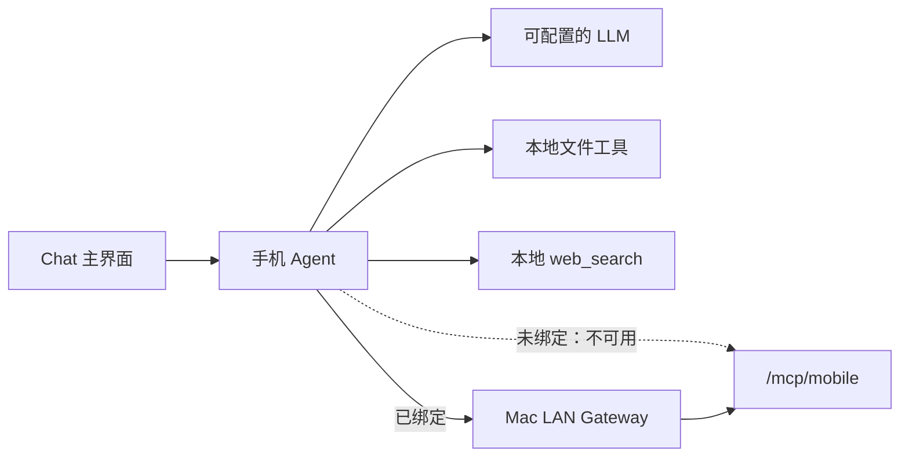
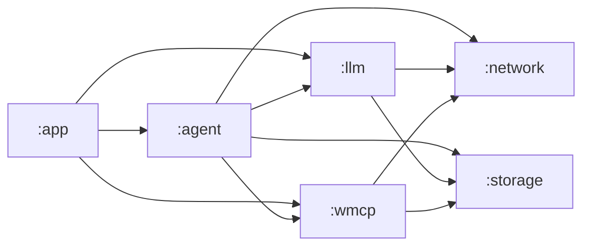
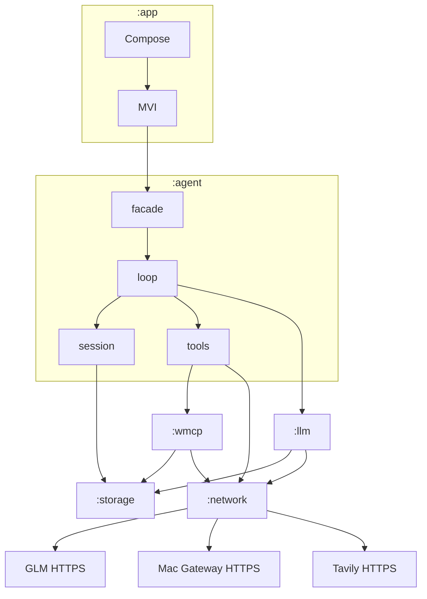

# Workbench Android 架构方案

本文已从 `docs/architecture/` 移入归档。`docs/architecture/` 是 SSOT 目录。

本文是 **目标方案**，不是当前 Android 代码的快照。实现与本文冲突时，改代码对齐本文。

Mac 侧入口与分层以 Workbench 仓库 `docs/architecture/arch-layer-constraints.md` 为准。本文只写手机端怎么切、怎么连 Mac。

---

## 不变项

实现不得改写下列句子。下列为对话签字锁定，不是当前 Android 代码的快照。

1. 多 session 并行的实现是多个 `loop` **实例**同时跑，不是一个 `loop` 里用一张表假装并行。每个 session 同时只有一轮 in-flight；不同 session 的 `loop` 可以一起跑。
2. 一轮请求的进度状态由该 session 的 `loop` 实例抛出。`:app` 用 MVI 接收并画出。不单开 `progress` 包。
3. Chat Agent 跑在手机上。没有 MCP（未绑定或 Mac 不在线）时仍可 LLM 对话 + 本地 `fs` 工具 + `web_search`。MCP 必须绑定后才可用。手机不是 Mac 上那个 Agent 的远程窗口。
4. 每个 session 两根目录：对话历史，以及工具 scratch。围栏只给工具那一根。本地工具是 `read` / `grep` / `write` / `edit`，外加 App 级 `stage` / `list_staged` / `get_staged`（不进 scratch），以及不经 Mac、不跟 LLM 厂商绑定的 `web_search`（只回短摘要 + 链接，不写盘）。这些文件只在手机应用内，不写 Mac 磁盘。工具进不去历史根。
5. 模块只有 `:app` `:agent` `:llm` `:wmcp` `:network` `:storage`，没有 `:core`。`:agent` 只有 `facade` / `loop` / `session` / `tools`（含 `fs`、`stage` 与 `web`），没有自建 mcp client。`:storage` 不认 session。`:network` 按扫码指纹钉 Gateway 证书。MVI 只在 `:app`。
6. 绑定用现有扫码，完成走 `/bind/complete`，工具走 `/mcp/mobile`。只在局域网。不直连 Host MCP，也不配 `cursor_ide` 本机 URL。MVP 不新开 Port B 业务路由，不做公网中继。

LLM 未配置时界面如何提示：仍未决，不是不变项。❌ Unresolved

---

## 1. 产品形态

手机是工作台的移动端。主界面是对话。底下是跑在手机上的 Chat Agent：智能来自 LLM；工作台业务能力来自绑定后的 Mac MCP。

| 能力 | 谁提供 | 绑定 |
|------|--------|------|
| 对话智能 | 手机 Agent 调 LLM | 不需要 |
| 本地 `read` / `grep` / `write` / `edit` | 手机 Agent，按 session 隔离 | 不需要 |
| 公网检索摘要 + 链接 | 手机 Agent 调 Tavily（默认 keyless；可选本机 key） | 不需要 |
| 笔记 / 知识库 / Todo 等 | Mac MCP | 必须绑定 |

公网检索走手机本地 `web_search`，不经 Mac、不跟 LLM 厂商工具绑定。无 key 时请求头 `X-Tavily-Access-Mode: keyless`；有 key 时 `Authorization: Bearer`。✅ Verified（对话锁定；Android `WebSearchTools`；[Tavily keyless](https://docs.tavily.com/documentation/keyless)）

「绑定」指手机与 Mac 配对（`Bind_Mobile`），不是 Mac 桌面助手里把 Agent 绑到业务 key 的 Binding Contract。

锁定（本对话收敛）。

---

## 2. 与 Mac 的关系

Android 是上游应用，只进 Mac LAN Gateway，不直连 Host MCP 监听端口。✅ Verified（Workbench `docs/architecture/arch-layer-constraints.md` Ban 2：Android must not call MCP Server directly）

| 通道 | 路径 | 用途 |
|------|------|------|
| 绑定 | `POST /bind/complete` | 扫码后完成配对，拿到 `device_mcp_token` |
| 工具 | `/mcp/mobile` | 绑定后调工作台工具；背后用 `workbench` 槽，工具集与 `cursor_ide` 相同（笔记 + Todo） |

✅ Verified（Workbench `src-tauri/src/services/gateway/mod.rs` 登记 `/bind/complete`、`/mcp/mobile`；`mcp_protocol_adapter/listen.rs` 的 `mount_mobile_service` 使用 `scene_slot: "workbench"`；`routes.rs` 中 `workbench` 与 `cursor_ide` 均为 `include_notes` + `include_todo`）

Mac 出示二维码（局域网 IP、Gateway 端口、临时公钥、TLS 指纹等），约 180 秒有效。✅ Verified（Workbench `services/bind/mod.rs`：`BIND_TTL_SECS = 180`，`BIND_MOBILE_BUSINESS_ID = "Bind_Mobile"`；`frontend/src/app-shell/ui/bind-dialog.tsx`）

MVP 不新开 Port B 业务路由，也不做公网中继。绑定仍走已有的 `/bind/complete`，工具只走 `/mcp/mobile`。锁定（本对话收敛）。

不要把 `http://127.0.0.1:9876/mcp/cursor_ide` 配到手机上。✅ Verified（该 URL 是本机 IDE 通道，见 Workbench `docs/archive/knowledge-mcp.md`；手机必须走 Gateway）

---

## 3. 界面与 LLM 配置

- 主界面：Jetpack Compose。
- 屏幕状态：MVI（意图 → 更新状态 → 再画），**只在 `:app`**。`:agent` 不持有 Compose 状态。
- LLM 配置存在手机本地，字段对齐 Mac，不读 Mac 钥匙串。

| 字段 | 手机是否可改 | Mac 对照 |
|------|----------------|----------|
| 引擎 | 固定 `host` | `assistant_engine` / `[[llm]]` type `host` |
| `platform` | 只读 `glm` | 预置只读 |
| `base_url` | 只读 `https://open.bigmodel.cn/api/paas/v4` | 预置只读 |
| `model` | 可改 | 可改 |
| API key | 可改，不回显明文 | 可改，不回显明文 |

✅ Verified（Workbench `frontend/src/app-shell/state/settings/engine-presets.ts`；`src-tauri/src/config/settings/llm.rs`；`types.rs` 中 `HOST_LLM_PLATFORM` / `HOST_LLM_BASE_URL`）

未配置 LLM 时界面如何提示：❌ Unresolved（本对话未锁定）。

锁定其余项（本对话收敛）。

---

## 4. Gradle 模块

六个模块，没有 `:core`。

| 模块 | 一句话 |
|------|--------|
| `:app` | 壳、Chat / 设置 / 扫码界面、MVI |
| `:agent` | 对话循环、多 session、本地文件工具、`web_search`、session 隔离 |
| `:llm` | LLM 配置形状与补全请求 |
| `:wmcp` | 绑定握手与密码学；调 `/mcp/mobile` |
| `:network` | 出站 HTTPS 客户端（LLM 公网 + Mac Gateway + Tavily） |
| `:storage` | 纯读写：路径上的文件，以及按键存取的密钥 |

依赖方向为对话锁定后的目标图。当前仓库尚无这些模块。✅ Verified（现工程只有单模块应用：`lulu-workbench/app/.../MainActivity.kt` 为 Compose `Hello Android`）

### 4.1 各模块必须 / 禁止

| 模块 | 必须 | 禁止 |
|------|------|------|
| `:app` | 扫码界面；用 MVI 画 Chat / 设置 / 绑定状态 | 自己发 HTTP；自己算工具围栏 |
| `:agent` | 按 `SessionId` 算历史根与工具根；分发本地工具（含 `web_search`，走 `:network`）与 `:wmcp` 工具 | 自建 MCP 客户端；自建 HTTPS 栈 |
| `:llm` | 表达配置与补全 | 认 `SessionId`；直连 Mac |
| `:wmcp` | 扫码载荷上的握手与密码学；把 TLS 指纹交给 `:network`；带 token 调 MCP | 实现 TLS 钉证书；当 server |
| `:network` | 普通 HTTPS；按传入的指纹钉 Gateway 证书 | 解析绑定协议；认 session |
| `:storage` | `read` / `write` / `delete` 路径；`getSecret` / `putSecret` 键 | 认 `SessionId`；做围栏；发网络 |

`:app` 依赖 `:llm`、`:wmcp` 是为了设置页与绑定页直接调它们的入口，而不经过对话循环。锁定（本对话收敛）。

---

## 5. `:agent` 内部

包（不是新的 Gradle 模块）：

| 包 | 职责 |
|----|------|
| `facade` | 给 `:app`：建 / 列 / 切 session，发消息，取消 |
| `loop` | 一轮：LLM → 工具 → LLM。每个 session 一个 `loop` 实例，可并行；每实例同时只有一轮 in-flight；进度从该实例抛出 |
| `session` | `SessionId`、两根路径、历史交给 `:storage` |
| `tools` | 合并工具表并分发 |
| `tools/fs` | `read` / `grep` / `write` / `edit` |
| `tools/stage` | `stage` / `list_staged` / `get_staged`；库在 `staged/`，不进 session scratch |
| `tools/web` | `web_search`；Tavily 短摘要 + 链接；默认 keyless，可选密钥在 `:storage` |

不单开 `progress` 包，不单开 mcp client 包。

对照 Mac Host Agent：`Session` / `Tools` / `LLM` / `Loop`，另有进程内 `mcp_client` 与 `path_fence`。✅ Verified（Workbench `src-tauri/src/services/agent/mod.rs`、`mcp_client.rs`、`path_fence.rs`、`loop/turn.rs`）

手机与 Mac 的刻意差异：

- LLM 在 `:llm`，不在 `:agent`。
- MCP 在 `:wmcp`，`:agent` 只决定调不调、调哪个名字。
- 不迁桌面 Binding Contract。
- 未绑定也能跑 `loop`（纯 LLM + 本地 `fs` + `stage` + `web_search`）。Mac 当前 `run_loop` 在无 Binding 时直接拒绝聊天。✅ Verified（`loop/turn.rs` 在无 Binding 时返回 `Unbound — no active Binding Contract`；Android `ToolDispatcher`）

---

## 6. Session 与文件围栏

支持多 session 并行：每个 session 一个 `loop` 实例，可同时跑。锁定（本对话签字）。Mac 当前是按 `session_id` 的 `flights` 表，不是多实例；手机不照抄该实现。✅ Verified（Workbench `services/agent/loop/flights.rs` 为按 id 的飞行表）

每个 session **两根目录**，都由 `:agent` 的 `session` 包计算路径，再交给 `:storage`：

| 根 | 谁读写 | 文件工具能否进入 |
|----|--------|------------------|
| 对话历史 | `:agent` 写轮次 | 不能 |
| 工具 scratch | `read` / `grep` / `write` / `edit` | 只能进这一根 |
| App 级暂存 `staged/` | `stage` / `list_staged` / `get_staged` | 不进 session 围栏；删对话不删 |

围栏只给工具 session 路径这一条，不加黑名单。历史根与工具根分开，因此不必用黑名单保护对话记录。

工具文件只在手机应用内目录，不读写 Mac 磁盘。Mac 上的业务数据走 MCP。锁定（本对话收敛）。

Mac 文件工具是 Host 本地工具，`write` / `edit` 进 `{scratch_parent}/{session_id}`。✅ Verified（`fs_tools.rs`、`path_fence.rs` 的 `with_session_scratch`）

未绑定：工具表是 `fs` 加 `stage` 族加 `web_search`。已绑定：再加上 `:wmcp` 列出的 MCP 工具。分发按名字：四件进 `fs`，`stage` / `list_staged` / `get_staged` 进 `stage`，`web_search` 进 `web`，其余进 `:wmcp`。对齐 Mac 合并 MCP catalog 与 `fs_tools::catalog` 再分发。✅ Verified（`loop/turn.rs`；Android `ToolDispatcher`）

---

## 7. 调用方向

### 禁止

1. 任何模块跳过 `:network` 自己做套接字访问 LLM、Gateway 或 Tavily。
2. `:agent` 内实现 Streamable HTTP MCP 客户端。
3. 手机直连 `127.0.0.1` 上的 Host MCP 或 `cursor_ide` 槽。
4. `:storage` 接收 `SessionId` 或实现围栏。
5. `:network` 解析绑定密文或 MCP JSON 语义。
6. `:llm` / `:wmcp` / `:network` / `:storage` 依赖一套共享的 session 核心模块（不存在 `:core`）。
7. `:agent` 跑 MVI 或持有 Compose 状态。
8. MVP 新开 Port B 业务 API，或做公网中继。
9. 文件工具读写对话历史根，或读写 Mac 工作区磁盘。

进入 MCP 是绑定成功之后的一次新入口，不是绑定请求的内部嵌套调用。对齐 Mac：Entering MCP Server after credentials from Business Route is a new entry。✅ Verified（Workbench `docs/architecture/arch-layer-constraints.md`）

---

## 8. MVP 范围

做：

- Chat 主界面（Compose + MVI）
- 手机本地 LLM 配置与对话
- 多 session；本地文件工具与两根目录隔离
- 手机本地 `web_search`（短摘要 + 链接）
- 扫码绑定 Mac；绑定后经 Gateway 使用 `/mcp/mobile`

不做：

- Port B 上除既有绑定外的新业务路由
- 公网中继
- 与 Mac 共用 API key
- 独立 `:core`、独立 mcp client 模块、`:agent` 内 `progress` 包
- 把手机做成 Mac Agent 的远程窗口

---

## 9. 当前代码

Android 仓库仍是单模块 Compose 占位，无 Chat、无绑定、无上述六模块。✅ Verified（`MainActivity.kt`）

Mac 侧 Gateway、扫码绑定、`/mcp/mobile`、设备 token 已存在。✅ Verified（见第 2 节引用）
