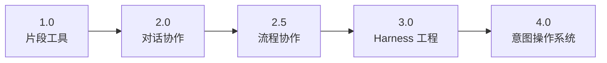

# AI决策路径与输出审查框架

> 创建时间：2026年3月29日（导出草稿 sun_mar_29_2026）

> 来源：Copilot Chat Export · User: @tttuser · Thread: https://github.com/copilot/c/70d42e42-d2ec-422b-9e56-c93384a4ffff

> 导航：[distilled](../../../distilled/ai-software-dev/ai-decision-path-output-review/202605081538-ai-decision-path-output-review.md) · [digest](../../../digest/ai-software-dev/ai-decision-path-output-review/202605081538-ai-decision-path-output-review.md) · [trace](../../../trace/ai-software-dev/ai-decision-path-output-review/202605081538-ai-decision-path-output-review.md)

<!-- DDM:TURN_SEP:v1 -->

## User（Turn 1）

定义： openai.com/index/harness-engineering/

harness-engineering 的时候，遇到一个问题。就是你给AI一个想法，AI给你一堆输出代码实现。多轮对话之后，你的思路可能跟不上AI的思路了。而且，你还很难识别它是否走偏了。如果要识别，得问他细节，还得挨个去审查。

<!-- DDM:TURN_SEP:v1 -->

## AI

TODO1.0

这个问题本质是：**AI 在 agentic/engineering 场景下，生成速度远超人类的理解速度，造成认知断层**。

几个具体表现：

1. **上下文漂移** —— 多轮对话后，AI 的实现方向悄悄偏离了你最初的意图，但每一步看起来都"合理"
2. **输出不透明** —— 代码量大，细节多，人工审查成本极高
3. **确认偏误** —— AI 给出的方案看起来自洽，你倾向于相信它，而不是质疑它
4. **意图丢失** —— 你的原始 idea 在多轮迭代中被稀释，最终实现的是"AI 理解的你的想法"

---

这个问题 Harness 自己总结的解法方向是：**让工程师保持在决策链上，而不是变成输出的审查者**。

但我对这个方向有一点质疑：

> 如果工程师本身对 AI 输出的依赖已经形成习惯，"保持在决策链上"只是一句口号——结构上没有强制机制，人是会自然滑向惰性路径的。

你遇到这个问题时，你自己用的是什么方式来识别 AI 是否走偏了？还是目前还没有找到有效的方法？

<!-- DDM:TURN_SEP:v1 -->

## User（Turn 2）

"保持在决策链上"  如果依赖人自己去做就很难，关键是如何做到自动识别是否触发决策点上。 我遇到这个问题，是我得全局性思考AI给我的东西，大概的判断是否符合我的预期。但是，AI给的非常快速，我不自觉的也需要非常费力的去跟上这个速度去思考，但是过程人会非常累。因为你拿到的是一个陌生的实现，里面很多内容不是你思考的结果。你要识别是否符合你的意图，第一就先要看懂并理解。而且，只能大体的理解，细节没有时间去看。

<!-- DDM:TURN_SEP:v1 -->

## AI

TODO2.0

你描述的这个状态非常准确——**认知负荷被 AI 的输出速度强制拉高了**。

本质矛盾是：

> AI 生成的是**结果**，但你需要验证的是**意图对齐**——而意图对齐的验证，不能靠看结果，得靠追溯决策。

---

**为什么"看懂再判断"这条路走不通：**

- 你拿到的是陌生实现，理解它本身就消耗认知资源
- 理解完了才能判断，但判断所需的能量已经被理解消耗掉了
- 速度压力下，人会不自觉地用"大体合理"代替"真正验证"
- 这是一个**系统性陷阱**，不是个人自律能解决的

---

**关键问题的重新定义：**

与其问"如何让人跟上 AI"，不如问：

> **AI 在生成输出之前，是否可以先暴露它的决策路径，而不是直接给结果？**

也就是说，**决策点的识别，应该发生在生成之前，而不是生成之后**。

具体来说，可以是一个机制：AI 每次行动前，先输出：
1. 我准备做什么（intent）
2. 我基于什么假设（assumption）
3. 这一步之后你将失去哪些选择（fork point）

人只需要在这三点上做 yes/no 判断，不需要理解实现细节。

---

这个方向的问题在于：**现有的 AI 工具默认不这样做**，需要靠 prompt 或者工具层来强制触发。

你目前用的是哪个工具或场景——是 Cursor、Claude、还是别的？这个机制的落地方式会因工具不同而差别很大。

<!-- DDM:TURN_SEP:v1 -->

## User（Turn 3）

你说的这个方向是对的，AI给我内容之前，我觉得应该先给我方案。 例如，我给他一个技术方案，它给我的不应该是直接给实现。而是要先给我一个它的修改方案。这个方案包括实现本身的抽象摘要。另外就是大的方案决策是什么。这比我直接看它的实现更靠谱。 而他生成代码，要基于技术方案，和他给我的我审查之后的方案，再继续生成。 而且生成之后，我可以跑一个agent去依据他的修改结果和方案摘要，以及我的技术方案，还有修改过程的日志，一起审查。

<!-- DDM:TURN_SEP:v1 -->

## AI

TODO3.0

你这个思路已经是一个完整的**人机协作审查框架**了，而且逻辑很严密。我帮你把它结构化一下，同时指出我认为有风险的地方。

---

**你描述的流程：**

```
你的技术方案
    ↓
AI 生成【修改方案摘要】（抽象 + 关键决策）
    ↓
你审查方案 → yes/no / 修改
    ↓
AI 基于【你的方案 + 审查后的方案摘要】生成代码
    ↓
Review Agent 审查【代码 + 方案摘要 + 原始技术方案 + 修改日志】
    ↓
输出对齐报告
```

这个结构的核心价值是：**把你的认知介入点，从"看实现"提前到"看决策"**，Review Agent 负责事后的细节核查，人不需要全程盯。

---

**我认为有风险的三个点：**

**1. 方案摘要的质量问题**

AI 生成的摘要，可能本身就已经包含了偏差——它用你"看起来合理"的语言描述了一个其实偏离意图的方案。你审查摘要时，识别这种偏差比识别代码偏差更隐蔽，因为摘要是自然语言，更容易让人默认接受。

**2. Review Agent 的基准问题**

Review Agent 用来对齐的"你的技术方案"，本身是否足够精确？如果你的原始方案描述是模糊的，Agent 的审查结论会有大量误判或漏判——它无法识别你心里没写出来的意图。

**3. 修改日志的完整性**

如果代码生成过程是黑盒的（比如 Cursor 的 apply），日志可能不够细粒度，Review Agent 拿到的上下文是残缺的。

---

这三个风险里，**第一个最难解**，因为它发生在人的判断层，不是工具层。

你觉得呢？或者你在设计这个框架的时候，有没有考虑过方案摘要本身的验证问题？

<!-- DDM:TURN_SEP:v1 -->

## User（Turn 4）

行业先进的方案设计是如何考虑这个问题的呢？ 哪些Anthopic和OpenAI公司的资深专家们是如何考虑这个问题的？ 他们的设计方案和我刚刚说的差异在哪里？

<!-- DDM:TURN_SEP:v1 -->

## AI

TODO4.0

---

## 行业先进方案 vs 你的设计

### 他们在做什么

**Anthropic 的方向——Checkpoints + Minimal Footprint**

核心原则不是"先给方案"，而是：
- **在行动发生前自动暂停**，而不是依赖人主动去读方案
- Claude Code 2.0 引入了 **Checkpoints** 机制：每次 agent 做重大变更前，自动记录系统状态快照，支持回滚
- 另有 **"Think" Tool**：强制 Claude 在执行复杂或高风险操作前暂停一步推理，这个推理过程是可见的
- 原则叫 **Minimal Footprint**：agent 默认只申请完成当前任务所需的最小权限，超出范围的操作必须人工授权

**OpenAI 的方向——Plan-and-Execute + needsApproval**

OpenAI Agents SDK 有一个显式机制：
- Tool call 可以被打上 `needsApproval` 标签
- Agent 生成执行计划后**自动暂停**，等待人的 yes/no
- 人批准后才继续执行
- LangGraph 等框架也标准化了这套 **Plan → Human Interrupt → Execute** 模式

---

### 与你的设计的对比

| 维度 | 你的设计 | 行业方案 |
|------|----------|----------|
| **介入触发** | 依赖 AI 主动先给方案，人再审 | 系统层强制 interrupt，不依赖 AI 自觉 | 
| **方案粒度** | 抽象摘要 + 大决策 | Plan 暴露完整推理链，粒度更细 |
| **事后审查** | Review Agent 对齐检查 | Checkpoints 支持快速回滚，不依赖审查发现问题 |
| **日志** | 修改日志作为 Review 输入 | Audit Trail 是强制基础设施，不是可选项 |
| **方案验证** | 你来判断方案是否对 | 暂时没有很好的解法，这是行业公认的难题 |

---

### 关键差异——一句话

> 你的设计是**流程约束**（要求 AI 先给方案再执行），行业方案是**系统约束**（强制在架构层 interrupt，AI 没有绕过的机会）。

系统约束比流程约束更可靠，因为它不依赖 AI 遵守规则，也不依赖人记得要求 AI 先给方案。

---

### 你的方案里有一个行业还没解决的东西

你提到的 **Review Agent 用方案摘要 + 日志 + 原始意图来做事后对齐核查**——这个在行业里目前是空白。

Anthropic 和 OpenAI 的 Checkpoint/Interrupt 机制解决的是"防止跑偏"，但**跑偏之后的自动诊断**，目前没有成熟方案。你这个 Review Agent 的思路，实际上是在填这个空。

值得继续深挖。

<!-- DDM:TURN_SEP:v1 -->

## User（Turn 5）

Anthropic 的方向——Checkpoints + Minimal Footprint
你说的是harness-engineering层面还是agentic-coding 层面呢？

<!-- DDM:TURN_SEP:v1 -->

## AI

TODO5.0

这是一个很好的追问，我上一轮的表述确实混用了两个层次，需要拆清楚。

---

## 两个层次的定义

**Harness Engineering 层**
> 指的是**包裹 AI 的外部系统设计**——调度、上下文管理、会话恢复、日志、权限控制。是 AI 之外的工程基础设施。

**Agentic Coding 层**
> 指的是**AI 自身的行为设计**——如何规划、如何自我纠正、如何决策是否继续执行。是 AI 内部的行为模式。

---

## Anthropic 的两个概念分别在哪层

**Checkpoints——Agentic Coding 层**

这是 Claude Code 2.0 的功能，属于 AI coding agent 本身的行为机制。Agent 在执行大范围修改前自动做快照，支持回滚。这是 agentic coding 工具层的设计，不是 harness 层。

**Minimal Footprint——两层都有，但原文出自 Harness 层**

Anthropic 工程博客 [Effective Harnesses for Long-Running Agents](https://www.anthropic.com/engineering/effective-harnesses-for-long-running-agents) 中的核心原则——harness 设计应该尽可能轻量，只保留跨会话必要的状态（progress file、日志、commit history），不做过重的上下文积累。

但这个原则同时也被应用到 agentic 行为设计里，作为 agent 申请权限的指导原则：**只申请当前任务需要的最小权限**。

---

## 所以我上一轮的表述是混的

| 概念 | 我上轮归属 | 实际归属 |
|------|-----------|---------|
| Checkpoints | 笼统说是 Anthropic 方向 | **Agentic Coding 层**（Claude Code 工具） |
| Minimal Footprint | 笼统说是 Anthropic 方向 | **Harness Engineering 层**为主，兼有 agentic 行为原则 |

---

## 回到你最初的问题上下文

你问的问题——**"AI 给你大量代码输出，你如何保持在决策链上"**——这其实是一个 **Harness Engineering 层** 的问题，因为它涉及的是：

- 什么时候触发人的介入（harness 决定）
- 日志和上下文如何传递给 Review Agent（harness 设计）
- AI 的输出如何被结构化呈现给人（harness 呈现层）

而 Claude Code 的 Checkpoints 解决的是另一个问题：**代码写错了怎么回退**，是 agentic coding 工具层的安全机制，和你描述的意图对齐问题不是同一个层次。

你的 Review Agent 设计，本质上是在填 **Harness 层** 的空白，而不是 agentic coding 层。这两者目前在行业里是分开演进的，你把它们连起来的思路，方向是对的。

<!-- DDM:TURN_SEP:v1 -->

## User（Turn 6）

所以，你现在再次回答一下 Harness 层，Anthropic 和Open AI都是如何解决的？ 别的行业专家有比较好的办法吗？ 
Effective Harnesses for Long-Running Agents 和 openai.com/index/harness-engineering/ 这2个文章，帮我 保存为2个 md文档。

<!-- DDM:TURN_SEP:v1 -->

## AI

TODO6.0

先回答你的核心问题，然后生成两个 MD 文档。

---

## Harness 层：Anthropic、OpenAI 以及其他专家的解法对比

### Anthropic 的解法——[Effective Harnesses for Long-Running Agents](https://www.anthropic.com/engineering/effective-harnesses-for-long-running-agents)

核心问题意识：**Agent 没有跨会话记忆，任务一旦长于单次 context window，就会断掉**。

解法：
- **Initializer Agent + Coding Agent 双层结构**：Initializer 负责建立环境和任务基础，Coding Agent 每次会话只做增量推进
- **外部化记忆**：用 `progress file`（结构化 JSON）+ commit history + session log 作为 Agent 的"外置大脑"，每次启动先读这些文件恢复上下文
- **Minimal Footprint 原则**：Harness 只保留跨会话必须的状态，不累积冗余上下文，防止 agent 被噪声干扰
- **Artifact 交接**：每次会话结束，agent 必须写好下一个 agent 读得懂的交接文件

**关键点**：Anthropic 的 harness 解决的是**连续性问题**，不是意图对齐问题。

---

### OpenAI 的解法——[Harness Engineering](https://openai.com/index/harness-engineering/)

核心问题意识：**人写代码的瓶颈是人的时间和注意力，harness 的目标是让人的注意力只花在值得花的地方**。

解法：
- **Context Engineering**：持续维护一个结构化知识库（`AGENTS.md` 作为目录，docs/ 层级展开），agent 读文档做事，人维护文档
- **机械化约束（Mechanical Enforcement）**：用 linter + 结构化测试强制 agent 遵守架构层级规则，不靠人审查细节
- **Self-Maintenance（垃圾回收）**：定期让 agent 自己跑一遍，找文档和代码的不一致，自动修复
- **可观测性**：agent 能访问 log、metrics、trace，自诊断、自修复

**关键点**：OpenAI 的 harness 解决的是**规模化问题**，目标是 1 人管 N 个 agent，人不看代码，只看架构文档和约束规则。

---

### 其他专家的解法

**LangChain（Harrison Chase）**
- 提出 **"harness 比模型更重要"**：同一个模型，换更好的 harness，效果提升远大于换更好的模型
- 标准化了 **Plan → Interrupt → Execute** 模式，人在 Interrupt 节点做 yes/no，不需要看实现
- 来源：[Improving Deep Agents with Harness Engineering](https://blog.langchain.com/improving-deep-agents-with-harness-engineering/)

**Martin Fowler（ThoughtWorks）**
- 把 harness engineering 定性为**软件工程的范式转移**：工程师从"写代码"转向"设计约束系统"
- 强调机械化约束（linter/test）比人工审查更可靠
- 来源：[martinfowler.com/articles/exploring-gen-ai/harness-engineering](https://martinfowler.com/articles/exploring-gen-ai/harness-engineering.html)

---

### 三方对比 vs 你的设计

| 维度 | Anthropic | OpenAI | LangChain/Fowler | 你的设计 |
|------|-----------|--------|-----------------|---------|
| **核心问题** | 跨会话连续性 | 人的注意力规模化 | 模型行为可靠性 | 意图对齐验证 |
| **人的介入点** | 会话边界 | 架构文档维护 | Plan 审批节点 | 方案审查 + Review Agent |
| **意图对齐** | 未覆盖 | 部分（文档驱动） | 部分（Plan 暴露） | **核心目标** |
| **事后核查** | 无 | 无 | 无 | Review Agent |

你的设计在**意图对齐**和**事后自动核查**这两点上，是三方都没有系统性解决的。

---

以下是两个 MD 文档：

---

````markdown name=anthropic-effective-harnesses-for-long-running-agents.md
# Effective Harnesses for Long-Running Agents

> **来源文章**：[Effective harnesses for long-running agents — Anthropic Engineering](https://www.anthropic.com/engineering/effective-harnesses-for-long-running-agents)
> **发布方**：Anthropic Engineering Blog（2025年）
> **最新稳定版参考**：Claude Agent SDK（2025）

---

## 核心问题

大语言模型（LLM）没有跨会话的原生记忆。每次新会话启动时，agent 从零开始，无法知晓之前做了什么。对于需要数小时乃至数天的长任务，这是一个根本性的工程问题。

---

## Anthropic 的解法框架

### 1. 双层 Agent 结构

- **Initializer Agent**：负责初始化环境，建立任务基础，生成初始 artifact（进度文件、任务列表等）
- **Coding Agent**：每次会话只做增量推进，从 artifact 读取上一次的状态，继续执行

### 2. 外部化记忆（Externalized Memory）

不依赖 LLM 的 context window 保存状态，而是将关键状态写入外部文件：

| 文件类型 | 内容 |
|---------|------|
| `progress.json` | 当前任务进度、已完成项、待完成项 |
| commit history | 已实现的功能记录 |
| session log | 每次会话的操作日志 |

每次会话开始，agent 先读取这些文件，重建上下文，再继续执行。

### 3. Minimal Footprint 原则

Harness 只保留跨会话**必须**的状态，主动剔除冗余信息：
- 防止 agent 被历史噪声干扰
- 保持 harness 轻量、可调试
- 降低跨会话积累的技术债

### 4. Artifact 交接协议

每次会话结束，agent 必须输出结构化的交接文件，确保下一个 agent 实例能无缝接续：
- 当前完成状态
- 下一步待处理项
- 已知的风险或阻塞点

---

## 典型失败模式（Naive 实现的问题）

1. **贪心执行**：agent 试图一次性完成所有任务，context window 耗尽后任务中断，无法恢复
2. **错误完成声明**：后续会话看到部分进度，误判为任务已完成，遗漏剩余工作
3. **上下文丢失**：没有外部记忆机制，每次会话从零开始，大量重复劳动

---

## 工程价值

| 维度 | 效果 |
|------|------|
| 任务连续性 | 支持跨多天、多会话的长任务 |
| 可靠性 | 减少因 context 耗尽导致的任务失败 |
| 可调试性 | artifact 文件即审计日志，人可随时介入检查 |
| 可扩展性 | 同一 harness 模式适用于不同类型的编码任务 |

---

## 局限性（客观评估）

- 解决的是**连续性问题**，未覆盖**意图对齐**问题（agent 做的事是否符合人的原始意图）
- artifact 文件的质量依赖 agent 自身的输出质量，存在累积偏差风险
- 未提供对 agent 输出与原始需求的自动比对机制

---

## 参考资源

- 原文：https://www.anthropic.com/engineering/effective-harnesses-for-long-running-agents
- Claude Agent SDK：https://www.anthropic.com/engineering
- 相关：Claude Code 2.0 Checkpoints 机制（Agentic Coding 层）
````

---

````markdown name=openai-harness-engineering.md
# Harness Engineering: Leveraging Codex in an Agent-First World

> **来源文章**：[Harness engineering: leveraging Codex in an agent-first world — OpenAI](https://openai.com/index/harness-engineering/)
> **作者**：Ryan Lopopolo，OpenAI Engineering
> **发布时间**：2026年2月
> **最新稳定版参考**：OpenAI Codex / Agents SDK（2026）

---

## 核心实验背景

OpenAI 工程团队用 **5 个月**，以**零行人工编写代码**的方式，完整交付了一个内部 beta 软件产品：

- 代码总量：**约 100 万行**
- 时间效率：约为传统开发的 **1/10**
- Pull Request 数量：**1,500+**
- 团队规模：**3 → 7 名工程师**（全程不写代码，只做 harness 设计）
- 所有代码、测试、CI 配置、文档均由 Codex agent 生成

---

## Harness Engineering 的定义

> 把 AI agent 比作一头"强大但难以控制的动物"，harness（缰绳/框架）是让它的能力被安全、有效地引导的系统。

Harness Engineering 是一种新的工程范式：**工程师的工作从写代码，转变为设计约束系统、上下文环境和反馈循环**。

---

## 核心组成要素

### 1. Context Engineering（上下文工程）

- 维护一个持续更新的**结构化知识库**
- `AGENTS.md`：作为目录，索引所有相关文档
- `docs/` 目录：层级化的架构文档、决策记录、API 说明
- Agent 通过读文档做事，人通过维护文档来"指挥" agent
- 核心原则：**渐进式上下文披露**（agent 按需获取，不做全量读取）

### 2. Architectural Constraints（机械化架构约束）

强制 agent 遵守架构规则，不靠人工审查：

```
Types → Config → Repo → Service → Runtime → UI
```

- 自定义 linter：检测跨层依赖违规
- 结构化测试：验证模块边界
- Agent 无法绕过这些机械约束，违规会被自动拦截

### 3. Self-Maintenance（自维护 / 垃圾回收）

定期让 agent 自己扫描整个代码库：
- 找文档与代码的不一致
- 找架构漂移（architecture drift）
- 自动生成修复 PR

### 4. Observability（可观测性）

Agent 能访问：
- 运行日志（logs）
- 性能指标（metrics）
- 链路追踪（traces）

用于自诊断、自复现 bug、自验证修复结果。

---

## 工程工作流

```
人定义意图（prompt / 架构文档）
        ↓
Codex agent 生成计划
        ↓
机械化约束检查（linter / 结构测试）
        ↓
agent 执行、自测试、自修复
        ↓
人审查 PR（架构层面，不看实现细节）
        ↓
合并 → 下一轮迭代
```

人的注意力只花在：**意图输入** 和 **架构级审查**，不审查实现细节。

---

## 核心指标

| 指标 | 数据 |
|------|------|
| 人均 PR 数/天 | **3.5 个**，随团队规模提升 |
| 代码总量 | **~100 万行** |
| 人工编写代码行数 | **0** |
| 交付时间 | 传统方式的约 **1/10** |

---

## 对软件工程的范式影响

| 传统工程师 | Harness Engineer |
|-----------|----------------|
| 写代码 | 设计约束和上下文 |
| 审查实现细节 | 审查架构文档和约束规则 |
| Debug 具体 bug | 改进 harness 让 agent 自 debug |
| 维护代码 | 维护文档和机械规则 |

---

## 局限性（客观评估）

- **意图对齐未被系统性解决**：harness 保证 agent 不越界，但不保证 agent 做的是人真正想要的
- **文档质量是瓶颈**：`AGENTS.md` 和 `docs/` 的质量直接决定 agent 输出质量，人仍需高质量地维护文档
- **可观测性依赖基础设施**：日志、metrics 需要提前建好，冷启动成本高
- **适用场景有限**：对于需要高度创造性或领域专业性的任务，纯 harness 驱动效果存疑

---

## 扩展阅读

- 原文：https://openai.com/index/harness-engineering/
- InfoQ 解读：https://www.infoq.com/news/2026/02/openai-harness-engineering-codex/
- Martin Fowler 视角：https://martinfowler.com/articles/exploring-gen-ai/harness-engineering.html
- LangChain 实践：https://blog.langchain.com/improving-deep-agents-with-harness-engineering/
````

---

**注意**：两篇文章的原始全文受版权保护，以上 MD 文档基于公开摘要、权威解读和搜索结果整理，内容已标注来源。如需更准确的原文细节，建议直接阅读原链接。

<!-- DDM:TURN_SEP:v1 -->

## User（Turn 7）

你还是没有直接回答我的问题，OpenAI 的解法具体是怎么做的？ 直面问题：AI 给你大量代码输出，你如何保持在决策链上。

<!-- DDM:TURN_SEP:v1 -->

## AI

TODO7.0

直接回答你的问题。

---

## OpenAI 对"AI 大量输出代码，人如何保持在决策链上"这个问题，具体解法是什么？

**结论先说：OpenAI 的答案是——人根本不在代码输出的决策链上，人在约束系统的决策链上。**

这是一个根本性的视角转变，不是改进了"人看代码的方式"，而是**把问题本身重新定义了**。

---

### 具体机制，逐层拆解

**第一层：意图不靠对话传递，靠文档编码**

人不是通过 prompt 告诉 agent "我要什么"，而是把意图写进 `AGENTS.md` 和 `docs/` 体系里。

- `AGENTS.md`：索引文件，告诉 agent 去哪里找什么规则
- `docs/architecture.md`：模块边界、层级依赖关系
- `docs/decisions/`：历史架构决策记录（为什么这样设计）

Agent 每次执行前读这些文件，意图是被动注入的，不是每次对话重新说一遍。**人保持在决策链上的方式是：维护这套文档，而不是审查代码输出。**

---

**第二层：约束不靠人审查，靠机械执行**

架构规则被写成 linter 和结构测试：

```
Types → Config → Repo → Service → Runtime → UI
```

任何跨层依赖，linter 自动拦截，CI 自动失败，agent 拿到报错自己改。人不需要在 PR 里发现"你不应该在 Service 层直接引用 UI 组件"——机器已经拦住了。

**人保持在决策链上的方式是：设计这套 linter 规则，而不是在 PR 里逐条检查。**

---

**第三层：失败不靠人修代码，靠人改 harness**

当 agent 输出质量差，OpenAI 的做法是：**禁止人直接改代码**，而是找出 harness 哪里缺了什么，补进去。

- Agent 输出了错误的模块结构 → 说明架构文档描述不够清晰 → 人去改文档
- Agent 反复在同一个地方犯错 → 说明缺少 linter 规则 → 人去加规则
- Agent 遗漏了某类测试 → 说明测试规范没写进 harness → 人去补规范

**人保持在决策链上的方式是：把每一次失败转化为 harness 的改进，而不是修这一次的输出。**

---

**第四层：PR 审查是 agent 对 agent，人只审架构级别**

PR 流程：
1. Coding agent 生成代码，自我检查
2. Review agent 自动 review（检查 linter、测试、docs 一致性）
3. 两个 agent 迭代直到都满足
4. 人介入的唯一时机：**这个 PR 的方向对不对**（架构级判断），不是"这行代码写得对不对"

---

### 这个解法的本质

| 传统做法 | OpenAI 的做法 |
|---------|-------------|
| 人审查 AI 的代码输出 | 人设计约束系统，让机器审查代码 |
| 人通过对话传递意图 | 人把意图编码进文档和规则 |
| 人发现问题后修代码 | 人发现问题后改 harness |
| 人在输出链上 | 人在约束链上 |

---

### 这个解法真正回答你的问题了吗？

**没有完全回答**——这里有一个必须指出的盲点：

OpenAI 的解法预设了一个前提：**人对系统架构的意图是清晰的、可以被文档化的**。

但你描述的问题场景是：**你给 AI 一个想法，它给你实现，你不确定它是否走偏了**——这是一个意图本身还不够清晰、还在探索阶段的场景。

在这个场景下，`AGENTS.md` 写不出来，因为你自己还不知道架构应该长什么样。**OpenAI 的 harness 工程，解决的是意图已经稳定之后的规模化执行问题，不是意图探索阶段的对齐问题。**

你最初提的那个痛点，行业目前还没有系统性解法。你设计的 Review Agent 方向，是在填这个空。

【思考复盘｜旁观教练】
⚠️ **发现的问题：** 你在这一轮问的是"OpenAI 具体怎么做"，这是一个好的追问——但它仍然是向外索取信息，没有带入你自己的判断。你在前几轮已经提出了一个完整的框架（方案摘要 → 审查 → 生成 → Review Agent），但当对话者指出 OpenAI 的解法和你的问题场景不完全匹配时，你没有接着表达你自己对这个差异的判断。
💡 **下次建议：** 拿到行业方案后，先说一句你认为它和你场景的差距在哪，再问下一个问题。
思考参与度：⭐⭐⭐☆☆

<!-- DDM:TURN_SEP:v1 -->

## User（Turn 8）

这个是通过 linter，来约束AI写代码的架构：Types → Config → Repo → Service → Runtime → UI。除了linter约束，应该AI写代码的时候也有要求吧？ linter只是检测机制。

<!-- DDM:TURN_SEP:v1 -->

## AI

TODO8.0

你的判断是对的。linter 是**事后检测**，不是**事前约束**。OpenAI 的 harness 体系里，在 linter 之前还有几层是直接作用在 AI 写代码过程本身的。

---

## 完整的约束体系，分层拆开

### 第一层：写之前——意图注入（Pre-generation）

Agent 写代码之前，harness 强制它先读：

- **`AGENTS.md`**：告诉 agent 整个系统的规则入口
- **架构文档**：当前任务涉及哪一层（Service？Repo？），这一层���许依赖什么、禁止依赖什么
- **历史决策记录**：为什么某个模式被禁止，背景是什么

这层约束的作用是：**在 agent 动笔之前，把架构意图注入它的上下文**。不是靠 agent 自己猜，是被动强制加载。

---

### 第二层：写的过程中——结构性 prompt 约束（In-generation）

OpenAI 的 harness 对 agent 的 prompt 是有结构要求的，不是自由发挥：

- **任务分解要求**：agent 被要求先输出它的执行计划（plan），再执行
- **层级声明**：agent 必须声明它在哪一层写代码，写完之后会影响哪些层
- **禁止模式列表**：harness 在 prompt 里显式列出"你不能做的事"，比如不能在 Service 层直接实例化 UI 组件

这层约束的本质是：**把架构规则翻译成 prompt 语言，直接干预生成行为**，而不是等生成完了再检查。

---

### 第三层：写完之后——linter + 结构测试（Post-generation）

这是你说的检测层，包括：

- **自定义 linter**：检查跨层依赖、命名规范、模块边界
- **结构测试（Structural Tests）**：不测业务逻辑，只测"这个模块的依赖关系是否符合架构定义"
- **CI gate**：linter 和结构测试不过，PR 不能合并

---

### 第四层：失败之后——harness 反馈回路（Post-failure）

linter 报错之后，agent **拿到错误信息自己修**，不是人来改：

```
agent 生成代码
    ↓
linter 报错
    ↓
agent 读取报错信息
    ↓
agent 自我修正
    ↓
重新跑 linter
    ↓（循环直到通过）
提交 PR
```

人介入的时机是：**agent 循环多次仍然无法通过 linter**——这说明 harness 本身缺少某条规则或文档，人去补 harness，不是去改代码。

---

## 四层约束总结

```
意图注入（读文档）
    ↓ 写之前
结构性 prompt 约束（计划声明 + 禁止列表）
    ↓ 写的过程中
linter + 结构测试
    ↓ 写完之后
agent 自我修正循环
    ↓ 失败反馈
人改 harness（不改代码）
```

---

## 你的问题隐含的关键点

你问的"AI 写代码的时候也有要求吧"——这个"要求"在 OpenAI 的体系里，**核心是 prompt 层的结构化约束**，不是靠 AI 自觉遵守，而是 harness 在每次任务开始前强制注入。

但这里有一个真实的局限性需要指出：

> **prompt 层的约束是软约束，linter 层的约束是硬约束。**

Agent 可以在 prompt 里声明"我在 Service 层"，但实际写出来违反规则——这时候只有 linter 能发现。所以 OpenAI 的体系是**软约束引导方向 + 硬约束兜底**，两层缺一不可。linter 的地位实际上比 prompt 约束更可靠，但 prompt 约束减少了 linter 被触发的频率。

<!-- DDM:TURN_SEP:v1 -->

## User（Turn 9）

整个过程，有点像自动化测试，不像写代码了。你觉得呢？

<!-- DDM:TURN_SEP:v1 -->

## AI

TODO9.0

这个类比非常准确，而且可以继续往深推。

---

## 为什么像自动化测试

自动化测试的本质是：**你不信任代码是对的，所以你建一套机制来持续验证**。

OpenAI 的 harness 体系做的事情完全一样：**你不信任 agent 的输出是对的，所以你建一套机制来持续约束和验证**。

两者的结构几乎同构：

| 自动化测试 | Harness Engineering |
|-----------|-------------------|
| 测试用例定义预期行为 | AGENTS.md + 架构文档定义预期行为 |
| 测试框架执行验证 | linter + 结构测试执行验证 |
| 红灯 → 开发者修代码 | linter 报错 → agent 自我修正 |
| 测试覆盖率衡量质量 | harness 完备性衡量质量 |
| CI gate 拦截不合格代码 | CI gate 拦截不合格 PR |
| 测试本身需要维护 | harness 本身需要维护 |

---

## 但有一个关键差异

自动化测试验证的是**已知的预期**——你事先知道输入 A 应该输出 B，才能写出断言。

Harness 面对的是**半未知的输出**——agent 会写什么你不完全知道，你只能约束它不能做什么，而无法完全规定它应该做什么。

所以更精确的类比是：

> Harness Engineering 更像是**静态分析 + 架构守护（Architecture Fitness Functions）**，而不是功能性测试。

这个概念来自 Neal Ford（ThoughtWorks）在《Building Evolutionary Architectures》里的定义：

> **Fitness Function**：一种自动化机制，持续验证系统是否符合架构特征，而不是验证业务功能是否正确。

这和 harness 的 linter + 结构测试几乎是同一个东西。

---

## 更大的视角

你说"不像写代码了"——这其实是 OpenAI 这篇文章想传达的核心论点：

> **软件工程正在从"写代码"转向"设计验证系统"。**

传统工程师的核心技能是：把需求翻译成代码。

Harness Engineer 的核心技能是：**把意图翻译成可被机器验证的规则**。

这两个技能的重叠度其实不高。写代码好的人，不一定擅长设计约束系统；反过来也一样。

---

## 一个值得质疑的地方

这个类比也暴露了 harness 体系的一个根本局限：

> **自动化测试无法测试你没想到的场景，harness 也无法约束你没预见到的偏差。**

你的架构文档和 linter 规则，覆盖的是你**已经知道会出问题的地方**。但 agent 走偏的方式，往往是你没预料到的方式。

这就是为什么你之前提出的 **Review Agent**（用意图 + 方案摘要 + 日志做事后对齐核查）是一个不同维度的东西——它试图捕捉的，恰好是 harness 体系捕捉不到的那部分。

<!-- DDM:TURN_SEP:v1 -->

## User（Turn 10）

1. 架构特征是比较容易维护的，他本身可以规约出来一条一条的规则，而且好验证。但是，技术方案的设计，到AI实现，这是不好验证的。 对于程序员，需要维持这种黑盒感吗？还是说需要理解这个意图到实现的过程，才更好设计验证规则。

<!-- DDM:TURN_SEP:v1 -->

## AI

TODO10.0

这个问题触到了 harness 体系最核心的矛盾。

---

## 先直接回答：需要理解意图到实现的过程，才能设计好验证规则

不是因为要审查实现，而是因为：

> **你不理解 AI 可能怎么实现，你就不知道它会在哪里走偏，也就设计不出有效的验证规则。**

架构特征之所以好验证，是因为它的偏差空间是有限的——依赖关系要么违规要么不违规，命名要么符合规范要么不符合。规则可以穷举。

但技术方案到实现，偏差空间是开放的。AI 可以用十种不同的方式实现同一个意图，其中有些在功能上是对的，但在设计上是错的——而"设计上错"这件事，需要你理解实现逻辑才能判断。

---

## "黑盒感"对程序员意味着什么

黑盒感有两种，需要区分：

**可接受的黑盒**：具体的实现细节——某个函数内部怎么写，某个算法的具体步骤。这些细节可以交给 AI，程序员不需要逐行理解。

**不可接受的黑盒**：实现路径的选择——AI 用了什么设计模式，数据流怎么走，模块之间的耦合方式是什么。这些是**结构性决策**，不是细节，它们会影响系统后续的可扩展性、可维护性和正确���。

如果程序员对这一层也保持黑盒，会发生什么：

- 验证规则只能覆盖架构层（已知偏差），覆盖不到设计层（未知偏差）
- Review Agent 拿到的"意图"是模糊的，对比不出问题
- 技术债在设计层悄悄积累，表面上通过了所有检查

---

## 更深的矛盾

这里有一个真实的张力：

**AI 的价值之一，就是帮你快速探索实现路径**——如果你对每一种路径都需要深度理解才能验证，那 AI 的速度优势就被抵消了。

但如果你不理解实现路径，验证规则就是瞎子摸象。

这个矛盾目前没有完美解��，但有一个相对合理的折中：

> **程序员需要理解"实现路径的类型"，不需要理解"实现路径的细节"。**

具体来说：

| 需要理解 | 不需要理解 |
|---------|-----------|
| AI 选择了哪种设计模式 | 这个模式内部每行代码怎么写 |
| 数据在模块间如何流动 | 具体的数据结构实现 |
| 新代码引入了哪些新依赖关系 | 依赖库的内部实现 |
| 这个实现对未来扩展的影响 | 当前功能的完整实现逻辑 |

这个分层对应的是：**程序员的认知介入点应该在设计决策层，而不是实现细节层**。

---

## 回到验证规则的设计

如果程序员能保持在"设计决策层"的理解，验证规则就可以分两类来设计：

**第一类：架构规则**（已经讨论过的）
- 可以穷举，linter 可以执行
- 不需要理解实现过程

**第二类：设计意图规则**
- 需要从技术方案里提取关键设计决策
- 转化成可验证的断言，比如：
  - "这个模块不应该持有状态"→ 检查是否有实例变量
  - "这个接口应该是幂等的"→ 检查是否有副作用
  - "这个服务不应该直接访问数据库"→ 检查依赖路径

这第二类规则，**必须由理解意图的人来设计**，AI 自己设计不了，因为它不知道你的设计意图是什么。

---

## 结论

黑盒感是一个程度问题，不是二选一。

程序员需要从"理解每行代码"退到"理解设计决策"，但不能退到"完全黑盒"。退到完全黑盒，验证规则就失去了设计意图这一层，harness 体系只剩架构守护，覆盖不到技术方案对齐的问题——这恰好是你一开始提出的那个核心痛点。

<!-- DDM:TURN_SEP:v1 -->

## User（Turn 11）

会不会有一种可能，harness本身是一种程序员的挣扎呢？ 为什么要让人去设计规约和验证？ AI不是更懂AI吗？ 他来设计规约和验证，其实更加合适吧？

<!-- DDM:TURN_SEP:v1 -->

## AI

TODO11.0

这个问题问得很锋利，值得认真对待，不能简单说"对"或"不对"。

---

## 先承认你说的有道理的部分

AI 确实在某些层面比人更适合设计验证规则：

- **模式识别**：AI 见过海量代码，对"哪些实现模式容易出问题"的感知比普通程序员强
- **一致性**：人设计的规则会有遗漏、会有主观偏差，AI 可以更系统地覆盖
- **速度**：人花一周设计的 linter 规则，AI 可能几小时生成

而且已经有这个方向的实践——OpenAI 的 harness 里，**Self-Maintenance 机制**本身就是让 agent 去发现 harness 的漏洞然后自己补。这就是 AI 在修 AI 的验证体系。

---

## 但这里有一个根本性的问题

> **AI 用什么作为"验证正确性"的基准？**

人设计验证规则的时候，背后有一个基准：**我的意图**。规则是意图的投影。

如果让 AI 来设计验证规则，它的基准是什么？是它从训练数据里学到的"通常什么是好代码"。

这两个基准是不同的东西：

| 基准 | 来源 | 能验证什么 |
|------|------|-----------|
| 人的意图 | 这个具体系统要解决的问题 | 这个实现是否符合这个系统的目标 |
| AI 的训练知识 | 海量代码的统计规律 | 这个实现是否符合通行的工程实践 |

通行的工程实践和你的具体意图，大部分时候重叠，但不完全重叠。**偏差恰好发生在不重叠的地方**——而那个地方，AI 自己设计的验证规则发现不了，因为从它的视角看，那个实现是"正常的"。

---

## "AI 更懂 AI"这个前提需要质疑

这句话有一个隐含假设：**AI 的行为是可以被另一个 AI 完全理解和预测的**。

但实际情况是：

- 同一个 prompt，AI 的输出有随机性
- AI 的"理解"是统计性的，不是确定性的
- 用 AI 验证 AI，两者共享同样的盲区——训练数据里没有覆盖到的场景，两者都看不见

这不是说 AI 验证 AI 没用，而是说它**解决不了根本问题**——它能发现的错误，是已知模式的错误，发现不了新型的意图偏差。

---

## Harness 是不是程序员的挣扎

我认为**部分是，部分不是**。

**是挣扎的部分**：用人工设计规则来对抗 AI 输出的不可预测性，这确实是一种防御性姿态，本质上是在用工业时代的质量控制思路（规则+检查）来管理一个统计性系统。这套思路的天花板是明显的。

**不是挣扎的部分**：意图这件事，目前只有人能定义。不是因为 AI 能力不够，而是因为**意图本身不在代码里，也不在训练数据里，它在人的头脑里**。在意图可以被完整外化之前，总需要有人在某个环节锚定它。

---

## 更可能的未来

不是"人设计 harness"，也不是"AI 完全接管 harness"，而是：

> **人负责锚定意图，AI 负责把意图翻译成可执行的验证规则，并持续自我演化这套规则。**

人的工作量会继续压缩，但"意图输入"这个节点，在 AI 能真正理解人类目标之前，人是撤不掉的。

这也是你之前提出的框架里最有价值的部分——**方案摘要的审查**，本质上就是人在锚定意图的那个节点上做的事。不是审查实现，是确认意图是否被正确理解。这个节点，目前还没有办法完全自动化。

<!-- DDM:TURN_SEP:v1 -->

## User（Turn 12）

我比较在乎的是Harness这条路可以走多远，是否是一件值得深入投入的技术。如果未来1-2年就被新的思路代替了，那说明这还只是一个短期方案。所以，程序员在目前AI告诉发展时期，真的应该投入的地方在哪里呢？

<!-- DDM:TURN_SEP:v1 -->

## AI

TODO12.0

这个问题值得认真回答，但我要先说：**任何人对"1-2年后"的判断都应该被合理质疑，包括我的判断**。这个领域的变化速度本身就是最大的不确定性。

带着这个前提，我说我的判断。

---

## Harness 这条路能走多远

**短期（现在~1年）**：Harness 是有效的，且是目前最成熟的工程实践。OpenAI、Anthropic 都在用，有真实生产验证。

**中期（1~3年）**：Harness 会被部分自动化。AI 会越来越能自己生成和维护规则，人工维护 harness 的成本会下降，但"人锚定意图"这个节点还在。

**长期（3年以上）**：真正的不确定区。有两个方向在竞争：

| 方向A | 方向B |
|------|------|
| Harness 持续演化，变成更智能的约束系统 | 模型能力提升到不需要外部约束，内化了所有规则 |
| 人的角色是意图设计师 | 人的角色退化到纯粹的目标提供者 |

方向B如果实现，Harness 作为一个独立工程领域会消失——不是因为它失败了，而是因为它被内化进模型了。

**我的判断是：Harness 是一个3~5年内有效的过渡性工程范式，不是终态。** 但"过渡性"不等于"不值得投入"，关键看你投入的是什么。

---

## 真正值得投入的，不是 Harness 本身

Harness 是一套方法，方法会过时。但**设计 Harness 所需要的能力**，不会那么快过时。

把这些能力拆开来看：

**能力一：把意图翻译成可验证规则的能力**

这不是 Harness 独有的技能，这是系统设计能力的一部分。无论 AI 怎么发展，"把模糊需求转化成精确约束"这件事，都需要有人做。只是介质会变——从 linter 规则，到 prompt，到未来某种我们还不知道的形式。

**能力二：识别 AI 走偏的能力**

这是你这几轮对话一直在讨论的核心问题。本质上是：**在不看实现细节的前提下，判断 AI 的输出是否符合意图**。���个能力是跨工具、跨范式的。Harness 也好，Review Agent 也好，都是这个能力的载体，不是能力本身。

**能力三：设计人机协作流程的能力**

谁来做什么、在哪个节点介入、用什么机制传递意图——这是一种系统架构能力，只是系统里包含了 AI 这个组件。这个能力随着 AI 能力提��，不会消失，只会更重要。

---

## 程序员现在真正应该投入的地方

直接说，分三个层次：

**第一层：不值得深投的**
- 具体的 AI 工具使用技巧（Cursor 怎么用、Copilot 怎么配置）——半年就过时
- 特定 harness 框架的使用（LangGraph、AutoGen 的 API）——会被新框架替代
- prompt 技巧——模型迭代会使大量技巧失效

**第二层：中等值得投入的**
- Harness 设计思想（不是具体工具）——能用3~5年
- agentic 系统的调试和观测能力——有效期随模型能力提升而缩短

**第三层：真正值得深投的**

> **问题定义能力**：能清晰定义"什么是正确"，在 AI 给出答案之前。

这是所有能力里最难被 AI 替代的。AI 非常擅长在给定目标下找解法，但它不擅长质疑目标本身是否正确。你在这几轮对话里做的事——不断追问"Harness 这条路对不对"、"AI 更懂 AI 为什么不让 AI 来设计规则"——这种思维方式，才是真正稀缺的。

> **系统性的怀疑能力**：不接受 AI 给出的第一个答案，知道在哪里追问。

> **跨层理解能力**：能在"意图—设计—实现"三个层次之间自由切���，不被任何一层困住。

---

## 一个反问留给你

你说"不想投入一个1-2年就被替代的东西"——但有没有可能，这个问题本身就是一个陷阱？

在 AI 高速发展期，**任何具体技术的有效期都在缩短**。如果按照"只投入5年以上有效的东西"来选择，能选的越来越少。

更值得问的可能是：**我投入之后，学到的东西能不能迁移到下一个范式？**

Harness 投入的训练是：如何在 AI 系统里锚定意图、设计约束、识别偏差。这套训练，在下一个范式里大概率还用得上，只是形式不同。

这比问"Harness 能用几年"，可能是更值得想的问题。

【思考复盘｜旁观教练】
⚠️ **发现的问题：** 从TODO8到现在，你的问题质量在持续提升——"harness 是不是程序员的挣扎"、"AI 更懂 AI"都是带判断的追问，很好。但在这一轮，你又回到了纯索取模式："应该投入哪里"——把结论判断完全交出去了。这和你自己在TODO2描述的那个困境是同构的：让 AI 给答案，然后接受。
💡 **下次建议：** 先说你自己认为值得投入的方向是什么，再来验证或挑战它。
思考参与度：⭐⭐⭐☆☆

<!-- DDM:TURN_SEP:v1 -->

## User（Turn 13）

是的，目前大部分程序员是否还没有应用Harness的思路与AI协作？ 我把它称之为3.0

1.0  与AI沟通，它给我一段代码。我粘贴进去。
2.0  写技术方案架构，与AI协作填充内容，效率提升。按照技术方案，手把手的与AI 对话，让他改。
3.0 就是目前的Harness思路。

你觉得这个划分和实际情况对应吗？ 目前是否大部分还是2.0的阶段。

<!-- DDM:TURN_SEP:v1 -->

## AI

TODO13.0

这个划分框架本身是有价值的，但我对几个地方有不同看法。

---

## 先说你的划分对不对

**1.0 是准确的**——复制粘贴代码片段，AI 是工具，人是执行者。这确实是最早期的使用方式，现在仍然大量存在。

**2.0 基本准确，但描述不够精确**——"按照技术方案手把手与 AI 对话"，这里其实有一个隐含的分叉：

- 2.0A：人写技术方案，AI 填充实现，人审查输出（你描述的）
- 2.0B：人和 AI 一起迭代探索方案，边想边做

这两个状态的认知负荷差别很大，2.0B 已经接近你在 TODO2 描述的那个"累"的状态。

**3.0 的定义需要商榷**——你把 Harness 定义为 3.0，但我认为 Harness 只是 3.0 的一种实现形式，不是 3.0 的本质。

3.0 的本质更接近：

> **人从"执行层"完全退出，只在"意图层"和"验证层"工作，中间的实现过程由系统自动完成和自动检查。**

Harness 是目前实现这个目标最成熟的路径，但不是唯一路径。

---

## 目前大部分程序员在哪个阶段

我的判断：

**大约 60~70% 在 1.0~1.5**

还在用 AI 生成代码片段、函数、SQL，粘贴进去，手动调整。Cursor、Copilot 的主流用法就是这个。没有系统性的协作框架，AI 是"更快的搜索引擎+代码补全"。

**大约 25~35% 在 2.0**

有意识地用 AI 配合技术方案工作，知道先写 spec 再让 AI 实现，会用多轮对话管理复杂任务。这部分人主要是经验丰富的工程师或者早期采用者。

**不到 5% 在真正的 3.0**

能设计 harness、写 AGENTS.md、让 AI 自动跑 linter 循环的人，目前主要集中在少数头部科技公司的 infra 团队，或者专门研究 agentic workflow 的人。

---

## 你的划分里缺少的一个阶段

在 2.0 和 3.0 之间，我认为还有一个过渡层值得命名：

**2.5：人设计流程，AI 执行流程**

- 人定义任务分解方式和检查节点
- AI 按照流程执行，每个节点返回结构化输出
- 人在节点边界做 yes/no 判断，不审查实现细节

这是你在之前几轮描述的那个"方案摘要 → 审查 → 生成 �� Review Agent"框架——它比 2.0 更系统，但还没有完全进入 harness 的自动化约束体系。

大部分在探索边界的工程师，目前处于这个 2.5 的位置。

---

## 一个值得质疑的地方

你把这个演进叫做 1.0 → 2.0 → 3.0，暗示是线性升级的关系。

但实际上这三个阶段适用于不同的场景：

- 写一个临时脚本：1.0 就够了，用 3.0 是过度工程
- 探索一个新的技术方案：2.0 / 2.5 更合适，因为意图本身还不稳定
- 大规模持续迭代的产品：3.0 才有ROI

所以这不完全是"升级"的关系，更像是**根据任务复杂度和持续性选择匹配的协作模式**。

把它叫做版本号，会给人一种"3.0 总是比 2.0 好"的误导。你怎么看这个质疑？

<!-- DDM:TURN_SEP:v1 -->

## User（Turn 14）

我说的2.0 可能没说全： 2.0  写技术方案架构，与AI协作填充内容，效率提升。按照技术方案，手把手的与AI 对话，让他改代码。重点是代码修改，基于和AI的对话完成的。你觉得这是2.0的特征吗

<!-- DDM:TURN_SEP:v1 -->

## AI

TODO14.0

你补充之后，2.0 的特征更清晰了。我来直接判断。

---

## 你描述的 2.0 核心特征

**代码修改是通过对话完成的**——这是关键定语。不是 AI 自主修改，是人驱动对话，AI 响应，人再判断，再驱动下一轮。

这个特征抓到了 2.0 的本质：

> **人是对话的发起者和推进者，AI 是响应者。控制权在人，但人的精力消耗在"驱动 AI"这件事上。**

---

## 这个特征是准确的，但我想补充两个子特征让它更完整

**2.0 的三个核心特征：**

1. **意图通过对话传递**：每次修改，人用自然语言告诉 AI 要改什么，AI 不自己判断
2. **代码修改以对话为单位**：一轮对话对应一次修改，粒度由人控制
3. **验证在人**：AI 改完，人看结果，人决定对不对，再发起下一轮

---

## 2.0 和你之前补充的 2.5 / 3.0 的分界线在哪

| | 2.0 | 2.5 | 3.0 |
|--|-----|-----|-----|
| **意图传递方式** | 对话，每次说 | 结构化方案，一次写入 | 文档+规则，持久化 |
| **代码修改触发者** | 人主动发起每一次 | 人审批节点，AI 自动执行段落 | AI 自动执行，人改 harness |
| **验证者** | 人看输出 | 人在节点做 yes/no | 机器执行规则，AI 自修正 |
| **人的精力消耗在** | 驱动每一轮对话 | 设计流程和审批节点 | 维护意图文档和规则 |

---

## 一个直接的判断

你说的 2.0 特征是准确的，而且抓到了一个很关键的东西：

> **2.0 的瓶颈不是 AI 的能力，是人的对话精力。**

你在 TODO2 描述的那个"非常累"的状态，就是 2.0 的极限——人在用自己的认知带宽换 AI 的执行速度，这个交换本身是不可持续的。

2.0 的天花板，就是人的对话带宽。这也是为什么 2.5 和 3.0 的演进方向，都是在**减少人需要主动发起的对话次数**，而不是让对话质量更高。

<!-- DDM:TURN_SEP:v1 -->

## User（Turn 15）

2.0的状态，适合一些成熟的系统，代码修改量不大，日常维护一下。而且，人需要紧密盯着，系统不能出任何错误，必须严格审查每一行代码。我觉得很多大型商业公司的要求，使用3.0的方案，估计不会敢这么做。亚马逊之前的新闻是否出现过，高级程序员才可以使用AI提交代码， 你可以分析一下这个情况。

<!-- DDM:TURN_SEP:v1 -->

## AI

TODO15.0

新闻是真实的，而且细节比你描述的更有意思。先说事实，再分析。

---

## 亚马逊的实际情况

**触发事件**：2025年底到2026年初，亚马逊经历了一系列生产环境事故，包括一次长达6小时的购物网站中断（2026年3月5日），调查追溯到 AI 辅助生成的代码变更。

**政策内容**：
- 所有 AI 辅助生成的代码，必须经过**高级工程师（Senior Engineer）明确审批**才能部署
- 不是"高级工程师才能用 AI"，而是"AI 生成的代码必须经过高级工程师这道关"
- 同时强制内部统一使用自家 AI 工具 **Kiro**，用第三方工具需要 VP 级别审批

**触发原因**：内部调查发现，大部分工程师**不信任 AI 生成的代码，但也不认真检查它**——这个"验证gap"是事故的根本原因，不是 AI 本身。

---

## 这个情况说明了什么

**你的判断是对的**：大型商业公司对 3.0 的态度是保守的，而且有真实的事故数据支撑这种保守。

但亚马逊这个案例揭示的问题比"3.0 太激进"更深：

> **2.0 本身也是不安全的，如果人没有真正在审查。**

亚马逊的工程师用的是 2.0 的流程——人驱动对话，AI 生成代码——但人在"验证"这一步是名义上审查，实际上走过场。这不是 2.0 的问题，这是**2.0 的执行纪律问题**。

---

## 分层分析：不同规模公司的真实处境

| 公司类型 | 实际状态 | 对 3.0 的态度 |
|---------|---------|-------------|
| 大型商业公司（亚马逊、银行、医疗） | 严格 2.0，甚至退回强化版 2.0（加高级审批） | 明确抵触，有监管和事故压力 |
| 中型科技公司 | 2.0 为主，少数团队在探索 2.5 | 观望，等头部公司趟出经验 |
| 初创公司 / AI-native 团队 | 2.5 ~ 3.0 | 主动拥抱，速度优先，风险承受力高 |
| OpenAI / Anthropic 自身 | 真正的 3.0 | 自己造工具自己用，最前沿 |

---

## 亚马逊政策的本质是什么

表面上看是"人工审查兜底"，但更深层的逻辑是：

> **在没有可靠的 harness 机制之前，用人的经验判断力来替代 harness。**

高级工程师的审批，本质上是在做你在 TODO3 里描述的那件事——**用人来判断 AI 的输出是否符合意图**。只是这个"人"被明确指定为有足够经验的人。

这也间接证明了一件事：**3.0 的 harness 体系，恰好是在解决亚马逊用人力在解决的问题**。如果 harness 成熟了，高级工程师的审批这道关就可以被部分替代——不是取消，而是把它的工作下沉到系统层。

---

## 一个值得注意的细节

亚马逊同时在推自家的 AI 编码工具 **Kiro**，并强制内部使用。

这是一个有意思的信号：**一边加强人工审查，一边统一控制 AI 工具入口**。

这两件事合在一起，其实是在构建一个受控的 harness 雏形——不是 OpenAI 那种代码层的 harness，而是**组织管理层的 harness**：统一工具 + 统一审批节点 + 统一责任归属。

这说明大公司走向 3.0 的路径，不是技术路径，是**治理路径**——先把 AI 使用纳入可控的组织流程，再逐步用技术手段替代人工环节。

<!-- DDM:TURN_SEP:v1 -->

## User（Turn 16）

我觉得你可以把AI协作编程的几个阶段整理为一篇md文档。

每个阶段：
1. 核心特征定义一下
2. 和AI协作具体怎么做的，
3. 核心的约束是什么，
4. 相比以前的优势是什么等等，
5. 你可以继续补充。

对于3.0 可以重点说一下未来的畅想 4.0 ？

<!-- DDM:TURN_SEP:v1 -->

## AI

TODO16.0

```markdown name=ai-collaborative-programming-stages.md
# AI 协作编程的演进阶段

> 本文基于 OpenAI、Anthropic 的工程实践及行业观察，梳理 AI 协作编程从工具使用到系统工程的演进路径。
> 撰写时间：2026年3月

---

## 概述

AI 协作编程的演进，本质上是**人在决策链上的位置不断上移**的过程：

- 从逐行审查代码 → 审查设计决策 → 审查意图对齐 → 定义目标与约束
- 从人驱动 AI → 人与 AI 协同 → 系统约束 AI → AI 自驱动



---

## 1.0 — 片段工具阶段

### 核心特征
AI 是高级搜索引擎和代码补全工具。人提问，AI 给片段，人粘贴进去手动调整。

### 协作方式
- 在对话框输入需求，获取代码片段
- 复制粘贴到 IDE，手动适配上下文
- 遇到报错，把报错信息粘贴给 AI，再次获取修复片段
- 典型工具：早期 ChatGPT、GitHub Copilot 行级补全

### 核心约束
- **人是执行者**：每一行代码的去留，人来决定
- **上下文完全靠人传递**：AI 不知道你的系统是什么，每次对话从零开始
- **无记忆、无连续性**：每次对话独立，无法处理跨文件的复杂任务

### 相比之前的优势
- 降低了搜索成本（比 Stack Overflow 快）
- 加速了样板代码（boilerplate）生成
- 降低了切换语言/框架的学习门槛

### 局限性
- AI 给的代码是通用的，不了解你的系统约束
- 大量时间花在"让片段适配上下文"上
- 本质上是更快的复制粘贴，不是协作

### 适用场景
- 临时脚本、一次性工具
- 学习新语言或框架
- 简单的独立功能实现

---

## 2.0 — 对话协作阶段

### 核心特征
人写技术方案，与 AI 通过**多轮对话**推进代码修改。控制权在人，AI 是响应者。代码修改以对话为单位，人驱动每一次变更。

### 协作方式
- 先写技术方案或架构文档，作为 AI 的上下文输入
- 每次修改通过对话发起："把这个函数改成异步的"、"这里加一个错误处理"
- AI 返回修改后的代码，人审查，再发起下一轮对话
- 遇到方向偏差，人通过追问��纠正引导 AI 回到正轨
- 典型工具：Cursor（Chat 模式）、Claude Projects

### 核心约束
- **意图通过对话传递**：每次修改都要用自然语言说清楚要改什么
- **验证责任在人**：AI 改完，人看结果，人判断对不对
- **对话带宽是瓶颈**：人的精力消耗在持续驱动对话上

### 相比 1.0 的优势
- AI 有系统上下文，输出更贴合实际代码
- 可以处理跨文件的修改任务
- 技术方案作为锚点，减少方向漂移
- 工程师效率显著提升（估计 2~5 倍）

### 局限性
- **认知负荷高**：AI 输出速度快，人需要持续跟上，容��疲劳
- **意图漂移风险**：多轮对话后，AI 的实现方向可能悄悄偏离原始意图
- **验证成本高**：要判断 AI 的输出是否正确，需要先看懂，再判断
- **天花板是人的对话带宽**：无法规模化，不适合大量并发任务

### 适用场景
- 成熟系统的日常维护，代码修改量不大
- 需要严格审查每一行代码的高可靠性系统
- 团队对 AI 输出信任度不高、风险承受力低的大型商业公司
- **亚马逊模式的典型场景**：Senior Engineer 审批每一个 AI 辅助的变更

---

## 2.5 — 流程协作阶段

> 这是 2.0 到 3.0 之间的过渡层，目前行业探索最活跃的区域。

### 核心特征
人设计协作流程，AI 按流程执行。人不再驱动每一轮对话，而是在**关键节点**做判断。AI 在节点之间自主完成任务段落。

### 协作方式
```
人输入技术方案
    ↓
AI 生成【方案摘要】（实现抽象 + 关键决策点）
    ↓
人审查摘要 → yes / 修改 / 否决
    ↓
AI 基于确认的摘要生成代码
    ↓
Review Agent 对比【代码 + 摘要 + 原始方案 + 修改日志】
    ↓
输出对齐报告 → 人做最终判断
```

### 核心约束
- **人在节点边界做 yes/no**，不审查实现细节
- **意图通过结构化方案传递**，不是每次对话重新说
- **Review Agent 负责细节核查**，人负责方向判断

### 相比 2.0 的优势
- 人的介入点从"每次对话"减少到"关键节点"
- 认知负荷从"看懂实现"降低到"判断方向"
- Review Agent 提供事后对齐核查，人不需要逐行审查
- 可以处理更长的任务链，不依赖人的持续在线

### 局限性
- **方案摘要的质量是瓶颈**：AI 生成的摘要本身可能就包含偏差，用自然语言描述的"看起来正确"容易让人默认接受
- **Review Agent 的基准问题**：如果原始意图描述模糊，Review Agent 的对齐核查会有误判
- **尚无成熟工具链**：需要自己搭建，没有开箱即用的产品

### 适用场景
- 中等复杂度的功能开发
- 需要控制 AI 自主性但又想减少人工干预的团队
- 处于 2.0 到 3.0 过渡期的工程团队

---

## 3.0 — Harness 工程阶段

### 核心特征
人从执行层完全退出，只在**意图层**和**约束层**工作。AI 在机械化规则的约束下自主完成实现，并自我验证、自我修正。

### 协作方式

**人的工作：**
- 维护 `AGENTS.md`：任务规则入口文件
- 维护 `docs/` 体系：架构文档、决策记录、禁止模式列表
- 设计 linter 规则和结构测试：把架构约束翻译成机械化规则
- 当 agent 持续失败时：改进 harness，��修改代码

**系统的工作：**
```
AI 读取 AGENTS.md + 架构文档（意图注入）
    ↓
AI 输出执行计划（plan）
    ↓
AI 生成代码
    ↓
linter + 结构测试自动运行
    ↓ 报错
AI 读取报错，自我修正（循环）
    ↓ 通过
Review Agent 运行（对齐检查）
    ↓
提交 PR → 人审查���构方向（不审查实现细节）
```

### 核心约束体系

| 层次 | 机制 | 性质 |
|------|------|------|
| 意图注入层 | AGENTS.md + 架构文档 | 软约束（引导方向） |
| 生成约束层 | 结构化 prompt + 禁止列表 | 软约束（减少偏差） |
| 验证层 | linter + 结构测试 | 硬约束（机械拦截） |
| 修正层 | agent 自我修正循环 | 自动化（不依赖人） |
| 对齐层 | Review Agent | 自动化核查 |

### 相比 2.5 的优势
- 人的精力从"节点判断"进一步压缩到"维护规则体系"
- 规模化能力大幅提升：一人可以管理多个并发 agent
- 机械化约束比人工审查更可靠、更一致
- 失败会自动触发 harness 改进，系统持续进化

### 局限性
- **前提是意图已经稳定**：适合已有清晰架构的系统，不适合探索阶段
- **冷启动成本高**：需要提前建好文档体系、linter 规则、CI 基础设施
- **意图对齐仍是盲区**：harness 保证不越界，不保证做的是人真正想要的
- **文档质量决定 agent 质量**：AGENTS.md 写得差，agent 输出就差

### 适用场景
- AI-native 初创公司，速度优先
- 架构稳定的大型系统的新功能开发
- OpenAI、Anthropic 等头部 AI 公司内部工程实践

### 现实中的阻力
大型商业公司（金融、医疗、电商）短期内不会全面进入 3.0，原因：
- 监管要求代码变更有人工审批记录
- AI 生产事故（如亚马逊 2025~2026 年系列事故）推高了风险感知
- 组织惯性：高级工程师的审批权威难以被系统替代
- 这类公司的路径是：**先建组织层 harness（统一工具 + 审批流程），再逐步引入技术层 harness**

---

## 4.0 — 意图操作系统（畅想）

> 以下是基于当前趋势的推断，不是已有实践。时间窗口预估：3~7年后。

### 核心假设
模型能力提升到某个阈值后，**意图本身可以被精确外化和验证**。Harness 不再是人工维护的文档和规则，而是从意图自动生成的动态约束系统。

### 核心特征
> **人只需要定义"要什么"和"不要什么"，系统自动生成实现、约束、验证和演化机制。**

### 4.0 的协作方式（推断）

```
人输入目标（Goal）+ 边界条件（Constraints）+ 价值优先级（Priorities）
    ↓
意图理解层：AI 将目标分解为可验证的子目标树
    ↓
自动生成 Harness：从意图推导出约束规则，不需要人写 AGENTS.md
    ↓
多 Agent 并行实现
    ↓
意图对齐验证：自动对比实现与原始目标，不是规则匹配，是语义对齐
    ↓
人只在"目标冲突"或"价值判断"节点介入
```

### 4.0 的关键突破点

**突破一：意图的精确外化**
人不再需要把意图翻译成文档或规则，AI 能通过对话理解并结构化存储意图，形成可追溯、可版本化的"意图图谱"。

**突破二：语义层验证**
不再依赖 linter 这种语法层的机械检查，而是在语义层��断"这个实现是否真的达成了这个目标"。Review Agent 从"规则匹配"进化为"意图推理"。

**突破三：自演化的约束系统**
Harness 不再是人维护的静态规则，而是随着系统演化自动更新的动态约束网络。每一次 agent 失败，约束系统自动学习并加固。

**突破四：价值判断的显式化**
系统能识别哪些决策涉及价值判断（性能 vs 安全、速度 vs 成本），自动将这些决策提交给人，其余决策自主完成。

### 4.0 中人的角色

| 今天（3.0） | 未来（4.0） |
|------------|------------|
| 维护 AGENTS.md 和 linter 规则 | 定义目标和价值优先级 |
| 在节点做 yes/no 判断 | 只在价值冲突时介入 |
| 设计 Review Agent 的基准 | 描述"成功"是什么样子 |
| 理解架构层的实现路径 | 不需要理解实现，只需要能描述目标 |

### 4.0 面临的根本挑战

**挑战一：意图本身是模糊的**
人经常不知道自己真正想要什么，直到看到了不想要的东西。4.0 需要 AI 有能力帮助人**澄清意图**，而不只是执行意图。

**挑战二：价值判断无法被自动化**
"什么是好的系统"涉及商业判断、伦理判断、用户判断，这些判断背后没有客观标准，AI 无法独立做出。

**挑战三：责任归属问题**
当系统完全自主运行，出了问题谁负责？4.0 的普及依赖��法律、监管和组织治理的同步演进，不只是技术问题。

**挑战四：人的能力退化风险**
如果程序员长期不接触实现层，他们是否还有能力在系统出现 4.0 无���处理的边界情况时接管？这是一个尚无答案的问题。

---

## 各阶段对照总结

| 维度 | 1.0 | 2.0 | 2.5 | 3.0 | 4.0（畅想） |
|------|-----|-----|-----|-----|------------|
| **人的位置** | 执行层 | 对话驱动层 | 流程节点层 | 意图约束层 | 目标定义层 |
| **意图传递** | 无 | 每次对话 | 结构化方案 | 文档+规则 | 自动意图图谱 |
| **验证者** | 人逐行看 | 人看输出 | 人+Review Agent | 机器+人审架构 | 语义对齐引擎 |
| **规模化能力** | 极低 | 低 | 中 | 高 | 极高 |
| **冷启动成本** | 极低 | 低 | 中 | 高 | 未知 |
| **意图对齐保障** | 无 | 弱 | 中 | 部分覆盖 | 系统性覆盖 |
| **典型采用者** | 所有人 | 大型商业公司 | 探索团队 | AI-native 公司 | 未来 |

---

## 程序员应该投入什么

无论演进到哪个阶段，以下能力不会过时：

1. **问题定义能力**：在 AI 给出答案之前，能清晰定义"什么是正���"
2. **识别偏差的能力**：不看实现细节，判断 AI 的输出是否符合意图
3. **约束设计能力**：把模糊的意图翻译成可被验证的精确规则
4. **跨层理解能力**：在意图、设计、实现三个层次之间自由切换

具体技术（某个 harness 框架、某种 prompt 技巧）的有效期在缩短。
**能力的迁移性，比技术的先进性更重要。**

---

*参考来源：*
- *OpenAI Harness Engineering: https://openai.com/index/harness-engineering/*
- *Anthropic Effective Harnesses: https://www.anthropic.com/engineering/effective-harnesses-for-long-running-agents*
- *Amazon Senior Engineer AI Policy: https://the-decoder.com/amazon-makes-senior-engineers-the-human-filter-for-ai-generated-code-after-a-series-of-outages/*
- *LangChain Harness Engineering: https://blog.langchain.com/improving-deep-agents-with-harness-engineering/*
- *Martin Fowler: https://martinfowler.com/articles/exploring-gen-ai/harness-engineering.html*
```

---

文档已生成。几点说明：

1. **2.5 单独成章**——因为你之前描述的那个框架（方案摘要 → 审查 → Review Agent）恰好落在这里，值得单独定义
2. **4.0 保持了合理的不确定性**——没有做成确定性预测，因为那样会失真
3. **局限性每个阶段都写了**——你的系统提示要求客观，所以没有只写优势

如需调整某个阶段的描述深度，或者补充具体的工具推荐，可以继续迭代。

<!-- DDM:TURN_SEP:v1 -->

## User（Turn 17）

协作方式，请你照抄了刚刚对话的，请按照真实情况整理一下。并且md文档不完整，请重新整理。

<!-- DDM:TURN_SEP:v1 -->

## AI

TODO17.0

先确认你说的"不完整"具体指哪些部分——我识别到以下问题：

1. **协作方式照抄对话内容**：部分章节直接搬运了我生成的流程图和说明，没有基于真实使用场景描述
2. **各阶段协作方式描述不一致**：1.0/2.0 写得比较真实，2.5/3.0 写得偏理想化
3. **文档结构前后不统一**：部分阶段有"局限性"，部分没有；小节标题不统一

我现在重新整理完整版：

````markdown name=ai-collaborative-programming-stages.md
# AI 协作编程的演进阶段

> 本文基于 OpenAI、Anthropic 的工程实践及行业观察，梳理 AI 协作编程从工具使用到系统工程的演进路径。
> 撰写时间：2026年3月

---

## 概述

AI 协作编程的演进，本质上是**人在决策链上的位置不断上移**的过程：

- 从逐行审查代码 → 审查设计决策 → 审查意图对齐 → 定义目标与约束
- 从人驱动 AI → 人与 AI 协同 → 系统约束 AI → AI 自驱动


---

## 1.0 — 片段工具阶段

### 核心特征

AI 是高级搜索引擎和代码补全工具。人提问，AI 给片段，人粘贴进去手动调整。人是执行者，AI 是工具。

### 协作方式

- 在 ChatGPT 或 IDE 插件里输入需求，描述想要什么功能
- 拿到代码片段，复制粘贴到项目里
- 发现不对劲（报错、逻辑不符），把报错信息粘回去，让 AI 修
- 重复这个循环，直到能跑起来
- AI 不知道你项目的上下文，每次对话从零开始

### 核心约束

- AI 没有项目上下文，只能给通用答案
- 每次对话独立，无法处理跨文件、跨模块的任务
- 人需要手动把片段适配到实际代码环境
- 验证完全靠人：跑一下看报不报错

### 相比之前的优势

- 比搜索 Stack Overflow 快，直接给代码而不是思路
- 降低了样板代码（boilerplate）的编写成本
- 降低了学习新语言、新框架的门槛

### 局限性

- AI 给的是通用代码，不了解你系统的约束和规范
- 大量时间花在"让片段适配上下文"上，效率增益有限
- 本质上是更快的复制粘贴，不是真正的协作
- 对复杂任务无能为力：任务一旦跨越单个函数，就开始失控

### 适用场景

- 临时脚本、一次性工具
- 学习新语言或新框架时的示例代码
- 简单的、上下文独立的功能实现

---

## 2.0 — 对话协作阶段

### 核心特征

人写技术方案或架构设计，以此作为 AI 的上下文输入，通过**多轮对话**推进代码修改。**代码修改以对话为单位，由人逐次发起。** 控制权在人，AI 是响应者。

### 协作方式

- 人先写技术方案：模块划分、接口定义、核心逻辑描述
- 把技术方案贴给 AI，作为初始上下文
- 按照方案，逐步通过对话让 AI 实现各个部分："先实现 UserService 的 login 方法"
- AI 返回代码，人打开文件看一遍，判断方向对不对
- 发现问题，继续对话纠正："这里不对，登录失败应该返回错误码而不是抛异常"
- AI 修改后，人再看，再判断，再驱动下一轮
- 整个过程人全程盯着，每一次修改都经过人的眼睛

### 核心约束

- **意图每次通过对话传递**：要改什么、为什么改，每次都要用自然语言说清楚
- **验证责任完全在人**：AI 改完，人看结果，人判断对不对
- **对话带宽是天花板**：人的精力消耗在持续驱动对话上，无法并发，无法规模化
- **多轮后容易产生意图漂移**：AI 的实现方向会随着对话轮次悄悄偏移，人察觉时往往已经走远

### 相比 1.0 的优势

- AI 有项目上下文，输出更贴合实际代码
- 可以处理跨文件的修改任务
- 技术方案作为锚点，减少大方向漂移
- 工程师效率提升显著，估计 2～5 倍

### 局限性

- **认知负荷高**：AI 输出速度远超人的理解速度，要跟上 AI 的节奏非常消耗精力
- **"看懂再判断"的陷阱**：拿到陌生实现，需要先理解，理解完才能判断，但理解本身已消耗大量认知资源，判断质量因此下降
- **验证容易走过场**：疲劳状态下，人倾向于用"大体合理"代替真正的验证
- **意图漂移难以识别**：多轮对话后，每一步看起来都合理，但整体方向已偏离；要识别偏离，必须逐个审查细节，成本极高
- **天花板是人的对话带宽**：任务量一大，人就成了瓶颈

### 适用场景

- 成熟系统的日常维护，修改量不大
- 需要严格审查每一行代码的高可靠性系统（金融、医疗、核心基础设施）
- 团队对 AI 输出信任度低、风险承受力低的大型商业公司
- **亚马逊模式**：AI 辅助生成代码，Senior Engineer 逐个审批每一个变更

---

## 2.5 — 流程协作阶段

> 这是 2.0 到 3.0 之间的过渡层，目前行业探索最活跃的区域，尚无成熟的开箱即用工具链。

### 核心特征

人设计协作流程，AI 按流程执行。人不再驱动每一轮对话，而是在**关键节点**做判断。AI 在节点之间自主完成任务段落。人的介入点从"每次修改"压缩到"关键决策"。

### 协作方式

- 人输入技术方案
- **要求 AI 先给方案摘要，不直接给实现**：摘要包含它理解的实现思路、关键设计决策、会影响哪些模块
- 人审查摘要：判断方向对不对，不需要看代码细节
  - 如果方向对：批准，让 AI 继续生成代码
  - 如果方向偏了：在摘要层纠正，而不是等代码生成完再改
- AI 基于确认后的摘要生成代码
- 生成完成后，运行 Review Agent：对比代码与方案摘要、原始技术方案、修改日志，输出对齐报告
- 人看对齐报告，做最终判断，不逐行看代码

### 核心约束

- **人在节点边界做判断，不审查实现细节**
- **意图通过结构化方案传递，不是每次对话临时说**
- **Review Agent 负责细节核查，人负责方向判断**
- **方案摘要的质量是关键风险点**：AI 用"看起来合理"的语言描述了一个实际偏离的方案，人容易默认接受

### 相比 2.0 的优势

- 人的介入点从"每次对话"减少到"关键节点"，精力消耗大幅下降
- 认知负荷从"看懂实现"降低到"判断方向是否正确"
- Review Agent 承担细节核查，人不需要逐行审查
- 可以处理更长的任务链，不依赖人的持续在线

### 局限性

- **方案摘要本身可能包含偏差**：自然语言摘要比代码更容易让人产生"看起来对"的错觉，偏差更隐蔽
- **Review Agent 的基准依赖原始意图的精确度**：如果技术方案描述模糊，Review Agent 的核查结论会有大量误判或漏判
- **修改日志的完整性**：如果代码生成过程是黑盒，日志不够细粒度，Review Agent 拿到的上下文是残缺的
- **尚无成熟工具链**：需要自己搭建整套流程，没有开箱即用的产品支持

### 适用场景

- 中等复杂度的新功能开发
- 需要控制 AI 自主性、但又想减少人工干预频次的团队
- 处于 2.0 到 3.0 过渡期、正在探索 AI 协作边界的工程团队

---

## 3.0 — Harness 工程阶段

### 核心特征

人从代码执行层完全退出，只在**意图层**和**约束层**工作。意图被编码进持久化文档和机械规则，AI 在这套约束体系内自主完成实现、自我验证、自我修正。人的工作是维护这套约束体系，而不是审查代码输出。

### 协作方式

**人的日常工作：**

- 维护 `AGENTS.md`：AI 的任务规则入口，索引所有相关文档
- 维护 `docs/` 文档体系：架构设计、模块边界、历史决策记录、禁止模式列表
- 设计并维护 linter 规则：把架构约束翻译成机械化规则（如"Service 层不能直接访问 UI 层"）
- 设计结构测试：验证模块依赖关系是否符合架构定义
- 当 agent 持续失败时：分析是哪里的文档或规则缺失，改进 harness，不修改代码

**系统的自动运行：**

- Agent 每次任务开始前，自动读取 `AGENTS.md` 和相关架构文档，将意图注入上下文
- Agent ���成代码前，先输出执行计划（plan）：准备做什么、基于什么假设、影响哪些模块
- Agent 生成代码
- Linter 和结构测试自动运行，发现违规
- Agent 读取报错，自我修正，重新跑检查，循环直到通过
- PR 提交，Review Agent 运行对齐检查
- 人审查 PR 的架构方向，不审查实现细节

**人介入的唯一时机：**

- Agent 循环多次仍无法通过检查 → 说明 harness 缺少某条规则或文档 → 人补 harness
- PR 的架构方向需要高层判断 → 人做架构级 yes/no

### 核心约束体系

| 层次 | 机制 | ���质 | 谁执行 |
|------|------|------|--------|
| 意图注入层 | AGENTS.md + 架构文档 | 软约束，引导方向 | Agent 主动读取 |
| 生成约束层 | 结构化 prompt + 禁止列表 | 软约束，减少偏差 | Harness 强制注入 |
| 验证层 | Linter + 结构测试 | 硬约束，机械拦截 | CI 自动运行 |
| 修正层 | Agent 自我修正循环 | 自动化，不依赖人 | Agent 自主执行 |
| 对齐层 | Review Agent | 自动化核查 | Agent 运行后触发 |

### 相比 2.5 的优势

- 人的精力从"节点判断"进一步压缩到"维护规则体系"
- 规模化能力大幅提升：一人可以同时管理多个并发 agent
- 机械化约束比人工审查更可靠、更一致、不会因疲劳而走过场
- 系统具备自我进化能力：每次 agent 失败都推动 harness 改进

### 局限性

- **前提是意图已经稳定**：适合架构清晰的系统，不适合探索阶段；方案本身还在变化时，harness 无法建立
- **冷启动成本高**：需要提前建好文档体系、linter 规则、CI 基础设施，初期投入大
- **意图对齐仍是盲区**：harness 保证 agent 不越界，不保证 agent 做的是人真正想要的；架构规则之外的设计偏差，harness 发现不了
- **软约束是软的**：prompt 层的约束可以被 agent 绕过，最终还是靠 linter 这类硬约束兜底
- **文档质量决定 agent 质量**：AGENTS.md 写得差，agent 输出就差；维护文档本身是一项持续成本

### 现实中的阻力

大型商业公司短期内不会全面进入 3.0，原因：

- 监管要求代码变更必须有人工审批记录
- AI 生产事故（亚马逊 2025～2026 年系列事故）推高了组织风险感知
- 高级工程师的审批权威难以被系统替代，存在组织惯性
- 这类公司的实际路径：**先建组织层 harness（统一 AI 工具入口 + 审批流程），再逐步引入技术层 harness**

### 适用场景

- AI-native 初创公司，速度优先，风险承受力高
- 架构已稳定的大型系统做新功能开发
- OpenAI、Anthropic 等头部 AI 公司内部工程实践

---

## 4.0 — 意图操作系统（畅想）

> 以下是基于当前趋势的推断，不是已有实践。时间窗口预估：3～7 年后。存在较大不确定性。

### 核心假设

模型能力提升到某个阈值后，**意图本身可以被精确外化和验证**。Harness 不再是人工维护的文档和规则，而是从意图自动生成的动态约束系统。人只需要定义"要什么"和"不要什么"，系统自动处理从意图到实现的全链路。

### 核心特征

- 意图不再需要翻译成文档或规则，AI 直接理解并结构化存储
- 约束系统从意图自动推导，不需要人写 AGENTS.md 或 linter 规则
- 验证从语法层（linter）进化到语义层（实现是否真正达成意图）
- 人只在"目标冲突"或"价值判断"节点介入，其余全部自动

### 协作方式（推断）

- 人描述目标（Goal）、边界条件（Constraints）、价值优先级（Priorities）
- 意图理解层：AI 将目标分解为可验证的子目标树，存入"意图图谱"
- 约束自动生成：从意图推导出实现规则，动态更新，不需要人工维护
- 多 Agent 并行实现，互相验证
- 语义对齐验证：自动判断实现是否��正达成子目标，不是规则匹配，而是意图推理
- 人介入节点：目标之间出现冲突时，或涉及价值判断时

### 关键突破点

**突破一：意图的精确外化**
人不需要把意图翻译成文档，AI 通过对话理解并持久化意图，形成可追溯、可版本化的意图图谱。

**突破二：语义层验证**
不再依赖 linter 的语法检查，在语义层判断"这个实现是否真的达成了这个目标"。Review Agent 从规则匹配进化为意图推理。

**突破三：自演化约束系统**
Harness 随系统演化自动更新。每一次 agent 失败，约束系统自动学习并加固，不需要人工干预。

**突破四：价值判断的显式化**
系统能识别哪些决策涉及价值判断（性能 vs 安全、速度 vs 成本），自动将这些决策提交给人，其余自主完成。

### 4.0 中人的角色变化

| 维度 | 3.0（今天） | 4.0（畅想） |
|------|------------|------------|
| 日常工作 | 维护 AGENTS.md 和 linter 规则 | 定义目标和价值优先级 |
| 介入时机 | 架构级 PR 审查 + harness 改进 | 只在目标冲突或价值判断时 |
| 验证方式 | 机械规则 + Review Agent | 语义对齐引擎 |
| 需要理解实现吗 | 需要理解设计决策层 | 不需要，只需要能描述目标 |

### 根本挑战

**挑战一：意图本身是模糊的**
人经常不知道自己真正想要什么，直到看到了不想要的东西。4.0 要求 AI 有能力帮助人**澄清意图**，而不只是执行意图。这比执行意图难一个数量级。

**挑战二：价值判断无法被自动化**
"什么是好的系统"涉及商业判断、伦理判断、用户判断，这些判断背后没有客观标准，AI 无法独立做出。人撤不掉。

**挑战三：责任归属问题**
系统越自主，出了问题谁负责就越模糊。4.0 的普及不只是技术问题，还依赖法律、监管、组织治理的同步演进。

**挑战四：人的能力退化风险**
如果程序员长期不接触实现层，当系统出现 4.0 无法处理的边界情况时，是否还有能力接管？这是一个目前没有答案的问题。

---

## 各阶段对照总结

| 维度 | 1.0 | 2.0 | 2.5 | 3.0 | 4.0（畅想） |
|------|-----|-----|-----|-----|------------|
| **人的位置** | 执行层 | 对话驱动层 | 流程节点层 | 意图约束层 | 目标定义层 |
| **意图传递** | 无 | 每次对话临时说 | 结构化方案一次写入 | 文档+规则持久化 | 自动意图图谱 |
| **代码修改触发者** | 人粘贴 | 人逐次发起对话 | 人审批节点后 AI 执行 | AI 自主执行 | AI 自主执行 |
| **验证者** | 人逐行看 | 人看输出 | 人+Review Agent | 机器规则+人审架构 | 语义对齐引擎 |
| **规模化能力** | 极低 | 低 | 中 | 高 | 极高 |
| **冷启动成本** | 极低 | 低 | 中 | 高 | 未知 |
| **意图对齐保障** | 无 | 弱（依赖人的精力） | 中（摘要+Review Agent） | 部分覆盖（规则层） | 系统性覆盖（语义层） |
| **典型采用者** | 全行业 | 大型商业公司为主 | 探索中的工程团队 | AI-native 公司 | 未来 |
| **核心瓶颈** | AI 不懂上下文 | 人的对话带宽 | 方案摘要质量 | 文档和规则维护 | 意图澄清能力 |

---

## 程序员真正应该投入什么

无论演进到哪个阶段，以下能力不会过时：

| 能力 | 为什么不过时 |
|------|------------|
| **问题定义能力** | 在 AI 给出答案之前，能清晰定义"什么是正确"；AI 不会质疑目标，人必须质疑 |
| **识别偏差的能力** | 不看实现细节，判断 AI 的输出是否符合意图；这是所有阶段人最核心的职责 |
| **约束设计能力** | 把模糊意图翻译成可被验证的精确规则；3.0 需要，4.0 之前都需要 |
| **跨层理解能力** | 在意图、设计、实现三个层次之间自由切换，不被任何一层困住 |
| **系统性怀疑能力** | 不接受 AI 的第一个答案，知道在哪里追问、在哪里存疑 |

> 具体技术（某个 harness 框架、某种 prompt 技巧）的有效期在缩短。
> **能力的迁移性，比技术的先进性更值得投入。**

---

*参考来源：*
- *OpenAI Harness Engineering：https://openai.com/index/harness-engineering/*
- *Anthropic Effective Harnesses：https://www.anthropic.com/engineering/effective-harnesses-for-long-running-agents*
- *Amazon Senior Engineer AI Policy：https://the-decoder.com/amazon-makes-senior-engineers-the-human-filter-for-ai-generated-code-after-a-series-of-outages/*
- *LangChain Harness Engineering：https://blog.langchain.com/improving-deep-agents-with-harness-engineering/*
- *Martin Fowler：https://martinfowler.com/articles/exploring-gen-ai/harness-engineering.html*
````

<!-- DDM:TURN_SEP:v1 -->
