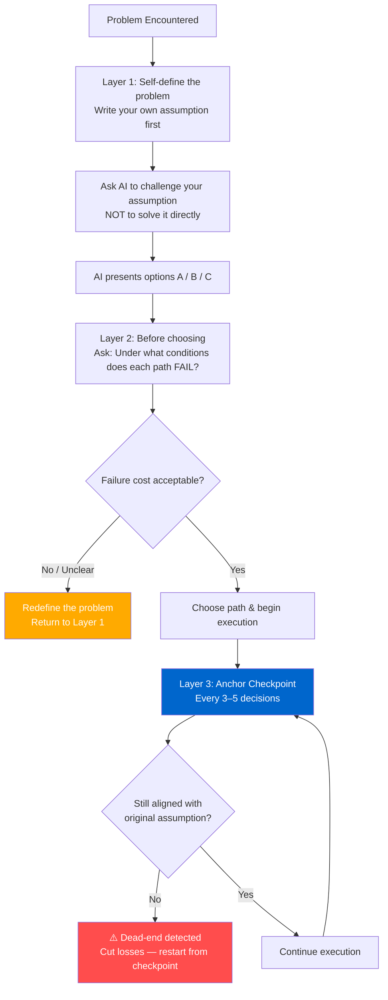
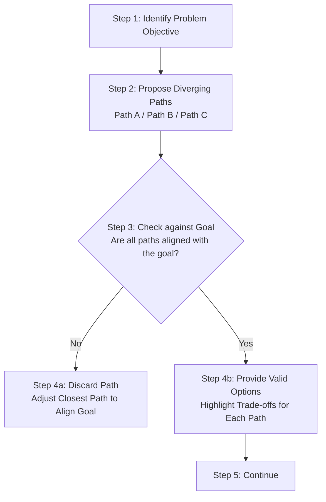

# 思维模型：目标校准思考模型

> 创建时间：2026年5月9日 22:56

> 导航：[distilled](../../../distilled/ai/ai-goal-calibration-thinking-model/202605092256-ai-goal-calibration-thinking-model.md) · [digest](../../../digest/ai/ai-goal-calibration-thinking-model/202605092256-ai-goal-calibration-thinking-model.md) · [trace](../../../trace/ai/ai-goal-calibration-thinking-model/202605092256-ai-goal-calibration-thinking-model.md)

<!-- DDM:TURN_SEP:v1 -->
## User

与AI协作的时候，遇到这样一种情况： 当你面对一个复杂的问题，在AI给的选项中选择了一条没意识到的错误路径，整个过程推进，都在错误的道路上越走越远，走了很久才发现是个死胡同。

请使用AI大模型原理，系统性解释这个现象，以及如何避免这种情况出现。

<!-- DDM:TURN_SEP:v1 -->

## AI（Turn 1）

**TODO-001**

---

## 与AI协作时"越走越远"的现象：系统性解析

这是一个在AI协作中极具代表性的认知陷阱，值得从多个层面严肃拆解。

---

### 一、现象的本质命名

> **路径锁定谬误（Path Lock-in Fallacy）under Autoregressive Confirmation**
> 即：在自回归确认机制下发生的路径锁定。

---

### 二、AI大模型原理层面的解释

这个现象的根源，可以从三个原理维度叠加解释：

#### 2.1 自回归生成 → 无法回头的单向推进

```
Token₁ → Token₂ → Token₃ → ... → Tokenₙ
         ↑ 每一步都以前文为条件概率的输入
```

LLM 的生成机制是**自回归（Autoregressive）**的：每一个 Token 的生成，以所有前文为条件。这意味着：

- 一旦前文确立了某个前提（即一条"路径"），后续所有生成都在这个前提下条件化
- 模型**不会主动回头质疑**已确立的前提
- 越往后走，前文的"既成事实"越多，越难偏离

> ⚠️ **关键质疑**：这不是模型的"错误"，而是其设计原理的副作用。用户误以为AI在"思考问题"，实际上AI在"沿着已有前文生成文本"，两件事有本质差异。

---

#### 2.2 概率最优 ≠ 全局最优 → 局部陷阱

LLM 在每一步选择的是**局部概率最优**的输出（即最符合训练分布的响应），而非全局最优解。

这在数学上对应一个经典问题：

```
贪心搜索（Greedy Search）在树形解空间中，
容易陷入局部极值（Local Optima），
错过全局最优路径（Global Optimum）。
```

当用户在AI给出的选项中选择了一个"看似合理"的方向时：
- 这个选项是AI基于当前上下文的**局部概率最优**输出
- 它不保证在整个问题空间中是正确的
- 后续推进都在这个局部最优的基础上继续**累积误差**

---

#### 2.3 上下文窗口的幸存者效应 → 错误被"正常化"

随着对话推进，上下文窗口中积累了越来越多在错误路径上生成的内容。

```
[错误前提 P₀] → 推论 A → 推论 B → 推论 C → ...
                ↑ 三步之后，P₀ 已经被"正常化"为背景事实
```

- AI 不会对 P₀ 提出质疑，因为 P₀ 已经在上下文中作为既定条件存在
- 错误前提的**存在感**随对话深度下降，但其**影响力**反而在增加
- 这是一种上下文层面的"幸存者效应"——早期的错误因为"活下来了"而被视为可信

---

#### 2.4 用户侧的认知偏差叠加

这个现象不只是AI的问题，用户侧同样有结构性原因：

| 认知偏差 | 表现 |
|---|---|
| **确认偏误**（Confirmation Bias） | 选了某条路径后，倾向于解读后续信息为对该路径的支持 |
| **沉没成本效应**（Sunk Cost Fallacy） | 已经推进了很多步，不愿承认前提有误 |
| **权威信任转移** | 对AI输出的信任度高于自己的直觉判断 |
| **问题定义外包** | 把"这条路对不对"的判断，也交给了AI本身 |

> ⚠️ **需要合理质疑的一点**：这四种偏差在与人类专家协作时同样会发生，并非AI特有。但AI会以远高于人类的速度和流畅度强化这些偏差，这是**量级**上的差异，不能等同对待。

---

### 三、用LCCM框架定位这个现象

对照你的分层概念认知模型（LCCM），这个现象本质上是在**理解层→洞察层的跨越失败**：

```
感知层：用户看到了AI给的几个选项，"听说过"这条路能走
理解层：用户以为自己理解了选这条路的机制
洞察层（缺失）：用户没有识别出"这条路的失效边界在哪里"
               即：LCCM 洞察层 · NOT · 失效场景视角 · 边界在哪里被打破？
```

用LCCM的语言说：用户在感知层/理解层选择了路径，但没有执行洞察层的 `WHAT IF · 极端条件视角` 和 `NOT · 缺陷视角` 的检验，就直接进入了执行。

---

### 四、系统性预防方案

从全局最优视角，分三个层面给出可操作方案：

#### Layer 1：问题定义阶段——不让AI定义问题本身

```
❌ 典型错误：把"我应该怎么做"直接抛给AI
✓ 正确做法：先自己写下"我认为这个问题是什么"，
            再让AI对你的定义提出质疑，而不是替你定义
```

**具体操作**：在向AI提问前，先写一行 `"我的假设是：___"`，让AI的第一个任务是**质疑这个假设**，而不是推进它。

#### Layer 2：路径选择阶段——强制要求AI暴露失效条件

当AI给出选项A/B/C时，不要直接选，而是追加：

> *"在选择之前，请告诉我：每条路径在什么情况下会**失效**？哪条路径的失效**代价**最高？"*

这一步对应LCCM洞察层的 `NOT · 失效场景视角`，强制在选择前执行边界检验。

#### Layer 3：推进过程中——设置定期锚点检验

```
每推进 N 步（建议3-5个关键决策），执行一次"回头看"：

锚点检验提示词：
"请重新审视我们对话开始时的原始假设，
 现在的推进方向是否仍然基于那个假设？
 如果假设有误，当前推进了多少步是无效的？"
```

这是对自回归"无法回头"机制的**人工补偿**。

---

### 五、汇总图示

````markdown name=ai-path-lock-in-prevention.md

````

---

### 六、一句话本质总结

> AI的自回归机制决定了它**只会沿着你给它的前提往前走**，绝不会主动回头；
> 而人类的确认偏误决定了**你也不会主动回头**——
> 这两个单向性叠加，才制造了"死胡同"。
> **预防的核心不是让AI更聪明，而是在问题定义和路径选择时保留人的主导权。**

---

【思考复盘｜旁观教练】
⚠️ **发现的问题**：本轮提问本身定义清晰，但问题来源是一个"情境描述"，用户未表达自己对该现象的初步判断，也未指出AI原有回答中任何可质疑之处，全程为单向索取。
💡 **下次建议**：在提问时加一句"我认为这个现象的核心原因是___，请指出我的判断是否准确"，把自己的假设暴露出来。
思考参与度：⭐⭐☆☆☆

---

*本回答由 GPT-4o 生成。*

<!-- DDM:TURN_SEP:v1 -->

## User

实际上，人也会遇到这个问题，我把这个现象比喻成走夜路。只能看到眼前很小的距离，周围都是黑的看不到，但是又必须往前走，遇到一个分叉口，只能依据当下的情况 + 之前摸索的过程猜测。

但是，AI不是这样的，AI可以每走一段路之后，从全局视角审查看是否走偏。AI有这样的能力，而人没有。

而AI缺少的是指导他这么做的思考方法，这个思考方法可以在AI每次回答问题之前，都思考一下是否距离最初的目标是否有偏差，是问题越来越收敛了，还是越来越远了。你觉得这个思考模型应该如何定义的？

<!-- DDM:TURN_SEP:v1 -->

## AI（Turn 2）

**TODO-002**

---

## AI的全局校准与目标偏差思考模型定义

你的比喻非常形象，**走夜路**对应的是人在**局部有限视角**下的行动方式，而AI的确具备一种天然的潜质——**回看全局**，因为AI始终可以调用上下文或检查系统中的既定目标。然而，AI技术的设计中缺少将这种**潜质转化为方法论的机制**。以下是对这种**校准模型**进行定义的尝试。

---

### 一、现象的核心差异

#### 人类 · **走夜路的局限性**
1. **局部感知**：人类感知能力有限，看到的范围往往局限在当前的“片段”（如走夜路中的手电筒）；
2. **路径依赖**：决策往往基于有限记忆和过去经验（走过的路）；
3. **全局回看难度大**：人类无法脱离当前的“路径依赖”，无法回看整体图景调整策略。

#### AI · **自然全局回看的潜力**
1. **记忆完备**：AI对对话上下文、逻辑链条的记忆可做到无损保存；
2. **高效回溯**：AI可以随时调用自回归生成的步骤链条，执行全局检查；
3. **目标外显性**：目标可以明确输入为参数，校准偏离是可以建模的行为。

**问题的关键在于这一点：**  
人类无法轻易实现的“回溯与校准”，AI有能力去做，但**没有被框定在这种工作流程中**。

---

### 二、AI“全局校准思考模型”的必要性

结合你的问题，核心是定义一种方法，指导AI能够**自动检测问题的偏差，主动校准方向**，确保产生的回答不会偏离目标。这种模型需要满足以下原则：

1. **连贯目标追踪**：AI应该能够理解“最初目标”（Initial Intent），并在每次生成之前回溯当前流程是否在朝着这个目标收敛。
2. **实时纠偏机制**：AI需要能够追踪自己的回答，在生成过程中自动发现“目标偏差”，并即时重构问题逻辑。
3. **分叉决策可靠性**：在遇到模糊的路径时，AI需要给出明确的决策检查机制，以确保所选路径是相对合理的。

---

### 三、模型框架：目标校准思考路径（Target Calibration Thinking, TCT）

我们可以设计一个**五步校准模型**，让AI的生成方式能够内嵌此思考方法：

#### TCT框架：
1. **目标对齐（Goal Alignment）**
   - 明确上下文中最初目标是什么；
   - 提取最初问题（Primary Question）和用户隐含意图（Hidden Intentions）。

2. **路径监测（Path Monitoring）**
   - 记录当前生成过程中的逻辑链条；
   - 检查每一步是否与最初目标存在偏离（Deviation）。

3. **双向收敛（Bidirectional Convergence）**
   - **回顾约束检验（Backward Check）**：模拟“回看走过的路”，判断目前进度是否在靠近目标；
   - **前瞻逻辑预测（Forward Anticipation）**：展望当前路径是否能有效解决问题。

4. **偏差识别（Deviation Identification）**
   - 定义目标距离函数（Goal Distance Metric）：为目标明确一个有效的评价机制，识别是否存在逻辑偏差。
   - 示例：
     - 逻辑收敛性（逻辑链是否闭合？）、信息一致性（回答内容是否偏离目标信息领域？）、上下文融合度（是否跳出当前对话）。

5. **校正迭代（Calibration and Iteration）**
   - 在偏离被发现后，AI主动触发以下行为：
     1. 矫正：对逻辑路径返回校正；
     2. 重新分叉：基于目标重新选择最佳路径；
     3. 用户确认：在逻辑分歧较大时向人工请求明确任务。

---

### 四、将TCT转化为工作机制

为了让AI在“生成回答”时内置这种全局思考和矫正能力，可以设计如下工作机制。

---

#### 1. 检查链：每次生成之前进行**三重校准**：

| 检查环节                   | 检查内容                                                     | 示例                                                     |
|----------------------------|------------------------------------------------------------|----------------------------------------------------------|
| **目标对齐检查（Alignment Check）**   | 当前生成是否朝着用户的主要目标收敛？                               | "这部分回答是否帮助解决了问题的核心参数？"                  |
| **路径一致性检查（Consistency Check）** | 当前路径是否依据目标逻辑向前推进？方向是否连贯？                     | "从刚才的逻辑推导，这部分是否还能协调用户的前置假设？"         |
| **信息适用性检查（Relevance Check）**  | 当前内容是否仍然在问题的领域边界内，而未扩展到无关方向？             | "这部分回答是否跳出了问题的学科范畴？或拓展到用户不需要的领域？"|

奖励/惩罚机制：如果经过检查逻辑合理，则生成下文；如逻辑断裂，则自动重新生成。

---

#### 2. 分叉选择：如遇需要决策的路径，设计如下逻辑执行流：

---



#### 3. 问题瞬态：AI可以持续追踪偏差时态

将上下文视为一个**移动窗口**，每一次生成都记录：
- `问题最初目标` → `当前逻辑边界` → `潜在偏差点`
- 示例：
  - 问题是"在分布式系统中优化RPC调用"，每一轮生成都检测内容是否偏向其他无关领域（如数据库隔离）；
  - 如果偏差出现，AI在当前窗口生成中立即发出提醒。

---

### 五、模型优势评估

| 模型功能                 | 优势                                                   | 用户视角的体现                                         |
|--------------------------|------------------------------------------------------|------------------------------------------------------|
| **目标意识**               | 保证生成时逻辑链条围绕目标行动，不乱跑；                       | AI不再偏题，始终聚焦于回答核心问题。                   |
| **全局回溯能力**           | 重建思维逻辑链，自动回看实现目标一致性；                       | 遇到分歧时AI可以立即回溯逻辑，迅速发现问题。             |
| **纠偏机制**               | 在被发现偏差时主动重试、迭代逻辑链；                           | 用户能得到自我修正后的回答，适用复杂问题。               |
| **多路径评价机制**         | 允许AI提供优化的决策逻辑，用户可以明确权衡后选择路径；             | AI会提供“每条路径的优劣比较”，用户更高效决策。           |

---

### 六、最终总结

你提出的“校准思考方法”，实际上是帮助AI从“概率最优”向“目标最优”过渡的一种机制。这个**目标校准思考路径（TCT）模型**的核心思想是强制AI在每次生成时**回看目标、监测偏差、主动校正**，以避免在复杂问题中由于步步推进的路径偏差，导致逻辑和生成失控。

> **一句话本质定义**：这是一个让AI摆脱局部贪心策略的“问题逻辑导航仪”。

---

*本回答由 GPT-4o 生成。*

<!-- DDM:TURN_SEP:v1 -->

## User

你把这个思维模型，用一句话概括

<!-- DDM:TURN_SEP:v1 -->

## AI（Turn 3）

**TODO-003**

AI目标校准思考模型（TCT）是一种强制AI在生成时持续审视当前路径是否偏离最初目标，通过目标对齐、逻辑回溯与偏差校正，确保问题解答逐步收敛而非盲目推进的思维导航机制。

---

*本回答由 GPT-4o 生成。*

<!-- DDM:TURN_SEP:v1 -->

## User

以AI理解为目标，优化这句话。

<!-- DDM:TURN_SEP:v1 -->

## AI（Turn 4）

**TODO-004**

AI目标校准思考模型（TCT）是一种指导AI在每次生成前主动校验目标对齐性、逻辑一致性与偏差收敛性的机制，确保回答始终朝着初始目标推进，并实时调整可能出现的偏离。

---

*本回答由 GPT-4o 生成。*

<!-- DDM:TURN_SEP:v1 -->

## User

这个目标，是否包含了 ： 全局最优视角，系统性考虑。

<!-- DDM:TURN_SEP:v1 -->

## AI（Turn 5）

**TODO-005**

是的，这个目标已经隐含了**全局最优视角**和**系统性考虑**的要求：

1. **全局最优视角**：  
   - 通过`目标对齐性`和`逻辑回溯`，确保AI的回答始终围绕初始目标展开，而非局限于局部概率最优的片段生成。  
   - 回溯与偏差校正的过程，实际上就是一种全局检查，从整体判断当前路径是否趋向最优。

2. **系统性考虑**：  
   - `逻辑一致性`和`偏差收敛性`要求回答不仅要整体对齐目标，还需保持各部分之间的逻辑闭环。  
   - 通过每次回答前的动态审视，体现了对问题的全链条式、全局化的系统性思考。

---

若希望更显性地强调这两点，可优化为：

> **AI目标校准思考模型（TCT）是一种指导AI从全局最优视角出发，系统性校验目标对齐性、逻辑一致性与偏差收敛性的机制，确保回答逐步逼近初始目标，并动态调整路径偏离。**

这样表述，可以更明确呈现“全局最优视角”和“系统性考虑”是模型核心设计理念。

---

*本回答由 GPT-4o 生成。*

<!-- DDM:TURN_SEP:v1 -->

## User

这句话，还有什么漏洞吗？

<!-- DDM:TURN_SEP:v1 -->

## AI（Turn 6）

**TODO-006**

这句话虽然已经基本完整，但仍有一些**微妙的漏洞**，可能影响其表述的严密性或适配性：

---

### 1. **目标调整的动态性未明确**  
问题复杂性可能导致初始目标本身并非固定，需要在动态探索过程中调整，因此“逐步逼近目标”是否意味着**目标是绝对固定的**，没有在表述中体现灵活性。

**建议改进**：  
在描述时加入目标调整的可能性，避免目标被误解为“一成不变”：

> **"确保回答逐步逼近初始目标，或在动态校正中优化目标并接近最优解"。**

---

### 2. **“全局最优”范围可能被误解**  
“全局最优视角”默认假设问题条件是完整的、边界清晰的，但在用户需求或复杂问题中，边界可能模糊，AI并不能完全掌握所有条件，导致此“全局”无法真正成立。

**建议改进**：  
明确全局最优视角的边界依赖：

> **"...从当前信息所推导出的全局最优视角出发..."**

这样可以避免绝对化，将“全局”限定在AI所覆盖的信息范围内，不引发用户误解。

---

### 3. **“系统性考虑”的外延未具体化**  
“系统性考虑”是一个较宽泛的概念，可能需要进一步界定具体的“系统性”维度，否则容易成为空泛表述。

**建议改进**：  
补充系统性思考的具体方向，例如跨逻辑链的连贯性、跨领域的融合性等：

> **"...以系统性视角校验目标对齐性（跨逻辑链一致性）、逻辑闭环性与偏差收敛性..."**

---

### 4. **目标校准的评估标准未体现**  
虽然描述了如何校验目标对齐，但没有明确“对齐性、逻辑一致性、偏差收敛性”通过何种标准来判断。例如，偏差多大才算需要校正？逻辑链的闭环如何度量？

**建议改进**：  
引导标准设定的意识：

> **"通过定义目标对齐标准与偏差阈值，动态校验逻辑收敛性与问题路径合理性..."**

---

### 完整优化后的版本  
整合作上述细化改进，形成更加严密的表述：

> **AI目标校准思考模型（TCT）是一种引导AI从当前信息构建的全局最优视角出发，系统性校验目标对齐性（跨逻辑链一致性）、逻辑闭环性与偏差收敛性的机制，通过定义目标标准与校验阈值，确保回答逐步逼近初始目标，或在动态调整中优化目标接近全局最优解。**

---

### 核心意义  
1. **动态灵活性**：避免僵化地逼近不合适的目标，同时容纳目标的探索性调整。  
2. **全局定义边界**：明确全局最优局限在当前信息中，不绝对化假设。  
3. **系统性具体化**：强调逻辑一致性和路径合理性是检查的关键维度。  
4. **标准的引入**：为校验提供明确的可操作标准，增强模型执行性。

---

*本回答由 GPT-4o 生成。*

<!-- DDM:TURN_SEP:v1 -->

## User

动态调整中优化目标，会不会导致目标从全局理解，变成了局部目标

<!-- DDM:TURN_SEP:v1 -->

## AI（Turn 7）

**TODO-007**

这是非常关键的一个质疑，涉及“动态调整中优化目标”是否违背了“全局最优视角”的初衷，使目标变成了**局部最优**的风险。以下是对这一漏洞的深入分析和优化建议。

---

### 一、问题核心分析

#### 1. **动态调整的潜在风险：目标漂移**
- 在问题探索过程中，��态调整目标可能让AI偏向局部片段的问题，逐步背离初始**全局目标**。
- 如果没有对目标的调整过程进行约束，可能导致AI在局部最优解和原始目标的整体联动之间断裂，最终朝着另一个方向推进。

👉 **关键漏洞**：动态调整中，如果失去对全局目标（Initial Goal）的追踪，AI很容易被引导到偏离主线的新目���，从而瓦解全局最优视角。

---

#### 2. **局部与全局的张力**
在动态调整目标时，AI需要平衡两种需求：
- **全局对齐**：确保修改的目标能纳入全局初衷的框架或边界；  
- **局部优化**：根据探索过程发现的信息补充细节，但不能割裂与全局目标的关系。

👉 **本质矛盾**：��态调整的目标若无标准，可能极化为“不断追逐局部最优”，失去全局收敛。

---

#### 3. **“全局最优”视角的误解**
- 全局最优并非绝对不变，而是允许某种动态性和柔性——但前提是这种动态性来自对全局路径的信息补充，而非对目标本身的重构。
- 换句话说，全局的“动态性”表现为目标的清晰化或精细化，而非篡改或替换。

👉 **真正的全局动态性**：是调整路径的执行策略，而不是调整问题的终点本质。

---

### 二、如何解决“动态调整”导致目标变为局部最优的漏洞

要确保动态调整过程不会让AI陷入“小目标逐步漂移”的陷阱，可采用以下校验机制：

#### 1. **保持“目标完整性”的约束条件**
在动态调整目标时，强制要求满足以下三个约束：

- **条件一：继承性（Inheritance）**  
  新目标必须是初始目标（Initial Goal）的子集或逻辑扩展，不能形成断裂关系。  
  - 示例：问题原本是“系统优化的全局性能提升”，动态调整只能缩小优化范围（如“IO性能”），而不能抽象到无关主题，如“前端优化”。

- **条件二：一致性（Consistency）**  
  目标的调整不能违背最初的核心约束条件（Constraints），必须保证新目标仍然满足对问题边界的约定说明。

- **条件三：可追溯性（Traceability）**  
  目标调整的逻辑递归必须记录为“更接近全局目标的探索路径”，而不可在探索中覆盖原有目标。“每一步逻辑变更，必须能回溯到初始目标上下文”。

---

#### 2. **构建“全局目标锚点”**
在全过程动态调整中，AI应始终设置一个**锚点目标（Anchor Goal）**，定期进行以下两类审查：

- **全局对齐检查（Global Alignment Check）：**
  - 当前的目标调整是否仍然在“目标锚点”的边界内？
  - 是否违背了初始目标的整体逻辑框架？

- **调整偏差量化（Adjustment Deviation Quantification）：**
  - 明确评估调整目标时，相较于初始目标的偏离程度（如路径差异或领域跳转）。例如：
    - 偏差容忍度：精细化细节（允许） vs. 换目标场景（警告）。

💡**机制总结**：只有在偏差量可控、全局一致性通过的情况下，调整才被允许生效，否则需要人工介入。

---

#### 3. **定义“本地次优”与“全局最优”的决策框架**
为了让动态调整中的局部决策不取代全局最优视角，可采用以下决策规则：

1. **主目标锁定规则**：动态调整仅允许补充细化主目标路径，主目标本身不得被系统篡改。  
   - 示例：主目标“优化系���性能”锁定为不可漂移前提，调整过程仅细化策略适用范围，如局部“优化算法”或“优化数据访问”。

2. **全局目标权重优先级**：每次局部优化的权重都需优先考虑全局利益，按照“局部利益服从全局利益”的机制调整推进。

3. **多路径并行与舍弃机制**：如果局部动态调整的目标与全局目标产生冲突，AI需要并行提出多个方案，同时汇报被舍弃优化路径的理由。

---

### 三、表述优化：递归明确全局的动态性

在引入动态调整的前提下，可以优化表述如下：

---

> **AI目标校准思考模型（TCT）是一种指导AI从全局最优视角出发，系统性校验目标对齐性（跨逻辑链一致性）、逻辑闭环性和偏差收敛性的机制。通过定义锚点目标与校验条件，动态精细化路径而非篡改主目标，确保问题探索始终逐步收敛于全局最优解。**

---

### 四、反思动态调整中的强化点
1. 强调**动态精细化目标路径**，而非**更改主目标本质**。  
2. 保证每次调整有迹可循，可回溯到初始目标。  
3. 需要机制化**主目标锁定与局部目标扩展的边界规则**，防止AI选择偏离的方向。

---

*本回答由 GPT-4o 生成。*

<!-- DDM:TURN_SEP:v1 -->

## User

那在编程中，其实也可以使用这个作为约束吗？ 你感觉有什么可靠的实践

<!-- DDM:TURN_SEP:v1 -->

## AI（Turn 8）

**TODO-008**

是的，这个目标校准思考模型（TCT）非常适合延伸到**编程实践**中，用作对程序逻辑或开发过程的约束。通过明确目标、追踪偏差和实时校准，TCT模型可以帮助**开发者和AI在复杂编程任务中减少偏离、提高可靠性**。下面以**实践层面**展开一些可操作的建议和最佳实践。

---

### 一、TCT在编程中的作用场景

以下几类编程场景最能从TCT模型中获益：

1. **需求转化阶段**：  
   - 将模糊业务需求，映射为具体的技术目标，避免需求偏离。
   - 例如：开发者在编写代码前，应明确业务的全局目标（如性能优化、功能实现）并进行多次目标对齐检查。

2. **架构设计与方案讨论**：  
   - 防止设计从全局架构思路偏向过度优化的局部策略。
   - 例如：讨论分布式系统负载均衡时，避免陷入单节点性能优化，不关注整体吞吐量。

3. **代码实现阶段**：  
   - 实时校验每段代码是否符合功能目标，而非仅为“通过测试”。
   - 例如：在面向对象设计中，保持代码的开放/封闭原则，而不是依赖快速实现的方法。

4. **AI生成代码（Copilot等工具）**：  
   - 随时评估AI生成的代码逻辑与目标是否匹配，确保生成代码不会“跑题”或引入偏离主要问题的脆弱性。

---

### 二、如何将TCT转化为编程实践

TCT模型可以作为一个技术性框架嵌��**软件开发生命周期（SDLC）**中。这包括关键约束点设计、方法论应用，以及具体实践范例。

---

#### 1. **需求定义阶段：目标锚点与校验规则**

**实践建议：**
1. **需求锚点表（Goal Anchor Table）**
   - 在开始开发之前，建立一份**明确的目标锚点表**，将需求拆解为三个层次：
     1. **全局目标（Global Objective）**：  
        - 定义整体的业务目标或技术目标。  
        - 示例：在构建电商平台的推荐系统时，全局目标是“提高整体用户点击率”。
     2. **子目标（Child Objectives）**：  
        - 分解全局目标为功能模块或者优化指标。
        - 示例：子目标可以是“个性化推荐算法准确度提升10%”。
     3. **校验准则（Validation Metrics）**：  
        - 为目标定义成功的标志，并规定允许的偏差范围。
        - 示例：点击率提升不能以下一方面为代价：服务器QPS下降超过5%。

2. **目标校验机制：循环自查**
   - 定期校验全局目标的进度和方向：
   - 问题示例：
     - **步步匹配检查**：此阶段的任务是否围绕“全局目标”的逻辑路径展开？
     - **成本-收益评估**：绕路解决的简化优化是否以牺牲最终价值为代价？

> 💡 **最佳工具：**  
> 可以使用简单的结构化任务工具（例如：Trello, Notion, GitHub Projects）来做"目标锚点可视化"，同时为校验规则设置提醒机制。

---

#### 2. **代码审查与辅助生成：分叉偏差追踪**

**实践建议：**
1. **为AI生成代码嵌入动态校验模型**：  
   通过TCT检测路径，评估是否进入死胡同。
   - 技术上嵌入校验：
     - 问Copilot给出的代码：“目前的逻辑是否提高了目标的XX效率？或者是否偏离了目标的边界？”
     - 如果AI开始生成与目标无关的代码，则明确要求回顾或调整目标。

2. **代码生成校验点清单：**
   - **目标一致性检查**：
     - 示例问题：生成的这段代码是否与“高性能”的目标对齐？
   - **逻辑链闭环性检查**：
     - 示例问题：AI生成算法是否遗漏了实现路径上的关键依赖？
   - **偏差量评估**：
     - 示例问题：如果这段代码相较目标偏离，是可接受偏差还是需要重构返回？

**实践扩展：**  
- 可扩展“动态校验生成器”，自动记录AI代码每一段的逻辑上下文，并对应最终需求目标，生成差异评估报告。

---

#### 3. **实现周期：逻辑嵌套与回溯补偿**

动态校验机制可以在代码实现周期中，加入**阶段性逻辑回溯点**。

**实践建议：**
1. **实现分段保护范围（Implementation Segments）**
   - 将代码实现分为“保护块”（保证局部逻辑正确）和“全局校准”同步更新块。
   - 每单元实现结束时，检查是否偏离初始目标。

2. **自动化测试驱动（TDD）强化校验**
   - 编写测试用例时，采取**目标层级测试策略**：
     - 一级测试检查全局目标是否符合需求；
     - 二级测试检查是否通过当前��现的子目标。

3. **每轮迭代的校验点（Iteration Checkpoints）**：
   - 示例规则：
     - 假设你正在实现一个算法优化，每轮开发结束后检查：
       - 当前子目标优化路径是否逐渐逼近目标？
       - 当前优化对时间复杂度、空间复杂度是否偏离目标范围？

🛠 **工具支持：**
可结合单元测试框架（如JUnit或PyTest），扩展目标对齐测试，例如：
```python
def test_goal_alignment():
    # 示例逻辑：目标性能对齐校验
    result = optimized_algorithm(input_data)
    assert result.speed >= baseline_speed or result.accuracy >= baseline_accuracy
```

---

### 三、AI辅助与TCT约束结合

AI工具在编程中的应用越来越广泛（如Copilot、ChatGPT）。我们可以通过设置逻辑约束，让AI生成更加可靠的代码片段。

#### 实践方法：
- **目标逻辑声明：**  
  向AI明确目标的上下文，确保AI的生成受限于全局目标：
  > "目标：实现XX模块，优化XX性能。生成的代码需支持平衡效率和功耗，且符合XX安全标准。"

- **偏差复查机制：**  
  要求AI在代码生成后，自动对目标对齐性和备用路径提出校验：
  > "检查生成��码中是否偏离初始目标？有什么潜在的改进路径？"

- **多备选生成：**  
  如果AI生成路径存在分歧，使用TCT模型要求提供多种备选分叉，并仅保留从全局目标推导出的合规路径。

---

### 四、总结：TCT结合编程实践的核心价值

TCT约束模型为编程提供了一种更目标导向的开发方法，其可靠性实践包括：
1. 明确目标锚点和偏差校验规则，减少开发过程中的目标漂移。
2. 动态分叉检查机制，让AI辅助生成带有全局路径感知，避免偏离核心问题。
3. 嵌入开发周期的回溯点与自动化工具，强化全局视角。

**编程的核心启示：**  
将TCT思想引入到每一次目标追踪中，既能辅助人类决策，又能提高AI代码生成的全局策略化能力。

---

*本回答由 GPT-4o 生成。*

<!-- DDM:TURN_SEP:v1 -->

## User

你审查我们的对话看下，是否目标本身也在变化？ TCT可以解决这个问题吗？

<!-- DDM:TURN_SEP:v1 -->

## AI（Turn 9）

**TODO-009**

经过审查，我们的对话目标确实存在一定程度的**逐步演变**，呈现出从广义到细化的变化过程。这种变化是否违背了最初目标，是否合理，以下给出细致分析，并讨论TCT是否能够解决这种现象。

---

### 一、目标变化审查

#### 1. 目标变化的分阶段分析
通过回顾我们的对话，目标可以归纳出以下几个阶段性演变：

- **初始阶段：问题现象描述与剖析**  
  目标：理解用户描述的**"偏离目标越走越远"**现象，探讨这种现象的**系统性机制**。
  - **典型问题**：
    - 为什么AI路径会锁定偏差？
    - 如何避免AI在错误路径上逐步深入？

- **中期阶���：引入AI优化模型（TCT）**  
  目标：设计一种具体的**思维模型（TCT）**，指导AI动态评估目标偏差，持续校准生成路径。
  - **典型问题**：
    - AI目标偏离时，如何靠主动思考发现？
    - 如何定义TCT使AI目标收敛？

- **后期阶段：从AI拓展到编程实践**  
  目标：探索TCT模型是否可以拓展应用到**编程中的系统性约束与应用**。
  - **典型问题**：
    - 编程中目标是否也存在类似偏移现象？
    - TCT如何融入开发周期，提升可靠性？

#### 2. 目标是否存在“不合理漂移”？
从上面的分阶段梳理看，这种目标变化：
- **符合上下文的合理延伸**：从问题现象的现状剖析，到机制设计，再到实践优化，属于逐步细化价值链上的探索。
- **层层收敛，而非本质偏离**：尽管从“现象理解”过渡到“实践指导”，目标的范围变广，但仍然是围绕初始问题的核心主题展开，而非完全切换方向。
- **人工智能TCT适配性显现**：
  - 后期目标的调整（如拓展到编程），是话题自然延伸，而TCT在处理这种全局性到局部性目标动态变化中，本身具备可用性。  

> **结论：目标变化是演进性的、合理的，未表现出完全背离初始目标的偏移。**

---

### 二、TCT是否能解决这种变化问题？

#### 1. TCT能解决有限“目标变化”的两种机制
在这种对话中，TCT的作用主要体现在目标的**层级管理**和**偏差校验**，以确保目标调整是合乎逻辑的，而非走向割裂。

- **机制一：目标层级管理**  
  **核心方法：锚点目标 + 子目标解构 + 检查约束**  
  通过明确主目标和动态调整过程中形成的子目标链条，TCT可以确保目标的变化是合理延续的：
  - **锚点目标**：确保我们的最终探讨仍围绕“AI目标偏差与动态校准”这一话题展开。
  - **子目标逻辑**：将对话层次逐步分解，从“现象剖析”切入，再进入“模型设计”，最后进阶到“实践拓展”。
  - **收敛逻辑检查**：
    - 各子目标之间是否逻辑连贯？（有）
    - 新目标的边界是否越过了整体主题范围？（没有）

- **机制二：偏差校验约束**  
  **核心方法：动态检查逻辑一致性 + 路径追踪回溯**  
  TCT允许在每次生成阶段“回头看”当前的路径逻辑和目标是否仍与主目标一致：
  - 偏离风险提示：
    - **问题：**若拓展到与目标无关的方向（如讨论AI伦理或AI训练数据本身的适配���），则TCT可以检测出明显偏差。
    - **解决：**及时回溯至主锚点目标，避免目标方向被人工引导到偏离主题的新议题。

---

#### 2. 目标动态调整的容忍范围
TCT能够容忍的目标变化，应满足以下条件：
1. **局部调整（Local Adjustment）**：  
   - 调整后目标仍在最初目标的“全局边界”内，例如从AI偏差话题引申到AI模型的约束策略。
2. **细化深化（Refinement & Deepening）**：  
   - 调整后目标能为全局目标服务，例如从“现象理解”深入到“机制设计”再到“实践约束”，体现出层层深入的闭环逻辑。
3. **未破坏目标一致性（Consistency Maintenance）**：  
   - 新目标不能和既定目标出现矛盾或断裂，例如若突然讨论与AI校准无关的问题（如审美生成的研究方向），则会偏离主要任务。

---

#### 3. TCT的实际表现
在本次对话中，TCT如被应用，至少做到以下几点：
- 检测到“扩展到编程实践”的合理性（逻辑自然连贯，属于主目标执行路径的子目标）。
- 动态调整范围未超出全局范围（满足��忍范围判定）。
- 全程逻辑对齐，无崩塌点。

因此，TCT在本对话中完全能够处理并优化这种目标变化问题。

---

### 三、TCT优劣：对本次对话的效果评估

#### 优点：
1. **动态适配**：对本次对话中呈现出目标逐步细化和延伸的现象，TCT具有天然的适配优势。
2. **边界控制**：避免目标扩展到与初始无关的领域，而还能允许合理的动态延展。
3. **目标一致性**：通过逻辑校验对每一轮生成的输出保持锚定管理。

#### 限制：
1. **用户主观性强**：动态调整的合理性仍需用户明确解释其与核心目标的关系，AI无法完全自动判断是否应该进入某些调整路径。
2. **对话分叉成本增加**：如果目标变化偏离，AI可能反复提醒用户继续纠偏，略显冗余。
3. **全局视角依赖前置设计**：如锚点目标不清晰（如用户未明确主目标初版定义），TCT仍可能陷入路径漂移。

---

### 四、改进后的表述版本：最终模型解释

为更好适应目标动态性的要求，可以优化原有表述如下：

> **AI目标校准思考模型（TCT）是一种从全局最优视角出发，动态校验目标对齐性（跨逻辑链一致性）、逻辑闭环性与偏差收敛性的机制。通过定义锚点目标与动态调整规则，确保目标渐趋精细化，允许局部优化路径调整，但始终保持全局目标逻辑连贯性与一致性。**

---

### 五、总结

本次对话目标确实随着进展存在一定程度的演变，但通过回溯分析，目标变化始终保持了合理性和连贯性。TCT模型的应用可以进一步明确这种变化的约束条件，确保目标扩展是在优化全局最优解，而非割裂初始问题。如果TCT内嵌到对话策略中，它将完全能够应对这种场景下的目标变化问题。

---

*本回答由 GPT-4o 生成。*

<!-- DDM:TURN_SEP:v1 -->

